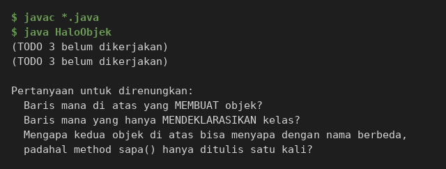
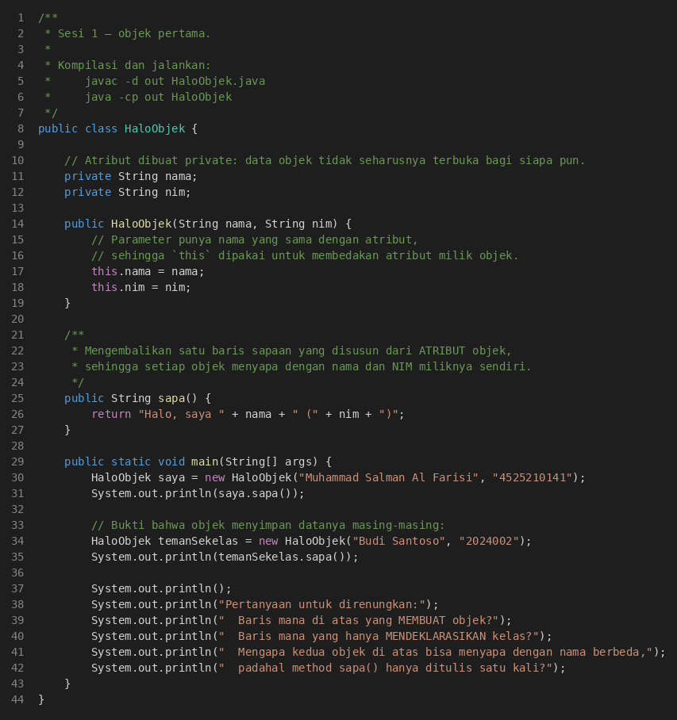
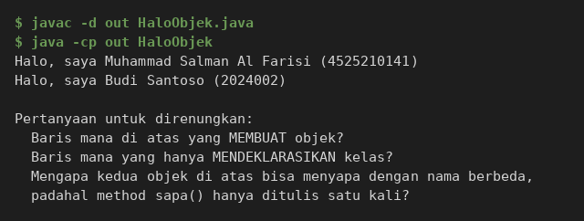
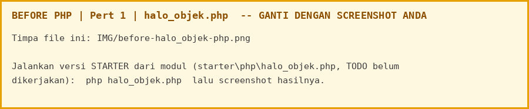
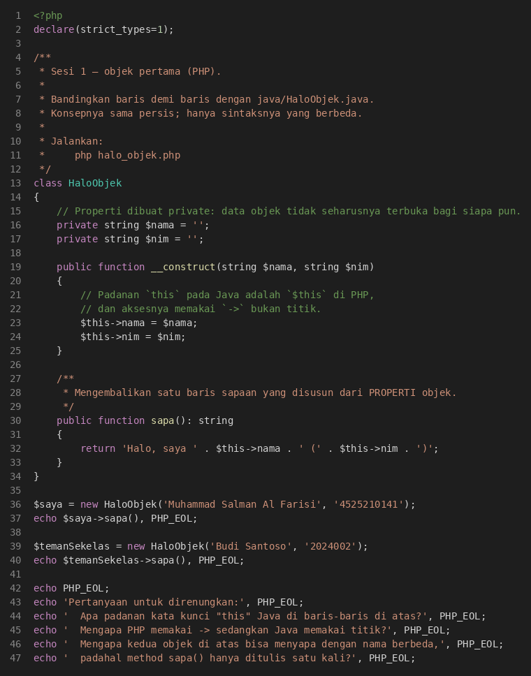
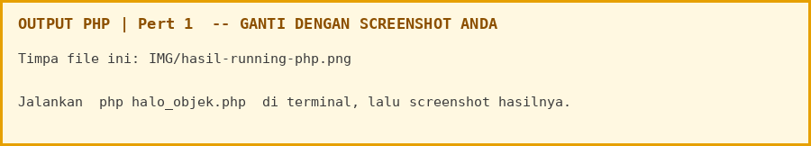

# LAPORAN PRAKTIKUM PEMROGRAMAN BERBASIS OBJEK

| Informasi Praktikan | Keterangan |
| :--- | :--- |
| **Nama** | Muhammad Salman Al Farisi |
| **NPM** | 4525210141 |
| **Kelas** | A |
| **Mata Kuliah** | Pemrograman Berbasis Objek (PBO) |
| **Pertemuan** | 1 - Paradigma OOP dan Lingkungan Pengembangan (Penyiapan Lingkungan Pengembangan) |
| **Tanggal** | 10 Oktober 2026 |

---

## 1. Implementasi Java

### 1.1. File: `HaloObjek.java`
**Penjelasan Kode:**
> Kelas `HaloObjek` adalah objek pertama. Atribut `nama` dan `nim` dibuat `private` supaya data objek tidak terbuka bagi siapa pun. Constructor menerima dua parameter yang namanya sama dengan atribut, sehingga `this.nama = nama` dan `this.nim = nim` dipakai untuk membedakan atribut milik objek dari parameter. Method `sapa()` menyusun kalimat dari atribut objek (bukan menulis nama langsung), sehingga dua objek yang dibuat dari satu kelas bisa menyapa dengan nama berbeda. `main` membuat objek milik saya dan satu objek teman sekelas sebagai bukti bahwa tiap objek menyimpan datanya sendiri.

**Bukti Eksekusi (Screenshot):**
* **Before** *(Kondisi awal / Kesalahan kompilasi)*:


* **After** *(Kondisi akhir / Eksekusi berhasil)*:


### Output
**Output Program:**


---

## 2. Implementasi PHP

### 2.1. File: `halo_objek.php`
**Penjelasan Kode:**
> Padanan PHP dari `HaloObjek.java`. Properti `$nama` dan `$nim` dibuat `private`, constructor mengisinya lewat `$this->nama` dan `$this->nim` (padanan `this` pada Java adalah `$this`, dan aksesnya memakai `->` bukan titik). Method `sapa()` mengembalikan string dari properti objek. Kode di bagian bawah berkas membuat objek saya dan objek teman sekelas, lalu mencetak sapaan keduanya.

**Bukti Eksekusi (Screenshot):**
* **Before** *(Kondisi awal / Galat logika)*:


* **After** *(Kondisi akhir / Eksekusi berhasil)*:


### Output
**Output Program:**

`php halo_objek.php`



**Keluaran yang diharapkan:**

`php halo_objek.php`
```text
Halo, saya Muhammad Salman Al Farisi (4525210141)
Halo, saya Budi Santoso (2024002)

Pertanyaan untuk direnungkan:
  Apa padanan kata kunci "this" Java di baris-baris di atas?
  Mengapa PHP memakai -> sedangkan Java memakai titik?
  Mengapa kedua objek di atas bisa menyapa dengan nama berbeda,
  padahal method sapa() hanya ditulis satu kali?
```

---

## 3. Kesimpulan
> Objek menyatukan data (`nama`, `nim`) dan perilaku (`sapa()`) dalam satu kelas. Dengan atribut `private`, data hanya bisa dipakai lewat method milik objek itu sendiri, dan `this` (Java) atau `$this` (PHP) membuat setiap objek memakai datanya masing-masing. Satu method `sapa()` yang ditulis sekali cukup untuk banyak objek dengan isi berbeda. Struktur kode Java dan PHP sama persis, hanya sintaksnya yang berbeda.
>
> Dokumen pendukung: [refleksi.md](refleksi.md) berisi tugas rumah (refleksi tentang data yang tercerai-berai dan bagaimana objek memperbaikinya).
>
> Cara menjalankan:
> ```cmd
> cd "Pert 1\java"
> javac -d out HaloObjek.java
> java -cp out HaloObjek
>
> cd ..\php
> php halo_objek.php
> ```
