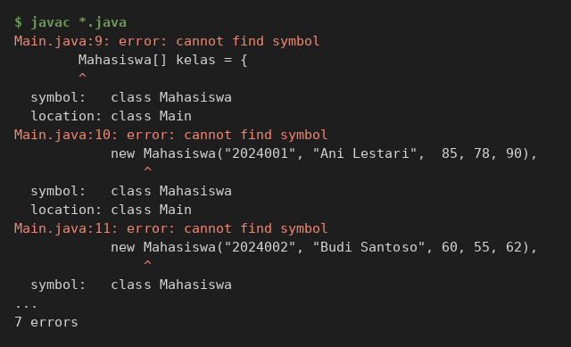
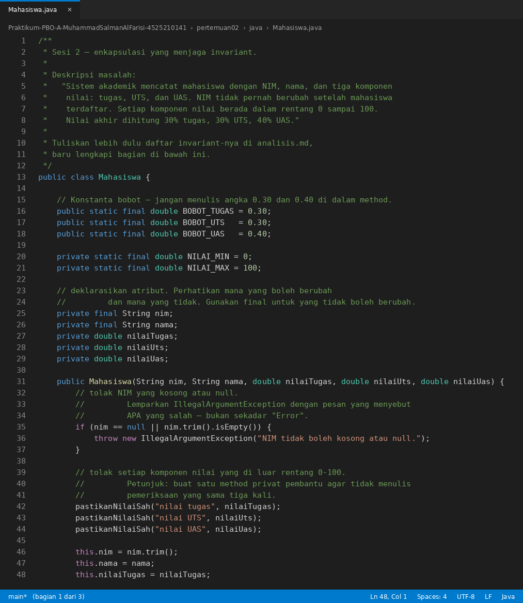
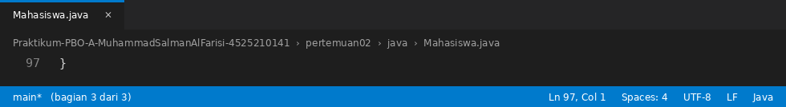
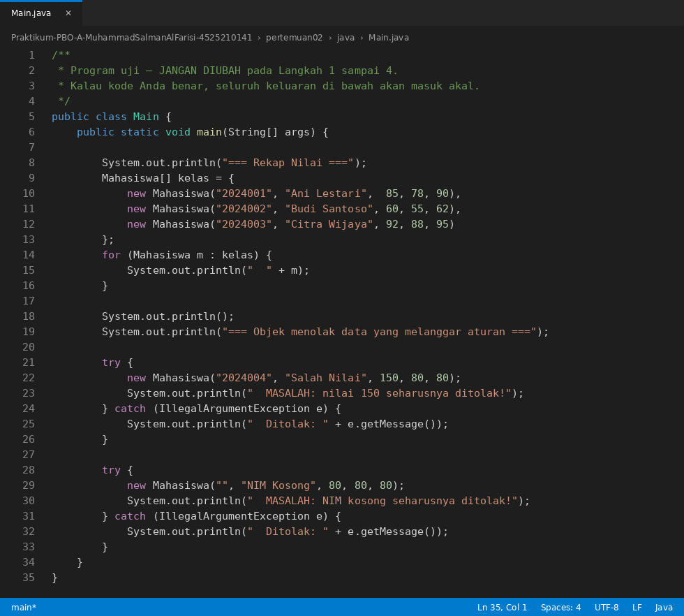
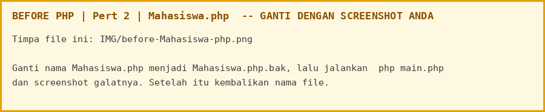
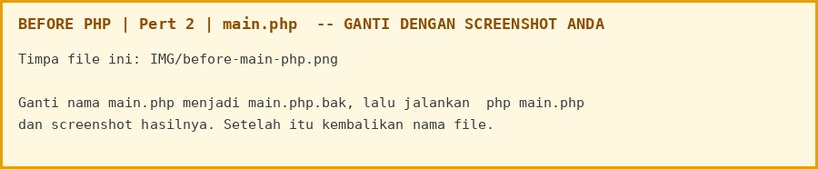
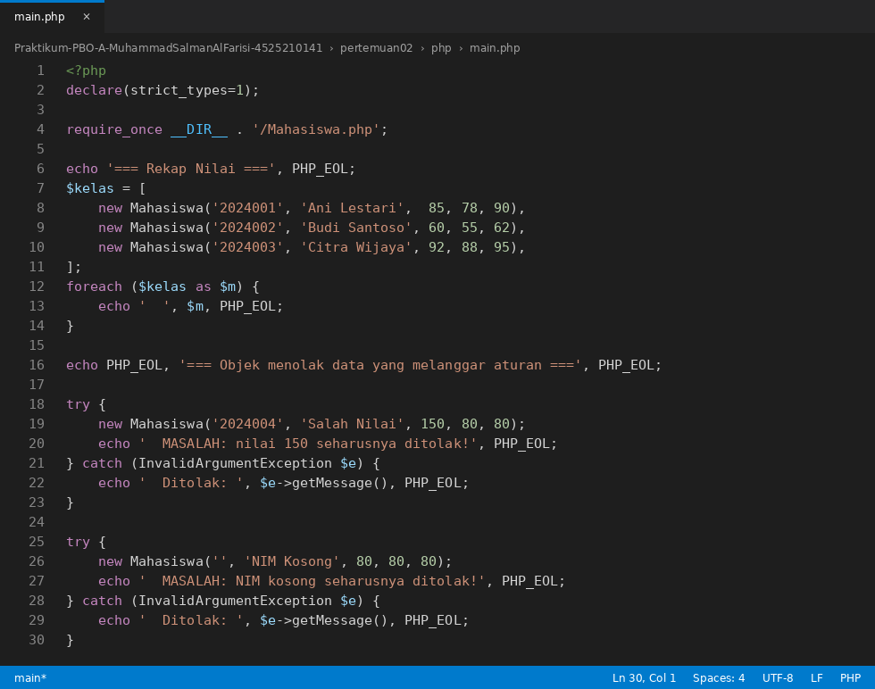
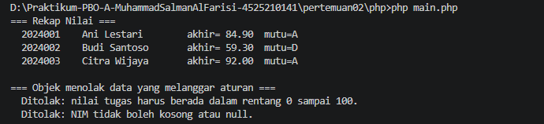

# LAPORAN PRAKTIKUM PEMROGRAMAN BERBASIS OBJEK

| Informasi Praktikan | Keterangan |
| :--- | :--- |
| **Nama** | Muhammad Salman Al Farisi |
| **NPM** | 4525210141 |
| **Kelas** | A |
| **Mata Kuliah** | Pemrograman Berbasis Objek (PBO) |
| **Pertemuan** | 2 - Class, Object and Encapsulation (Enkapsulasi dan Invariant) |
| **Tanggal** | 10 Oktober 2026 |

---

## 1. Implementasi Java

### 1.1. File: `Mahasiswa.java`
**Penjelasan Kode:**
> Kelas `Mahasiswa` menjaga invariant sistem akademik. `nim` dan `nama` dibuat `private final` dan tidak punya setter, sehingga NIM tidak bisa berubah setelah mahasiswa terdaftar. Constructor menolak NIM kosong atau null dengan `IllegalArgumentException`, lalu memanggil method privat pembantu `pastikanNilaiSah(...)` sebanyak tiga kali supaya nilai tugas, UTS, dan UAS selalu berada pada rentang 0 sampai 100 tanpa menulis pemeriksaan yang sama berulang. Bobot nilai ditulis sebagai konstanta `BOBOT_TUGAS = 0.30`, `BOBOT_UTS = 0.30`, `BOBOT_UAS = 0.40` sehingga `nilaiAkhir()` tidak memakai angka ajaib, dan `hurufMutu()` memetakan nilai akhir ke huruf A sampai E. Daftar invariant lengkap ada di [analisis.md](analisis.md).

**Bukti Eksekusi (Screenshot):**
* **Before** *(Kondisi awal / Kesalahan kompilasi)*:


* **After** *(Kondisi akhir / Eksekusi berhasil)*:




### 1.2. File: `Main.java`
**Penjelasan Kode:**
> Program uji yang tidak diubah. `Main` membuat tiga objek `Mahasiswa` dan mencetak rekap nilainya lewat `toString()`. Setelah itu ia mencoba membuat dua objek yang melanggar aturan (nilai tugas 150 dan NIM kosong), menangkap `IllegalArgumentException`, dan mencetak pesan penolakan yang menyebut apa yang salah.

**Bukti Eksekusi (Screenshot):**
* **Before** *(Kondisi awal / Kesalahan kompilasi)*:


* **After** *(Kondisi akhir / Eksekusi berhasil)*:


### Output
**Output Program:**


---

## 2. Implementasi PHP

### 2.1. File: `Mahasiswa.php`
**Penjelasan Kode:**
> Padanan PHP dari `Mahasiswa.java`. NIM dibuat `private readonly string $nim` dan tidak punya `setNim()`. Constructor melempar `InvalidArgumentException` untuk NIM kosong dan memanggil `pastikanNilaiSah(...)` tiga kali. Bobot ditulis sebagai `const BOBOT_*`, dan huruf mutu ditentukan dengan `match (true)` dari nilai tertinggi ke terendah.

**Bukti Eksekusi (Screenshot):**
* **Before** *(Kondisi awal / Galat logika)*:


* **After** *(Kondisi akhir / Eksekusi berhasil)*:


### 2.2. File: `main.php`
**Penjelasan Kode:**
> Program uji PHP yang memuat kelas dengan `require_once`, membuat tiga mahasiswa, mencetak rekap, lalu mencoba dua data tidak sah dan menangkap `InvalidArgumentException` seperti pada versi Java.

**Bukti Eksekusi (Screenshot):**
* **Before** *(Kondisi awal / Galat logika)*:


* **After** *(Kondisi akhir / Eksekusi berhasil)*:


### Output
**Output Program:**


---

## 3. Kesimpulan
> Enkapsulasi membuat objek `Mahasiswa` menolak data yang melanggar aturan sejak constructor, bukan baru gagal belakangan. Perbedaan penerapan di dua bahasa:
>
> | Aturan | Java | PHP |
> |---|---|---|
> | NIM tidak boleh berubah | `private final String nim`, tanpa `setNim()` | `private readonly string $nim`, tanpa `setNim()` |
> | NIM kosong atau null ditolak | `IllegalArgumentException` | `InvalidArgumentException` |
> | Nilai di luar 0-100 ditolak | `pastikanNilaiSah(...)` dipanggil 3 kali | `pastikanNilaiSah(...)` dipanggil 3 kali |
> | Bobot nilai | `BOBOT_TUGAS`, `BOBOT_UTS`, `BOBOT_UAS` | `const BOBOT_*` |
> | Huruf mutu | rangkaian `if` dari nilai tertinggi | `match (true) { ... }` |
>
> Pemeriksaan manual nilai akhir (dibandingkan dengan keluaran program):
>
> | Mahasiswa | Perhitungan | Nilai akhir | Mutu |
> |---|---|---|---|
> | Ani Lestari | 85x0,30 + 78x0,30 + 90x0,40 = 25,5 + 23,4 + 36,0 | 84,90 | A |
> | Budi Santoso | 60x0,30 + 55x0,30 + 62x0,40 = 18,0 + 16,5 + 24,8 | 59,30 | D |
> | Citra Wijaya | 92x0,30 + 88x0,30 + 95x0,40 = 27,6 + 26,4 + 38,0 | 92,00 | A |
>
> Dua data tidak sah ditolak dengan pesan yang menyebut apa yang salah (nilai tugas 150, dan NIM kosong).
>
> Dokumen pendukung: [analisis.md](analisis.md) (daftar invariant).
>
> Cara menjalankan:
> ```cmd
> cd "Pert 2\java"
> javac *.java
> java Main
>
> cd ..\php
> php main.php
> ```
