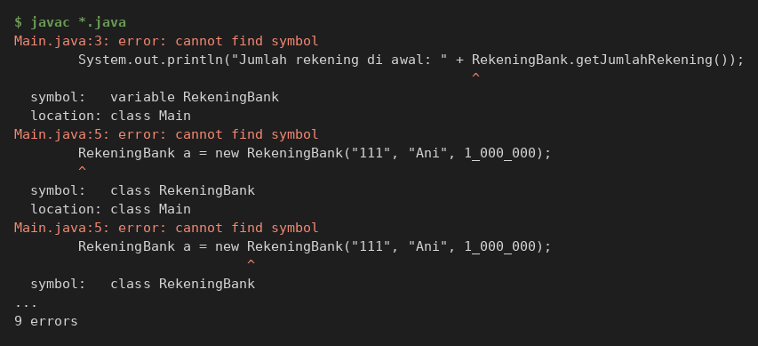
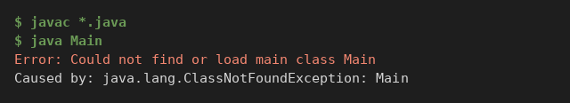
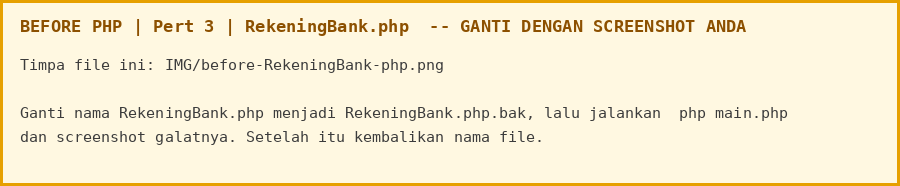
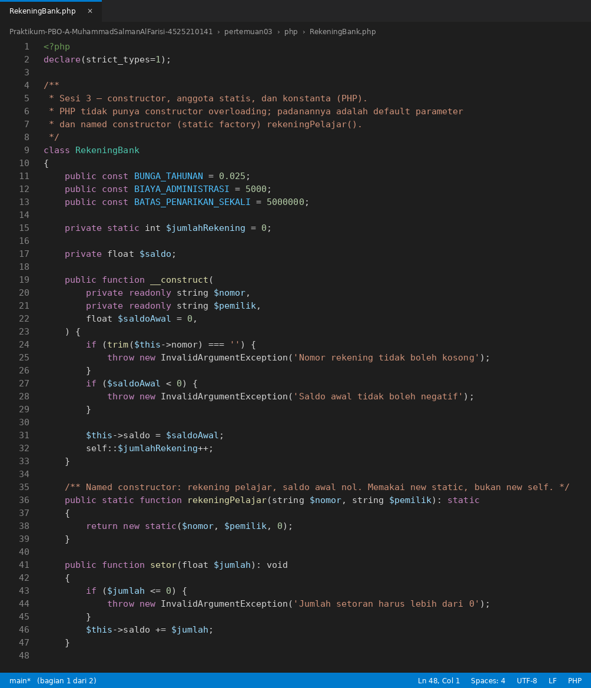
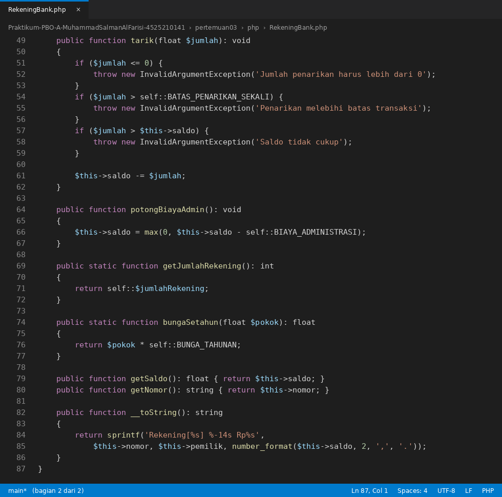
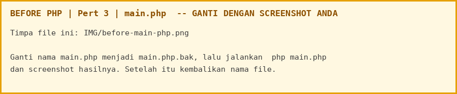
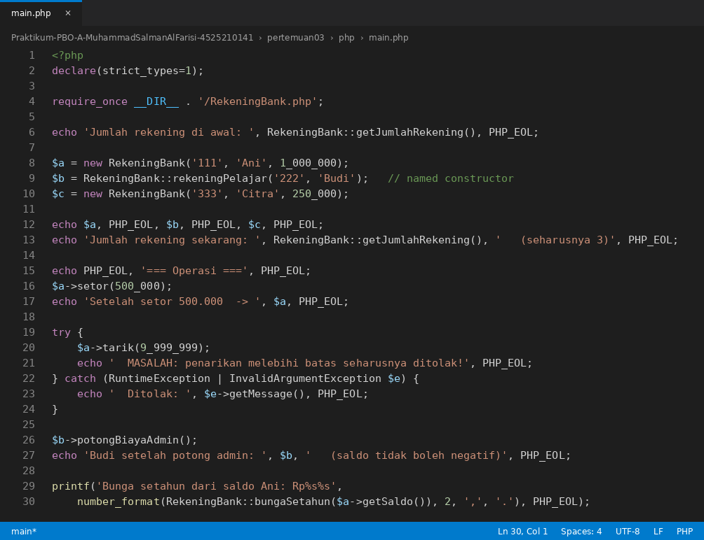
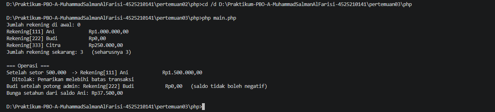

# LAPORAN PRAKTIKUM PEMROGRAMAN BERBASIS OBJEK

| Informasi Praktikan | Keterangan |
| :--- | :--- |
| **Nama** | Muhammad Salman Al Farisi |
| **NPM** | 4525210141 |
| **Kelas** | A |
| **Mata Kuliah** | Pemrograman Berbasis Objek (PBO) |
| **Pertemuan** | 3 - Class, Object and Encapsulation (Constructor, Static, dan Konstanta) |
| **Tanggal** | 10 Oktober 2026 |

---

## 1. Implementasi Java

### 1.1. File: `RekeningBank.java`
**Penjelasan Kode:**
> Kelas `RekeningBank` dengan tiga invariant: saldo tidak pernah negatif, nomor rekening tidak berubah (`private final`), dan setoran serta penarikan selalu positif. Konstanta ditulis `public static final` (`BUNGA_TAHUNAN = 0.025`, `BIAYA_ADMINISTRASI = 5000`, `BATAS_PENARIKAN_SEKALI = 5_000_000`) sehingga tidak ada angka ajaib. Penghitung `private static int jumlahRekening` naik setiap objek dibuat. Constructor ringkas mendelegasikan ke constructor lengkap lewat `this(nomor, pemilik, 0)`, sehingga validasi hanya ditulis di satu tempat dan penghitung naik sekali saja. Method `setor`, `tarik`, dan `potongBiayaAdmin` (memakai `Math.max(0, ...)` agar saldo tidak negatif) menjaga invariant. Method statis `getJumlahRekening()` dan `bungaSetahun()` tidak membutuhkan objek.

**Bukti Eksekusi (Screenshot):**
* **Before** *(Kondisi awal / Kesalahan kompilasi)*:


* **After** *(Kondisi akhir / Eksekusi berhasil)*:


### 1.2. File: `Main.java`
**Penjelasan Kode:**
> Program uji yang membuat tiga rekening (Ani, Budi lewat constructor ringkas, dan Citra), mencetak jumlah rekening sebelum dan sesudah objek dibuat, lalu mencoba setoran, penarikan yang melebihi batas transaksi (ditolak), pemotongan biaya administrasi pada saldo 0, dan perhitungan bunga setahun.

**Bukti Eksekusi (Screenshot):**
* **Before** *(Kondisi awal / Kesalahan kompilasi)*:


* **After** *(Kondisi akhir / Eksekusi berhasil)*:


### Output
**Output Program:**


---

## 2. Implementasi PHP

### 2.1. File: `RekeningBank.php`
**Penjelasan Kode:**
> Padanan PHP dari `RekeningBank.java`. Konstanta memakai `public const`, penghitung memakai `private static int $jumlahRekening`, dan `nomor` serta `pemilik` dibuat lewat constructor promotion `private readonly`. Constructor ringkas diganti default parameter `$saldoAwal = 0`. Karena PHP tidak punya overloading constructor, ditambahkan named constructor `rekeningPelajar()` yang memakai `new static`. Validasi hanya ada di `__construct`.

**Bukti Eksekusi (Screenshot):**
* **Before** *(Kondisi awal / Galat logika)*:


* **After** *(Kondisi akhir / Eksekusi berhasil)*:



### 2.2. File: `main.php`
**Penjelasan Kode:**
> Program uji PHP yang memuat `RekeningBank.php` dengan `require_once`, membuat tiga rekening, lalu menjalankan skenario yang sama dengan versi Java: setor, tarik melebihi batas, potong biaya administrasi, dan bunga setahun.

**Bukti Eksekusi (Screenshot):**
* **Before** *(Kondisi awal / Galat logika)*:


* **After** *(Kondisi akhir / Eksekusi berhasil)*:


### Output
**Output Program:**


---

## 3. Kesimpulan
> Constructor yang mendelegasikan ke constructor lengkap memastikan validasi tidak ditulis dua kali, dan anggota `static` cocok untuk data yang dimiliki kelas (penghitung rekening, bunga) bukan oleh satu objek.
>
> | Konsep | Java | PHP |
> |---|---|---|
> | Konstanta (tanpa angka ajaib) | `public static final` | `public const` |
> | Penghitung rekening | `private static int jumlahRekening` | `private static int $jumlahRekening` |
> | Constructor ringkas | `this(nomor, pemilik, 0)` (delegasi) | default parameter `$saldoAwal = 0` |
> | Cara lain membuat objek | - | named constructor `rekeningPelajar()` dengan `new static` |
> | Method statis | `getJumlahRekening()`, `bungaSetahun()` | `getJumlahRekening()`, `bungaSetahun()` |
>
> Penjelasan hasil running:
>
> | Keluaran | Penjelasan |
> |---|---|
> | `Jumlah rekening di awal: 0` | Penghitung statis bernilai awal 0 sebelum ada objek |
> | `Jumlah rekening sekarang: 3` | Tiga objek dibuat. Constructor ringkas Budi mendelegasikan ke constructor lengkap, jadi penghitung naik sekali, bukan dua kali |
> | `Rp1.500.000,00` setelah setor | 1.000.000 + 500.000 |
> | `Ditolak: Penarikan melebihi batas transaksi` | Penarikan 9.999.999 melampaui batas 5.000.000 per transaksi |
> | Budi `Rp0,00` setelah potong admin | Saldo 0 dikurangi 5.000 dibatasi `Math.max(0, ...)`, sehingga tidak negatif |
> | `Rp37.500,00` | Bunga setahun dari saldo Ani: 1.500.000 x 0,025 |
>
> Tugas pekan ini: konstanta `BIAYA_ADMINISTRASI` dan method `potongBiayaAdmin()`, named constructor `RekeningBank::rekeningPelajar(...)` di PHP, serta percobaan anggota statis.
>
> Percobaan anggota statis (lihat [percobaan-static.md](percobaan-static.md)):
>
> 
> 
>
> Dokumen pendukung: [percobaan-static.md](percobaan-static.md), [sekuens-constructor.puml](sekuens-constructor.puml), dan slide [materi-pertemuan03.pptx](materi-pertemuan03.pptx).
>
> Cara menjalankan:
> ```cmd
> cd "Pert 3\java"
> javac *.java
> java Main
>
> cd ..\php
> php main.php
> ```
