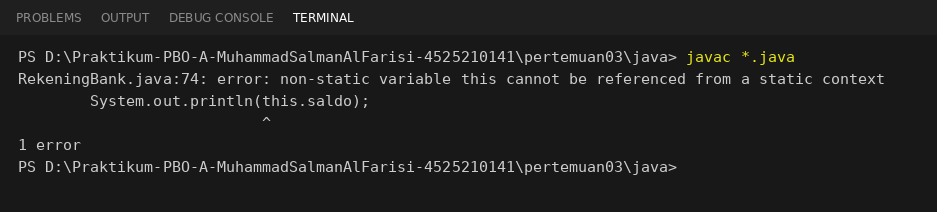
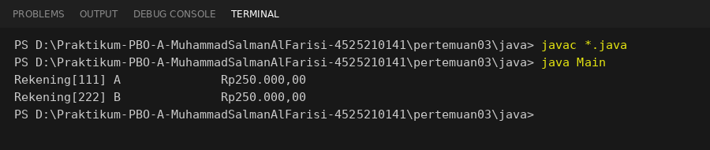

# Hasil Percobaan Anggota Statis (Static)
**Mata Kuliah:** Pemrograman Berorientasi Objek
**Materi:** Constructor, Anggota Statis, dan Konstanta

Semua percobaan dijalankan pada kode `RekeningBank.java` pertemuan ini.
Setelah selesai, kode dikembalikan ke kondisi semula.

## 1. Mencetak `jumlahRekening` lewat nama kelas
**Kode yang dijalankan:**
```java
System.out.println("Jumlah rekening di awal: " + RekeningBank.getJumlahRekening());
```

**Hasil:**
Program dikompilasi tanpa error dan mencetak `0` sebelum ada objek, lalu `3` setelah tiga rekening dibuat.
Panggilan memakai nama kelas `RekeningBank`, tanpa `new` terlebih dahulu.


**Kesimpulan:**
Method statis dipanggil lewat nama kelas karena ia milik kelas, bukan milik objek tertentu.
Itu sebabnya `getJumlahRekening()` bisa dipanggil bahkan ketika belum ada satu pun objek.

---

## 2. Mengakses `this` di dalam method static
**Percobaan:**
Menambahkan baris `System.out.println(this.saldo);` di dalam method statis `getJumlahRekening()`.

**Pesan kompilator:**
```text
RekeningBank.java:74: error: non-static variable this cannot be referenced from a static context
        System.out.println(this.saldo);
                           ^
1 error
```



**Kesimpulan:**
`this` menunjuk ke objek yang sedang aktif. Method statis berjalan di tingkat kelas dan tidak terikat pada objek mana pun,
jadi tidak ada objek yang bisa ditunjuk oleh `this`. Karena itu `saldo` (atribut per objek) juga tidak bisa dibaca dari konteks statis.

---

## 3. Mengubah atribut instance menjadi static
**Percobaan:**
Mengubah `private double saldo;` menjadi `private static double saldo;`, lalu membuat dua rekening:
- Rekening A dengan saldo awal 1.000.000
- Rekening B dengan saldo awal 250.000

lalu mencetak keduanya.

**Hasil:**
```text
Rekening[111] A              Rp250.000,00
Rekening[222] B              Rp250.000,00
```



**Kesimpulan:**
Kedua rekening menampilkan saldo yang sama, yaitu 250.000. Atribut `static` hanya punya satu tempat di memori yang dipakai bersama
oleh semua objek. Saat Rekening B dibuat, nilainya menimpa saldo Rekening A.
Saldo seharusnya milik masing-masing objek, jadi atribut ini tidak boleh `static`.
(Setelah percobaan, `saldo` dikembalikan menjadi non-static.)

---

## Jawaban Tugas Rumah: Kapan penggunaan static membuat kode sulit diuji?

Static mempersulit pengujian ketika dipakai untuk menyimpan keadaan global yang nilainya bisa berubah (*mutable global state*).
Anggota statis dimiliki kelas dan hidup selama program berjalan, sehingga nilainya terbawa dari satu tes ke tes berikutnya.
Padahal tes yang baik harus terisolasi: hasilnya tidak boleh bergantung pada tes lain atau urutan menjalankannya.
Jika satu tes mengubah variabel statis dan tidak mengembalikannya, perubahan itu bocor ke tes lain dan membuat hasilnya tidak stabil (*flaky*).

Contoh pada kode ini adalah `private static int jumlahRekening` di `RekeningBank`.
Misalkan Tes A membuat dua rekening sehingga penghitung menjadi 2. Tes B kemudian mengharapkan `getJumlahRekening()` bernilai 1
setelah membuat satu rekening. Tes B gagal (hasilnya 3), padahal kodenya benar. Tes yang sama bisa lulus jika dijalankan sendirian,
tetapi gagal jika dijalankan setelah Tes A.

Ada dua masalah lain. Pertama, pemanggilan statis tertanam langsung di kode (*hard-coded dependency*), sehingga sulit diganti dengan
objek tiruan (*mock*) saat pengujian. Kedua, ketergantungan yang tersembunyi: dari tanda tangan method, penguji tidak tahu bahwa
konstruktor `RekeningBank` mengubah keadaan global.

Cara mengatasinya: batasi static pada hal yang tidak punya keadaan dan murni, seperti `bungaSetahun(pokok)` yang hanya menghitung
dari argumen dan konstanta (aman diuji). Untuk keadaan yang bisa berubah, simpan di objek (instance) dan berikan lewat constructor
(*dependency injection*). Jika terpaksa memakai static yang mutable, sediakan cara me-reset nilainya sebelum atau sesudah tiap tes.
