# LAPORAN PRAKTIKUM PEMROGRAMAN BERBASIS OBJEK

| Informasi Praktikan | Keterangan |
| :--- | :--- |
| **Nama** | Muhammad Salman Al Farisi |
| **NPM** | 4525210141 |
| **Kelas** | A |
| **Mata Kuliah** | Pemrograman Berbasis Objek (PBO) |
| **Pertemuan** | 4 - Pewarisan (Inheritance) |
| **Tanggal** | 10 Oktober 2026 |

---

## 1. Implementasi Java

### 1.1. File: `ProfilPembayaran.java`
**Penjelasan Kode:**
> Kelas `final` yang menyimpan `bank` dan `nomorRekening` (keduanya `private final`). Dipakai sebagai **komposisi**: setiap `Pegawai` *memiliki* satu profil pembayaran, bukan *adalah* profil pembayaran, sehingga tidak memakai pewarisan.

**Bukti Eksekusi (Screenshot):**
* **Before** *(Kondisi awal / Kesalahan kompilasi)*:
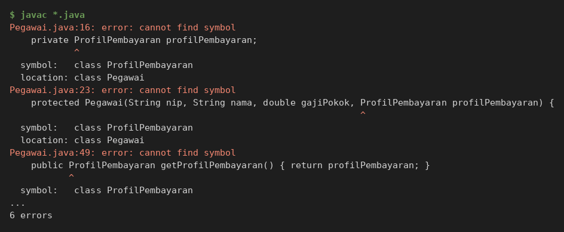

* **After** *(Kondisi akhir / Eksekusi berhasil)*:


### 1.2. File: `Pegawai.java`
**Penjelasan Kode:**
> Kelas abstrak induk. Data yang sama pada semua pegawai (`nip`, `nama`, `gajiPokok`) ditulis sekali di sini dan hanya dapat diisi lewat constructor `protected`. `hitungGaji()` mengembalikan gaji pokok sebagai perilaku bawaan, sedangkan `jenis()` dibuat `abstract` sehingga setiap turunan wajib mengisinya. Pegawai juga menyimpan `ProfilPembayaran` (komposisi) yang bernilai `BELUM DIATUR` sampai diganti lewat `setProfilPembayaran(...)`. Validasi data input (gaji tidak negatif, dan sebagainya) dilakukan di constructor.

**Bukti Eksekusi (Screenshot):**
* **Before** *(Kondisi awal / Kesalahan kompilasi)*:
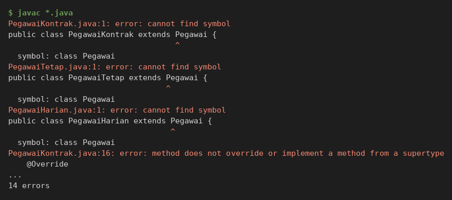

* **After** *(Kondisi akhir / Eksekusi berhasil)*:


### 1.3. File: `PegawaiTetap.java`
**Penjelasan Kode:**
> Turunan `Pegawai` yang menambah tunjangan masa kerja 2% per tahun dengan batas maksimal 40% (`TUNJANGAN_PER_TAHUN`, `TUNJANGAN_MAKSIMUM`). Constructor memanggil `super(nip, nama, gajiPokok)` terlebih dahulu, dan `hitungGaji()` meng-override method induk dengan memanfaatkan `super.hitungGaji()` supaya aturan gaji pokok tidak ditulis ulang.

**Bukti Eksekusi (Screenshot):**
* **Before** *(Kondisi awal / Kesalahan kompilasi)*:
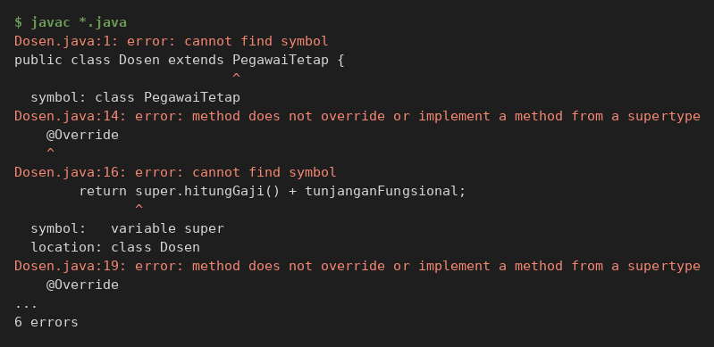

* **After** *(Kondisi akhir / Eksekusi berhasil)*:


### 1.4. File: `PegawaiKontrak.java`
**Penjelasan Kode:**
> Turunan `Pegawai` dengan atribut tambahan `bulanKontrak`. Kelas ini sengaja **tidak** meng-override `hitungGaji()` karena gaji pegawai kontrak memang gaji pokok apa adanya, jadi perilaku bawaan induk dipakai ulang (alasannya dicatat di [catatan.md](catatan.md)).

**Bukti Eksekusi (Screenshot):**
* **Before** *(Kondisi awal / Kesalahan kompilasi)*:
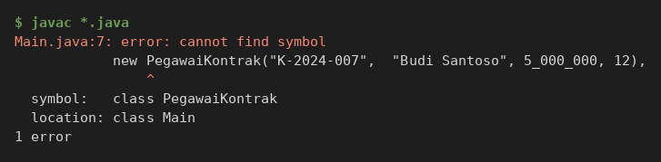

* **After** *(Kondisi akhir / Eksekusi berhasil)*:
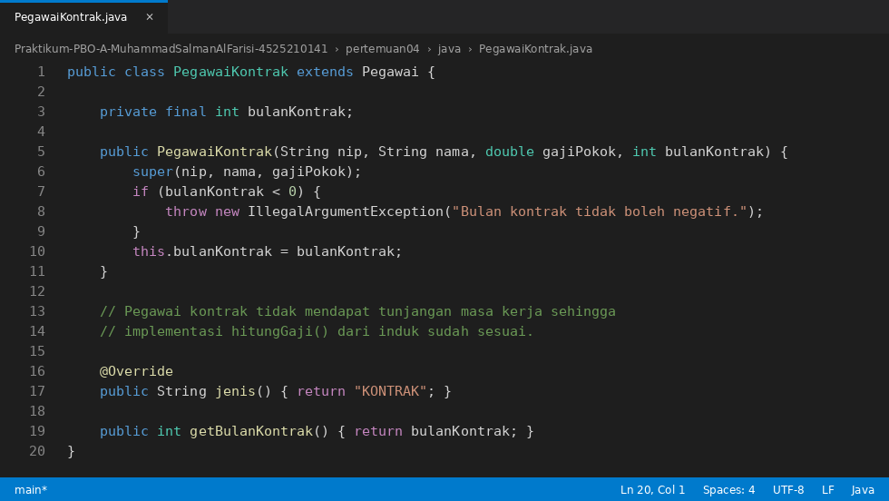

### 1.5. File: `Dosen.java`
**Penjelasan Kode:**
> Turunan `PegawaiTetap` (pewarisan bertingkat) dengan tunjangan fungsional. `hitungGaji()` memanggil `super.hitungGaji()` (gaji pegawai tetap beserta tunjangan masa kerja) lalu menambah tunjangan fungsional, sehingga aturan tunjangan masa kerja tidak ditulis ulang.

**Bukti Eksekusi (Screenshot):**
* **Before** *(Kondisi awal / Kesalahan kompilasi)*:
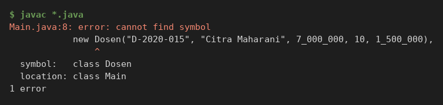

* **After** *(Kondisi akhir / Eksekusi berhasil)*:


### 1.6. File: `PegawaiHarian.java`
**Penjelasan Kode:**
> Turunan `Pegawai` yang menghitung gaji dari tarif per hari dikali jumlah hari kerja. Tarif per hari disimpan sebagai gaji pokok lewat `super(nip, nama, tarifPerHari)`, dan `hitungGaji()` di-override menjadi `super.hitungGaji() * jumlahHariKerja`. Jumlah hari kerja divalidasi agar tidak negatif.

**Bukti Eksekusi (Screenshot):**
* **Before** *(Kondisi awal / Kesalahan kompilasi)*:
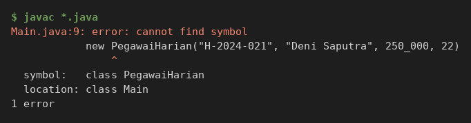

* **After** *(Kondisi akhir / Eksekusi berhasil)*:


### 1.7. File: `Main.java`
**Penjelasan Kode:**
> Membuat empat jenis pegawai (tetap, kontrak, dosen, harian), menyimpannya dalam satu daftar bertipe `Pegawai`, lalu menghitung gaji dan total gaji lewat perulangan yang sama untuk semua jenis. Bagian "Komposisi: profil pembayaran" memperlihatkan profil pembayaran Ani berubah dari `BELUM DIATUR` menjadi `BNI` saat program berjalan.

**Bukti Eksekusi (Screenshot):**
* **Before** *(Kondisi awal / Kesalahan kompilasi)*:


* **After** *(Kondisi akhir / Eksekusi berhasil)*:


### Output
**Output Program:**


---

## 2. Implementasi PHP

### 2.1. File: `Pegawai.php`
**Penjelasan Kode:**
> Seluruh hierarki PHP ditulis dalam satu berkas: `ProfilPembayaran` (final), `Pegawai` (abstract), `PegawaiTetap`, `PegawaiKontrak`, `Dosen`, dan `PegawaiHarian`. Properti dibuat lewat constructor promotion (`protected readonly`), pemanggilan constructor induk memakai `parent::__construct(...)`, dan pemanggilan method induk memakai `parent::hitungGaji()`. Method `jenis()` dideklarasikan `abstract public function jenis(): string`.

**Bukti Eksekusi (Screenshot):**
* **Before** *(Kondisi awal / Galat logika)*:
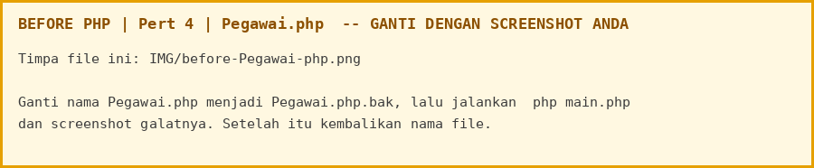

* **After** *(Kondisi akhir / Eksekusi berhasil)*:
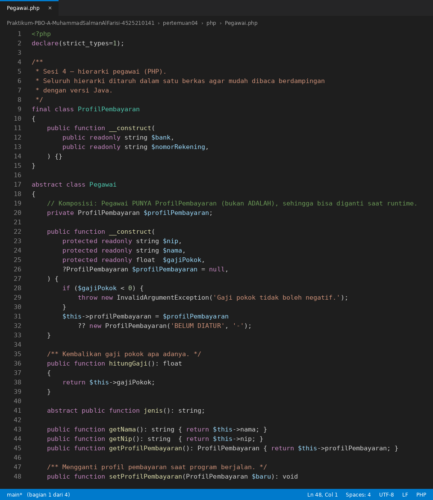


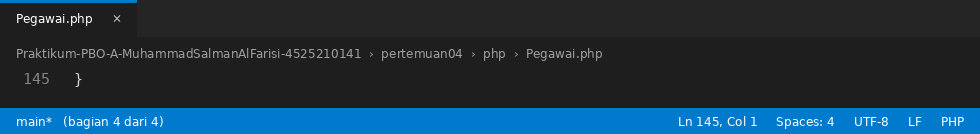

### 2.2. File: `main.php`
**Penjelasan Kode:**
> Memuat `Pegawai.php` dengan `require_once`, membuat empat jenis pegawai, lalu memprosesnya lewat satu array bertipe `Pegawai` dan menunjukkan perubahan profil pembayaran, sama seperti `Main.java`.

**Bukti Eksekusi (Screenshot):**
* **Before** *(Kondisi awal / Galat logika)*:
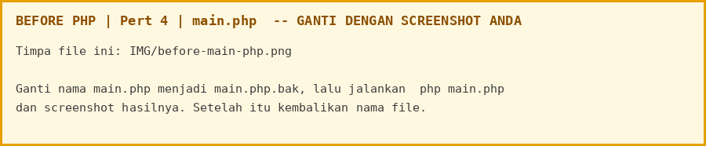

* **After** *(Kondisi akhir / Eksekusi berhasil)*:
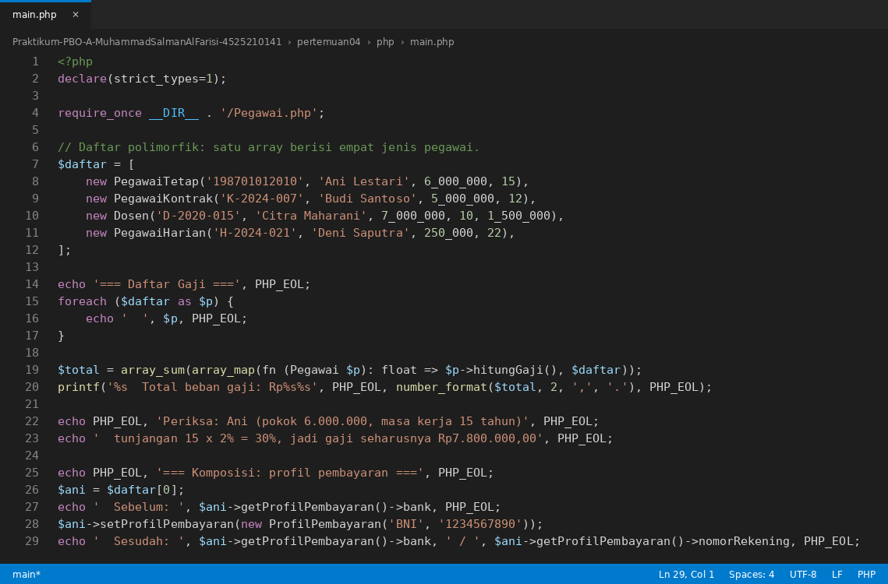

### Output
**Output Program:**


---

## 3. Kesimpulan
> Data dan perilaku yang sama pada semua pegawai ditulis sekali di kelas abstrak `Pegawai`, sedangkan aturan gaji yang berbeda ditaruh di kelas turunan. Semua jenis pegawai tetap bisa diproses lewat satu tipe `Pegawai`. Hubungan "adalah" memakai pewarisan, sedangkan hubungan "memiliki" (profil pembayaran) memakai komposisi.
>
> | Kelas | Induk | Aturan gaji |
> |---|---|---|
> | `Pegawai` (abstract) | - | Gaji pokok apa adanya |
> | `PegawaiTetap` | `Pegawai` | Gaji pokok + tunjangan masa kerja 2% per tahun, maksimal 40% |
> | `PegawaiKontrak` | `Pegawai` | Gaji pokok (tidak meng-override `hitungGaji()`) |
> | `Dosen` | `PegawaiTetap` | Gaji pegawai tetap + tunjangan fungsional |
> | `PegawaiHarian` | `Pegawai` | Tarif per hari x jumlah hari kerja |
> | `ProfilPembayaran` | - | Komposisi: setiap `Pegawai` memiliki satu profil pembayaran |
>
> | Konsep | Java | PHP |
> |---|---|---|
> | Mewarisi | `extends Pegawai` | `extends Pegawai` |
> | Constructor induk | `super(nip, nama, gajiPokok)` | `parent::__construct(...)` |
> | Method induk | `super.hitungGaji()` | `parent::hitungGaji()` |
> | Kelas abstrak | `abstract class` + `abstract String jenis()` | `abstract class` + `abstract function jenis()` |
>
> Pemeriksaan manual:
>
> | Pegawai | Perhitungan | Gaji |
> |---|---|---|
> | Ani (tetap) | 6.000.000 x (1 + 15 x 2% = 30%) | Rp7.800.000,00 |
> | Budi (kontrak) | gaji pokok | Rp5.000.000,00 |
> | Citra (dosen) | 7.000.000 x (1 + 10 x 2% = 20%) = 8.400.000, ditambah 1.500.000 | Rp9.900.000,00 |
> | Deni (harian) | 250.000 x 22 hari | Rp5.500.000,00 |
> | **Total** | 7.800.000 + 5.000.000 + 9.900.000 + 5.500.000 | **Rp28.200.000,00** |
>
> Percobaan: membuat objek `Pegawai` langsung (kelas abstrak ditolak) dan menghapus pemanggilan `super(...)`:
>
> 
> 
>
> Dokumen pendukung: [diagram.puml](diagram.puml) (class diagram), [justifikasi.md](justifikasi.md) (justifikasi pewarisan dan komposisi), [catatan.md](catatan.md), serta slide [materi-pertemuan04.pptx](materi-pertemuan04.pptx) dan [materi-inheritance.pptx](materi-inheritance.pptx).
>
> Cara menjalankan:
> ```cmd
> cd "Pert 4\java"
> javac *.java
> java Main
>
> cd ..\php
> php main.php
> ```
