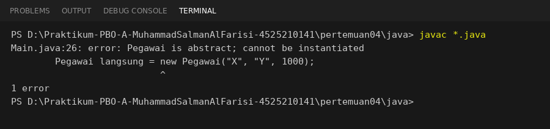
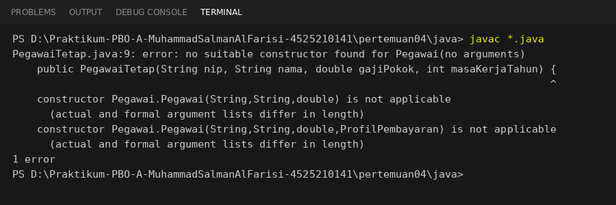

# Catatan

## 1. Apakah method `hitungGaji()` perlu di-override di `PegawaiKontrak`?
Tidak perlu. Pegawai kontrak tidak mendapat tunjangan masa kerja, jadi rumus dasar dari `Pegawai` (gaji = gaji pokok) sudah benar.
Method itu diwariskan apa adanya sehingga perilaku yang sama tidak ditulis ulang.
Sebaliknya, `PegawaiTetap`, `Dosen`, dan `PegawaiHarian` meng-override karena masing-masing punya komponen perhitungan tambahan.

## 2. Percobaan Langkah 1: membuat objek dari kelas abstract
**Percobaan:** mengaktifkan baris `Pegawai langsung = new Pegawai("X", "Y", 1000);` di `Main.java`.

**Pesan kompilator:**
```text
Main.java:26: error: Pegawai is abstract; cannot be instantiated
        Pegawai langsung = new Pegawai("X", "Y", 1000);
                           ^
1 error
```



**Kesimpulan:** kelas `abstract` tidak boleh di-`new` langsung karena ada method abstract (`jenis()`) yang belum punya isi.
Objek hanya bisa dibuat dari turunan yang sudah melengkapinya.

**Catatan tambahan:** baris contoh pada soal memakai kurung kurawal, yaitu
`new Pegawai("X", "Y", 1000) { public String jenis() { return "?"; } };`.
Bentuk itu lolos kompilasi karena membuat *kelas anonim* yang menjadi turunan `Pegawai` dan melengkapi `jenis()`.
Jadi yang dilarang adalah membuat objek `Pegawai` itu sendiri, bukan objek dari turunannya.

## 3. Percobaan Langkah 3: menghapus `super(...)` dari `PegawaiTetap`
**Percobaan:** menghapus baris `super(nip, nama, gajiPokok);` pada constructor `PegawaiTetap`.

**Pesan kompilator:**
```text
PegawaiTetap.java:9: error: no suitable constructor found for Pegawai(no arguments)
    public PegawaiTetap(String nip, String nama, double gajiPokok, int masaKerjaTahun) {
                                                                                       ^
    constructor Pegawai.Pegawai(String,String,double) is not applicable
      (actual and formal argument lists differ in length)
    constructor Pegawai.Pegawai(String,String,double,ProfilPembayaran) is not applicable
      (actual and formal argument lists differ in length)
1 error
```



**Kesimpulan:** jika constructor turunan tidak memanggil `super(...)` secara eksplisit, Java menyisipkan `super()` tanpa argumen.
`Pegawai` tidak punya constructor tanpa argumen, sehingga kompilasi gagal. Constructor induk harus dipanggil dengan data yang dibutuhkannya,
dan pemanggilan itu wajib menjadi pernyataan pertama di constructor turunan.
