# LAPORAN PRAKTIKUM PEMROGRAMAN BERBASIS OBJEK

| Informasi Praktikan | Keterangan |
| :--- | :--- |
| **Nama** | Muhammad Salman Al Farisi |
| **NPM** | 4525210141 |
| **Kelas** | A |
| **Mata Kuliah** | Pemrograman Berbasis Objek (PBO) |
| **Pertemuan** | 5 - Polimorfisme |
| **Tanggal** | 10 Oktober 2026 |

---

## 1. Implementasi Java

### 1.1. File: `BangunDatar.java`
**Penjelasan Kode:**
> Kelas abstrak yang menetapkan kontrak `luas()` dan `keliling()` untuk semua bangun datar. `toString()` ditulis sekali di induk dan memanggil `luas()` lewat `invokevirtual`, sehingga method yang berjalan ditentukan oleh **tipe objek**, bukan tipe variabel (dynamic dispatch). Alur penelusurannya ada di [penelusuran.md](penelusuran.md).

**Bukti Eksekusi (Screenshot):**
* **Before** *(Kondisi awal / Kesalahan kompilasi)*:
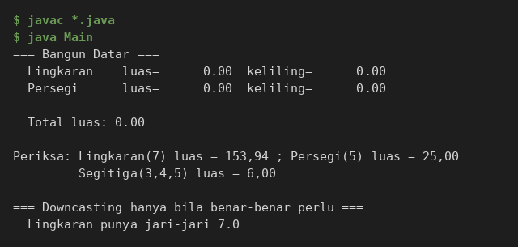

* **After** *(Kondisi akhir / Eksekusi berhasil)*:


### 1.2. File: `Lingkaran.java`
**Penjelasan Kode:**
> Turunan `BangunDatar`. Constructor menolak jari-jari yang tidak lebih besar dari 0. `luas()` = `Math.PI x r x r` dan `keliling()` = `2 x Math.PI x r`, keduanya ditandai `@Override`.

**Bukti Eksekusi (Screenshot):**
* **Before** *(Kondisi awal / Kesalahan kompilasi)*:


* **After** *(Kondisi akhir / Eksekusi berhasil)*:
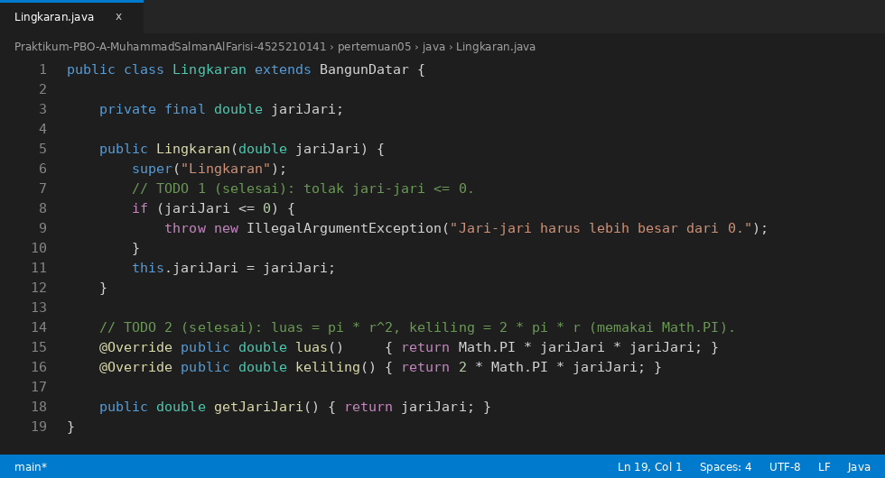

### 1.3. File: `Persegi.java`
**Penjelasan Kode:**
> Turunan `BangunDatar` dengan validasi sisi > 0. `luas()` = `sisi x sisi` dan `keliling()` = `4 x sisi`.

**Bukti Eksekusi (Screenshot):**
* **Before** *(Kondisi awal / Kesalahan kompilasi)*:


* **After** *(Kondisi akhir / Eksekusi berhasil)*:
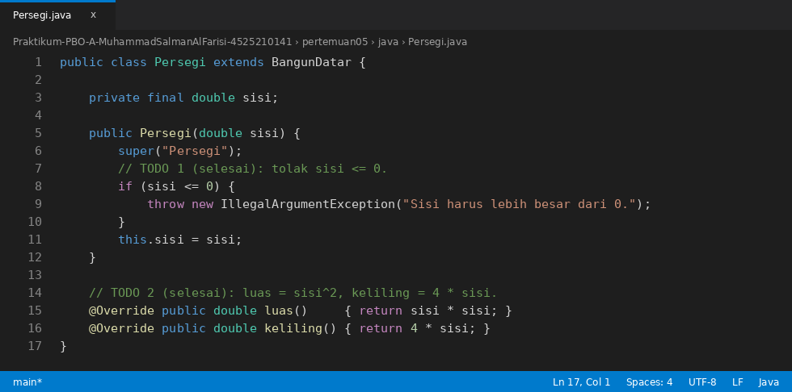

### 1.4. File: `Segitiga.java`
**Penjelasan Kode:**
> Turunan `BangunDatar` yang dibuat dari tiga sisi. Constructor menolak sisi yang tidak positif dan sisi yang tidak memenuhi syarat segitiga (jumlah dua sisi harus lebih besar dari sisi ketiga), sehingga rumus Heron tidak pernah menghasilkan `NaN`. `luas()` memakai rumus Heron dan `keliling()` = `a + b + c`. Menambah kelas ini hanya menambah satu baris objek di `Main`.

**Bukti Eksekusi (Screenshot):**
* **Before** *(Kondisi awal / Kesalahan kompilasi)*:
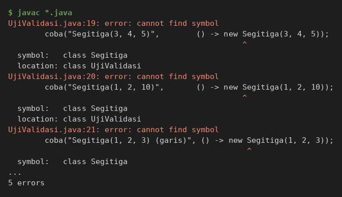

* **After** *(Kondisi akhir / Eksekusi berhasil)*:
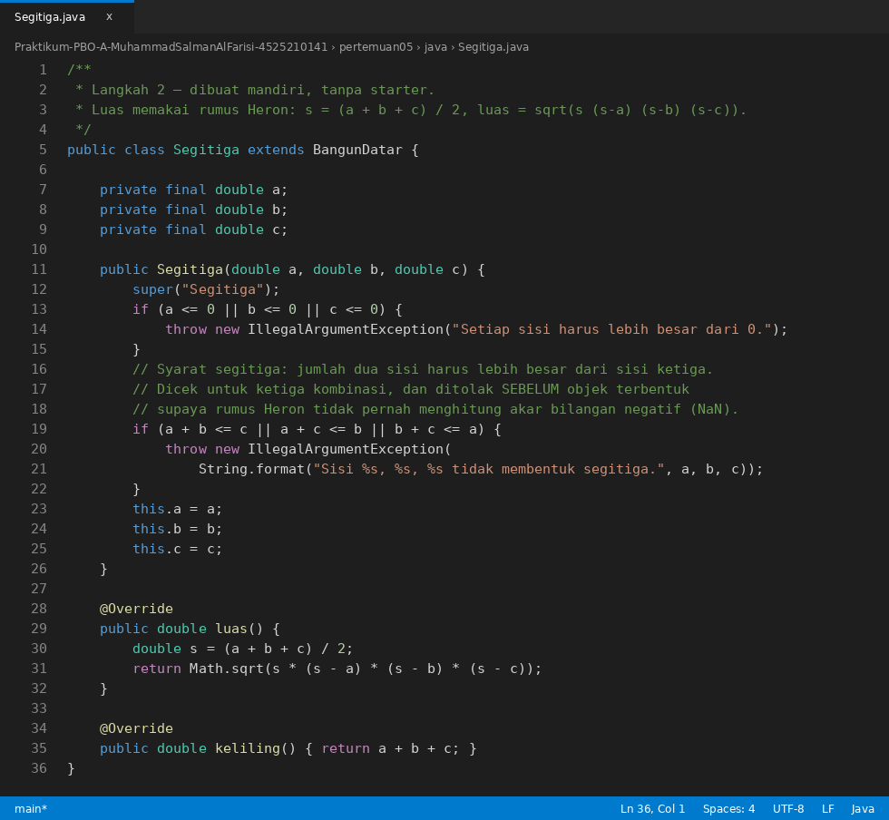

### 1.5. File: `Trapesium.java`
**Penjelasan Kode:**
> Turunan `BangunDatar` dengan lima ukuran: `alasAtas`, `alasBawah`, `tinggi`, `kakiKiri`, dan `kakiKanan`. Constructor menolak ukuran yang tidak positif dan kaki (sisi miring) yang lebih pendek dari tinggi. `luas()` = `(alasAtas + alasBawah) / 2 x tinggi` dan `keliling()` adalah jumlah keempat sisi. Bukti Open-Closed: kelas ini ditambahkan tanpa mengubah satu berkas lama pun.

**Bukti Eksekusi (Screenshot):**
* **Before** *(Kondisi awal / Kesalahan kompilasi)*:
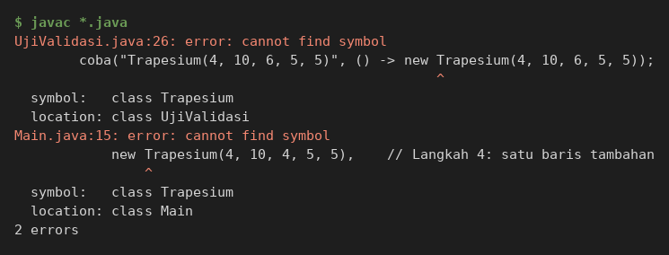

* **After** *(Kondisi akhir / Eksekusi berhasil)*:


### 1.6. File: `AntiPattern.java`
**Penjelasan Kode:**
> Contoh anti-pattern bawaan starter yang **tidak diubah**: total luas dihitung dengan rantai `instanceof` per jenis bangun. Setiap kali ada tipe baru, method `hitungLuas()` harus dibuka dan disisipi percabangan baru. Berkas ini dipertahankan sebagai pembanding bagi versi refaktor.

**Bukti Eksekusi (Screenshot):**
* **Before** *(Kondisi awal / Kesalahan kompilasi)*:
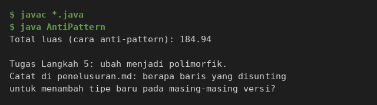

* **After** *(Kondisi akhir / Eksekusi berhasil)*:
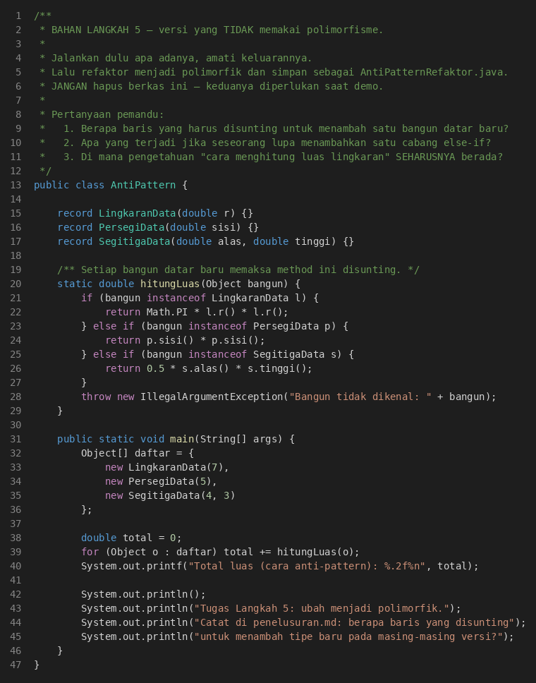

### 1.7. File: `AntiPatternRefaktor.java`
**Penjelasan Kode:**
> Versi refaktor dari `AntiPattern`: setiap record (`LingkaranData`, `PersegiData`, `SegitigaData`) mengimplementasikan interface `Bangun` dan menulis `luas()`-nya sendiri, sehingga rantai `instanceof` diganti satu perulangan `for (Bangun b : daftar) total += b.luas()`. Menambah tipe baru tidak menyentuh logika perhitungan. Kedua versi menghasilkan total luas yang sama (184,94).

**Bukti Eksekusi (Screenshot):**
* **Before** *(Kondisi awal / Kesalahan kompilasi)*:
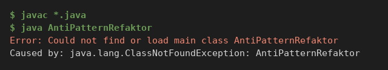

* **After** *(Kondisi akhir / Eksekusi berhasil)*:

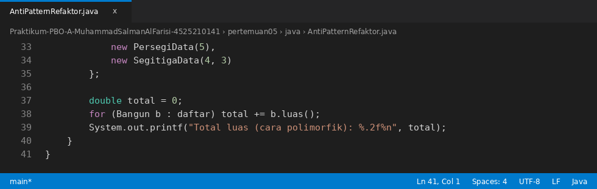

### 1.8. File: `UjiValidasi.java`
**Penjelasan Kode:**
> Program uji terpisah (supaya `Main.java` tidak perlu disunting) yang membuktikan bahwa konstruksi yang tidak sah ditolak **saat objek dibuat**: `Segitiga(1, 2, 10)`, `Segitiga(1, 2, 3)`, `Lingkaran(0)`, dan `Persegi(0)` ditolak, sedangkan `Segitiga(3, 4, 5)` diterima dengan luas 6,00.

**Bukti Eksekusi (Screenshot):**
* **Before** *(Kondisi awal / Kesalahan kompilasi)*:
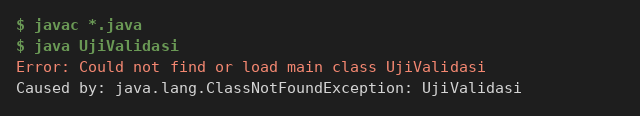

* **After** *(Kondisi akhir / Eksekusi berhasil)*:
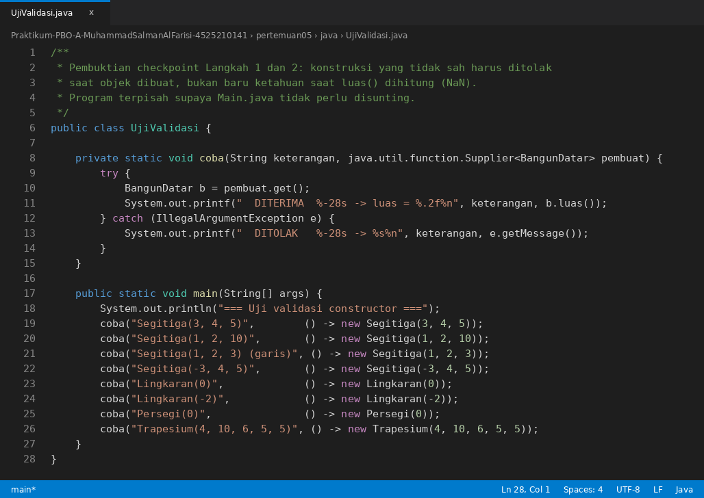

### 1.9. File: `Main.java`
**Penjelasan Kode:**
> Menyimpan semua bangun dalam satu array bertipe `BangunDatar[]` (upcasting) dan memprosesnya dengan perulangan yang sama tanpa satu pun pemeriksaan tipe. Perubahan dari starter hanya pada isi array (objek `Segitiga` dan `Trapesium` ditambahkan), sedangkan perulangan dan bagian downcasting tidak diubah. Downcasting dipakai hanya bila benar-benar perlu. Detail `diff` ada di [penelusuran.md](penelusuran.md).

**Bukti Eksekusi (Screenshot):**
* **Before** *(Kondisi awal / Kesalahan kompilasi)*:


* **After** *(Kondisi akhir / Eksekusi berhasil)*:
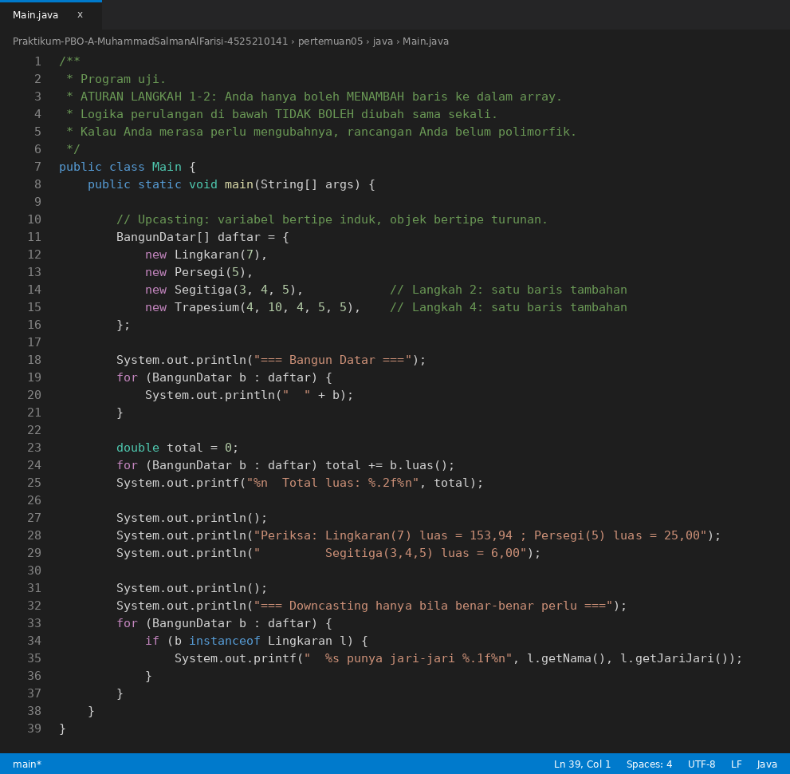

### 1.10. Tugas Rumah: hierarki Koleksi (`tugas-rumah/`)
**Penjelasan Kode:**
> Folder `tugas-rumah/` berisi `Koleksi` (abstrak) dengan turunan `Buku`, `Majalah`, dan `Skripsi`. Masing-masing meng-override `biayaKeterlambatan(int hariTerlambat)` dengan aturan berbeda: `Buku` Rp1.000 per hari, `Majalah` Rp500 per hari dengan 3 hari pertama bebas denda, dan `Skripsi` Rp5.000 per hari untuk 7 hari pertama lalu Rp50.000 per hari. `Main` memproses semuanya lewat tipe `Koleksi`. Hierarki Koleksi dibuat baru di folder ini karena pertemuan 4 membahas `Pegawai`.

**Bukti Eksekusi (Screenshot):**
* **Before** *(Kondisi awal / Kesalahan kompilasi)*:
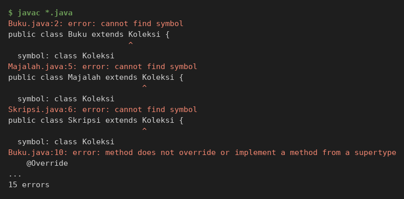

* **After** *(Kondisi akhir / Eksekusi berhasil)*:
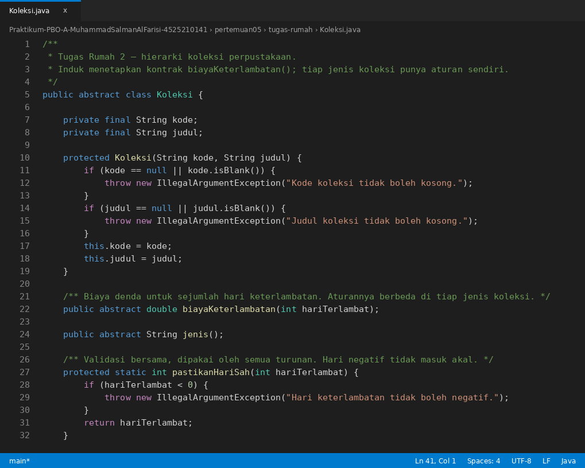


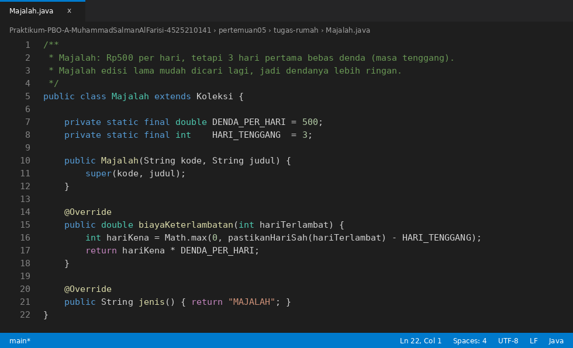
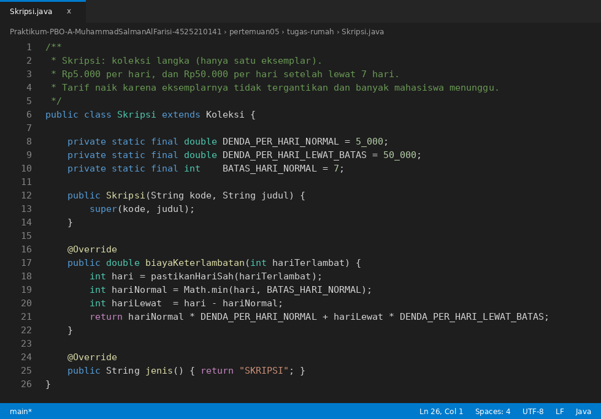


* **Output** *(`java Main (folder tugas-rumah)`)*:


### Output
**Output Program:**

`java Main`


`java UjiValidasi`


`java AntiPattern dan java AntiPatternRefaktor`

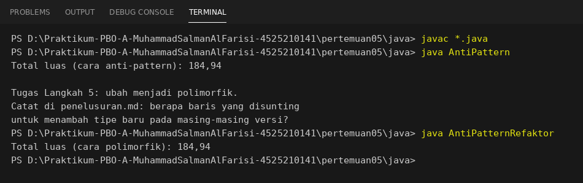

---

## 2. Implementasi PHP

### 2.1. File: `BangunDatar.php`
**Penjelasan Kode:**
> Padanan PHP dari seluruh hierarki bangun datar dalam satu berkas: `abstract class BangunDatar` dengan `abstract public function luas(): float` dan `keliling(): float`, serta `Lingkaran`, `Persegi`, `Segitiga`, dan `Trapesium`. Overriding tidak memakai anotasi, cetak objek memakai `__toString()`, validasi memakai `InvalidArgumentException`, dan konstanta pi memakai `M_PI`.

**Bukti Eksekusi (Screenshot):**
* **Before** *(Kondisi awal / Galat logika)*:
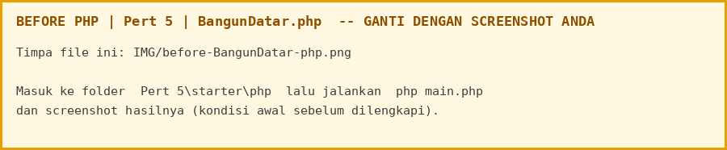

* **After** *(Kondisi akhir / Eksekusi berhasil)*:


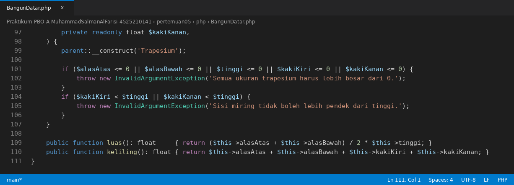

### 2.2. File: `notifikasi.php`
**Penjelasan Kode:**
> Hierarki `Notifikasi` (abstrak) dengan turunan `Email`, `SMS`, dan `WhatsApp`, masing-masing punya `kirim(string $pesan)` dengan format berbeda. Fungsi `kirimSemua(array $daftar, string $pesan)` hanya berisi `foreach` yang memanggil `$notifikasi->kirim($pesan)`, tanpa `instanceof`, `match`, maupun `switch` atas jenis notifikasi. Kelas `Telegram` ditambahkan sebagai bukti Open-Closed: `kirimSemua` tidak perlu diubah.

**Bukti Eksekusi (Screenshot):**
* **Before** *(Kondisi awal / Galat logika)*:
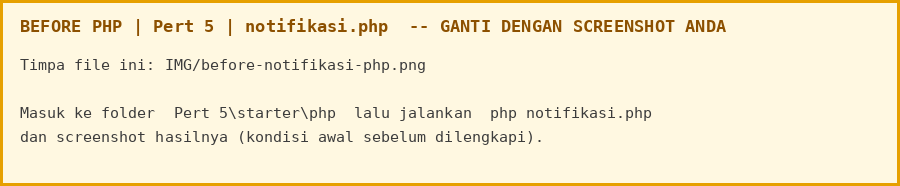

* **After** *(Kondisi akhir / Eksekusi berhasil)*:

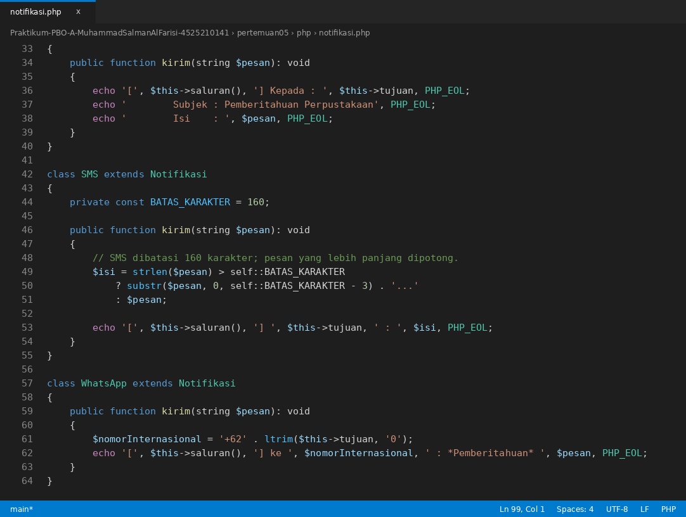
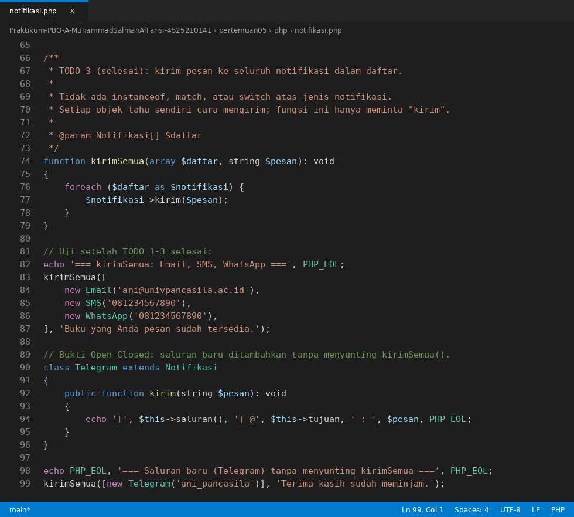

### 2.3. File: `uji-validasi.php`
**Penjelasan Kode:**
> Padanan PHP dari `UjiValidasi.java`: membuktikan bahwa `Segitiga(1, 2, 10)`, `Segitiga(1, 2, 3)`, `Lingkaran(0)`, `Persegi(-5)`, dan trapesium dengan sisi miring terlalu pendek ditolak oleh constructor.

**Bukti Eksekusi (Screenshot):**
* **Before** *(Kondisi awal / Galat logika)*:
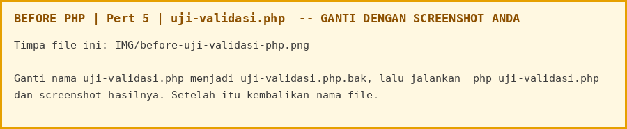

* **After** *(Kondisi akhir / Eksekusi berhasil)*:


### 2.4. File: `main.php`
**Penjelasan Kode:**
> Padanan PHP dari `Main.java`: array berisi `Lingkaran`, `Persegi`, `Segitiga`, dan `Trapesium` diproses oleh satu perulangan yang memanggil `luas()` dan `keliling()`, lalu mencetak total luas.

**Bukti Eksekusi (Screenshot):**
* **Before** *(Kondisi awal / Galat logika)*:
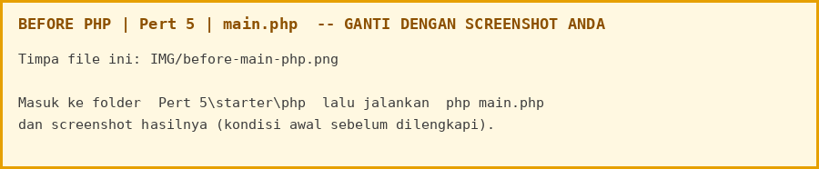

* **After** *(Kondisi akhir / Eksekusi berhasil)*:
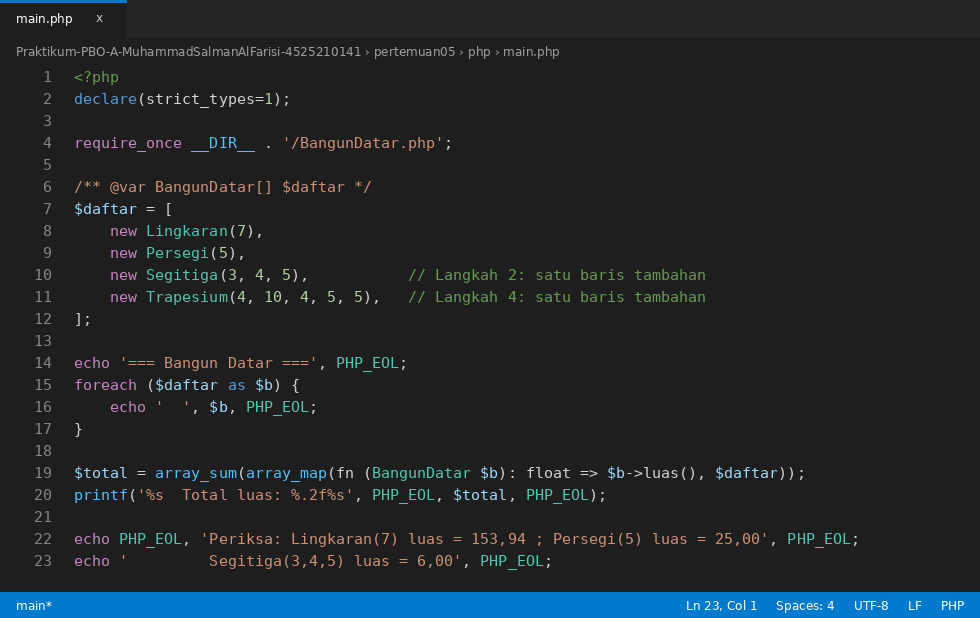

### Output
**Output Program:**

`php main.php`

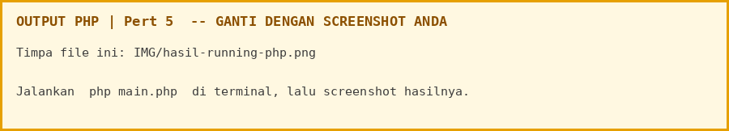

`php uji-validasi.php`

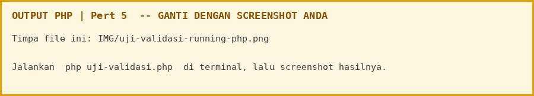

`php notifikasi.php`

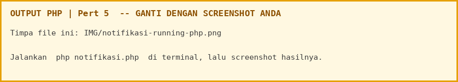

**Keluaran yang diharapkan:**

`php main.php`
```text
=== Bangun Datar ===
  Lingkaran    luas=    153.94  keliling=     43.98
  Persegi      luas=     25.00  keliling=     20.00
  Segitiga     luas=      6.00  keliling=     12.00
  Trapesium    luas=     28.00  keliling=     24.00

  Total luas: 212.94

Periksa: Lingkaran(7) luas = 153,94 ; Persegi(5) luas = 25,00
         Segitiga(3,4,5) luas = 6,00
```

`php uji-validasi.php`
```text
=== Uji validasi constructor ===
  DITERIMA  Segitiga(3, 4, 5)          -> luas = 6.00
  DITOLAK   Segitiga(1, 2, 10)         -> Sisi 1, 2, 10 tidak membentuk segitiga.
  DITOLAK   Segitiga(1, 2, 3) (garis)  -> Sisi 1, 2, 3 tidak membentuk segitiga.
  DITOLAK   Lingkaran(0)               -> Jari-jari harus lebih besar dari 0.
  DITOLAK   Persegi(-5)                -> Sisi harus lebih besar dari 0.
  DITOLAK   Trapesium(4,10,6,5,5)      -> Sisi miring tidak boleh lebih pendek dari tinggi.
```

`php notifikasi.php`
```text
=== kirimSemua: Email, SMS, WhatsApp ===
[Email] Kepada : ani@univpancasila.ac.id
        Subjek : Pemberitahuan Perpustakaan
        Isi    : Buku yang Anda pesan sudah tersedia.
[SMS] 081234567890 : Buku yang Anda pesan sudah tersedia.
[WhatsApp] ke +6281234567890 : *Pemberitahuan* Buku yang Anda pesan sudah tersedia.

=== Saluran baru (Telegram) tanpa menyunting kirimSemua ===
[Telegram] @ani_pancasila : Terima kasih sudah meminjam.
```

---

## 3. Kesimpulan
> Polimorfisme membuat `Main` cukup memegang tipe induk `BangunDatar` (upcasting): method yang berjalan dipilih saat program berjalan berdasarkan tipe objek (dynamic dispatch), bukan tipe variabel. Menambah bangun baru (`Segitiga`, `Trapesium`) cukup membuat kelas baru dan menambah satu baris objek, sedangkan logika perulangan tidak berubah (Open-Closed Principle).
>
> | Bangun | Perhitungan luas | Luas | Keliling |
> |---|---|---|---|
> | Lingkaran(7) | 3,14159... x 7 x 7 | 153,94 | 2 x 3,14159... x 7 = 43,98 |
> | Persegi(5) | 5 x 5 | 25,00 | 4 x 5 = 20,00 |
> | Segitiga(3, 4, 5) | s = 6, luas = akar(6 x 3 x 2 x 1) = akar(36) | 6,00 | 3 + 4 + 5 = 12,00 |
> | Trapesium(4, 10, 4, 5, 5) | (4 + 10) / 2 x 4 | 28,00 | 4 + 10 + 5 + 5 = 24,00 |
> | **Total luas** | 153,94 + 25,00 + 6,00 + 28,00 | **212,94** | |
>
> | Konsep | Java | PHP |
> |---|---|---|
> | Kelas abstrak | `abstract class BangunDatar` | `abstract class BangunDatar` |
> | Method kontrak | `public abstract double luas();` | `abstract public function luas(): float;` |
> | Overriding | `@Override public double luas()` | `public function luas(): float` (tanpa anotasi) |
> | Upcasting | `BangunDatar[] daftar = { new Lingkaran(7), ... }` | `$daftar = [new Lingkaran(7), ...]` |
> | Cetak objek | `toString()` | `__toString()` |
> | Validasi | `IllegalArgumentException` | `InvalidArgumentException` |
> | Konstanta pi | `Math.PI` | `M_PI` |
>
> Refaktor `AntiPattern` menjadi `AntiPatternRefaktor`:
>
> | Menambah satu tipe baru | `AntiPattern.java` | `AntiPatternRefaktor.java` |
> |---|---|---|
> | Baris yang disisipkan ke logika lama | 2 | 0 |
> | Method lama yang harus dibuka | `hitungLuas()` | tidak ada |
> | Bila lupa melengkapi | Galat baru muncul saat berjalan | Ditolak saat kompilasi |
>
> Latihan mandiri (lihat [percobaan-mandiri.md](percobaan-mandiri.md)): method `static hitungLuas()` di induk dan "override" di `Lingkaran` menunjukkan static binding (hiding, bukan overriding), dan `BangunDatar[]` yang diganti `Object[]` ditolak kompilator karena kontrak hilang.
>
> 
> 
> 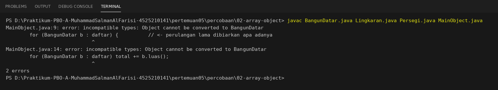
> 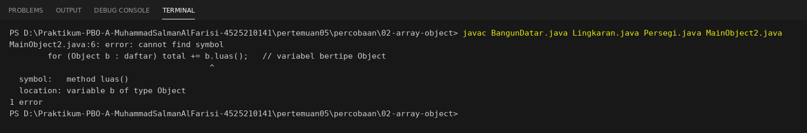
> 
> 
> 
> 
> 
>
> Pemeriksaan manual tugas rumah (terlambat 10 hari): Buku 10 x 1.000 = Rp10.000, Majalah (10 - 3) x 500 = Rp3.500, Skripsi 7 x 5.000 + 3 x 50.000 = Rp185.000, total Rp198.500.
>
> Dokumen pendukung: [penelusuran.md](penelusuran.md), [refleksi.md](refleksi.md), [percobaan-mandiri.md](percobaan-mandiri.md), [persiapan-demo.md](persiapan-demo.md), [diagram.puml](diagram.puml), [sekuens-dispatch.puml](sekuens-dispatch.puml), [diagram-notifikasi.puml](diagram-notifikasi.puml), folder [percobaan/](percobaan/) dan [starter/](starter/), serta slide [materi-pertemuan05.pptx](materi-pertemuan05.pptx).
>
> Cara menjalankan:
> ```cmd
> cd "Pert 5\java"
> javac *.java
> java Main
> java UjiValidasi
> java AntiPattern
> java AntiPatternRefaktor
>
> cd ..\tugas-rumah
> javac *.java
> java Main
>
> cd ..\php
> php main.php
> php uji-validasi.php
> php notifikasi.php
> ```
