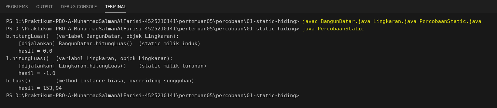
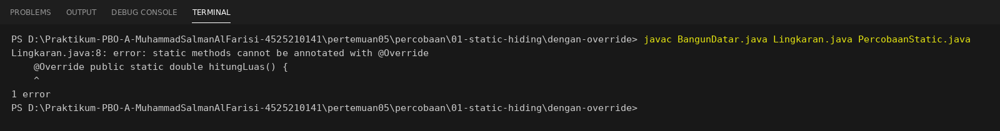

# Hasil Latihan Mandiri di Lab
**Materi:** Polimorfisme (Pertemuan 5)

Seluruh percobaan memakai salinan kode di folder `percobaan/`, sehingga berkas di `java/` tidak berubah.

---

## 1. Method `static` pada `BangunDatar`, lalu "di-override" di `Lingkaran`

**Percobaan** (`percobaan/01-static-hiding/`): `BangunDatar` diberi `public static double hitungLuas()`, dan `Lingkaran` menulis method static dengan nama dan tanda tangan yang sama. Lalu dipanggil lewat dua variabel:

```java
BangunDatar b = new Lingkaran(7);   // tipe variabel BangunDatar, objek Lingkaran
Lingkaran   l = new Lingkaran(7);   // tipe variabel Lingkaran,   objek Lingkaran
b.hitungLuas();
l.hitungLuas();
```

**Hasil:**
```text
b.hitungLuas()  (variabel BangunDatar, objek Lingkaran):
    [dijalankan] BangunDatar.hitungLuas()  (static milik induk)
    hasil = 0.0
l.hitungLuas()  (variabel Lingkaran, objek Lingkaran):
    [dijalankan] Lingkaran.hitungLuas()    (static milik turunan)
    hasil = -1.0
b.luas()        (method instance biasa, overriding sungguhan):
    hasil = 153,94
```



Jika `@Override` ditambahkan pada method static di `Lingkaran`, kompilasi gagal:

```text
Lingkaran.java:8: error: static methods cannot be annotated with @Override
    @Override public static double hitungLuas() {
    ^
1 error
```



**Penjelasan:** objek yang sama (`Lingkaran`) memanggil method yang berbeda tergantung **tipe variabel**. Method `static` milik kelas, bukan milik objek, sehingga tidak ada dynamic dispatch. Kompilator memilih method saat kompilasi berdasarkan tipe variabel (*static binding*). Method static di `Lingkaran` hanya **menutupi** (*hiding*) method milik induk, dan bukan *overriding*. Pada overriding biasa (`b.luas()`), JVM memilih berdasarkan **tipe objek** sehingga hasilnya 153,94 walaupun variabelnya bertipe `BangunDatar`.

---

## 2. Mengubah `BangunDatar[]` di `Main` menjadi `Object[]`

**Percobaan** (`percobaan/02-array-object/`): array diubah menjadi `Object[] daftar = { new Lingkaran(7), new Persegi(5) };` tanpa mengubah perulangan.

**Yang rusak (1):** perulangan lama `for (BangunDatar b : daftar)`

```text
MainObject.java:9: error: incompatible types: Object cannot be converted to BangunDatar
        for (BangunDatar b : daftar) {
                             ^
MainObject.java:14: error: incompatible types: Object cannot be converted to BangunDatar
        for (BangunDatar b : daftar) total += b.luas();
                             ^
2 errors
```

![Percobaan Object[] (1)](IMG/percobaan-array-object-1.png)

**Yang rusak (2):** jika perulangan juga diganti menjadi `for (Object b : daftar)`, pemanggilan `b.luas()` gagal:

```text
MainObject2.java:6: error: cannot find symbol
        for (Object b : daftar) total += b.luas();   // variabel bertipe Object
                                          ^
  symbol:   method luas()
  location: variable b of type Object
1 error
```

![Percobaan Object[] (2)](IMG/percobaan-array-object-2.png)

**Penjelasan:** kompilator hanya melihat **tipe variabel**. Variabel bertipe `Object` hanya boleh memanggil method milik `Object`, dan `luas()` tidak termasuk di dalamnya.
Polimorfisme bekerja lewat tipe induk yang **mendeklarasikan kontrak** (`BangunDatar.luas()`). Jika tipenya dilonggarkan menjadi `Object`, kontraknya hilang. Satu-satunya jalan adalah downcasting dengan `instanceof` untuk setiap tipe, yaitu persis rantai anti-pattern pada `AntiPattern.java`.
