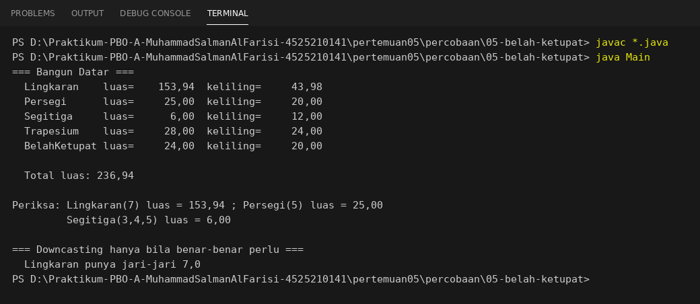
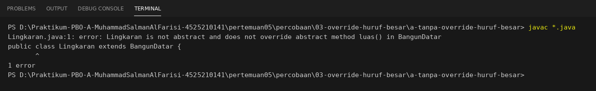
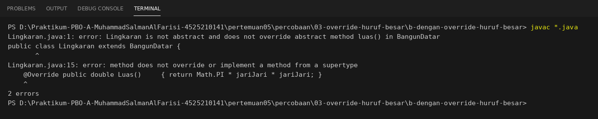
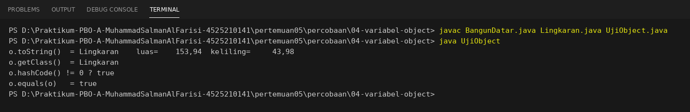
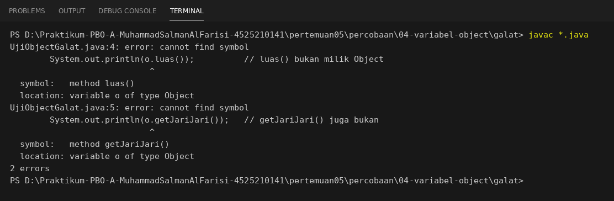

# Persiapan Demo Pertemuan 5
Jawaban untuk tujuh pertanyaan demo di modul (bagian I). Semua jawaban sudah dicoba pada kode di folder ini.
Pelajari alurnya, lalu coba jalankan sendiri sebelum demo. Modul menegaskan bahwa kode yang tidak dapat dijelaskan tidak dinilai.

## 1. Tipe variabel, tipe objek, dan mana yang menentukan method yang dijalankan
Pada `for (BangunDatar b : daftar)`, tipe **variabel** `b` selalu `BangunDatar`. Tipe **objek**-nya berganti: `Lingkaran`, `Persegi`, `Segitiga`, lalu `Trapesium`.
Yang menentukan method mana yang dijalankan adalah **tipe objek**. Tipe variabel hanya menentukan method apa yang boleh dipanggil. Bukti: `penelusuran.md`, Langkah 3.

## 2. Bagaimana `toString()` di induk bisa memanggil `luas()` yang isinya ada di turunan?
Kompilator hanya memeriksa bahwa `luas()` ada di `BangunDatar` (sebagai method abstrak). Di bytecode, pemanggilannya adalah `invokevirtual BangunDatar.luas()`.
Saat berjalan, JVM melihat kelas asli dari `this` (misalnya `Lingkaran`) lalu menjalankan `Lingkaran.luas()`. Induk hanya bergantung pada kontrak, tidak pada nama turunan.

## 3. "Tambahkan BelahKetupat sekarang. Berkas mana yang berubah?"
Hanya **satu berkas baru** (`BelahKetupat.java`) dan **satu baris** tambahan di array `Main.java`. Tidak ada kelas lama yang logikanya diubah.

```java
public class BelahKetupat extends BangunDatar {
    private final double diagonal1;
    private final double diagonal2;
    private final double sisi;

    public BelahKetupat(double diagonal1, double diagonal2) {
        super("BelahKetupat");
        if (diagonal1 <= 0 || diagonal2 <= 0) {
            throw new IllegalArgumentException("Diagonal harus lebih besar dari 0.");
        }
        this.diagonal1 = diagonal1;
        this.diagonal2 = diagonal2;
        this.sisi = Math.sqrt(Math.pow(diagonal1 / 2, 2) + Math.pow(diagonal2 / 2, 2));
    }

    @Override public double luas()     { return diagonal1 * diagonal2 / 2; }
    @Override public double keliling() { return 4 * sisi; }
}
```

Baris di `Main.java`: `new BelahKetupat(6, 8),`. Hasil percobaan (`percobaan/05-belah-ketupat/`): luas 24,00 dan keliling 20,00, total luas menjadi 236,94.



## 4. Bandingkan `AntiPattern.java` dan `AntiPatternRefaktor.java`
Untuk menambah tipe baru: versi anti-pattern perlu **2 baris di dalam method lama** `hitungLuas()` (ditambah 1 baris deklarasi dan 2 baris data). Versi refaktor perlu **0 baris pada kode lama** (hanya tipe baru ditambah 2 baris data). Tabel lengkap ada di `penelusuran.md`, Langkah 5.

## 5. Hapus `@Override`, ubah nama menjadi `Luas()`, lalu kembalikan `@Override`
Percobaan di `percobaan/03-override-huruf-besar/`.

**a. Tanpa `@Override`, nama `Luas()`:**
```text
Lingkaran.java:1: error: Lingkaran is not abstract and does not override abstract method luas() in BangunDatar
```
Java membedakan huruf besar dan kecil, jadi `Luas()` adalah method **baru**, bukan override. `luas()` yang abstrak belum diimplementasikan sehingga kompilasi gagal. (Seandainya `luas()` di induk tidak abstrak, kode tetap lolos kompilasi dan hasilnya diam-diam salah, sesuai gejala "semua bangun mencetak luas 0" di bagian J modul.)

**b. `@Override` dikembalikan, nama tetap `Luas()`:**
```text
Lingkaran.java:1: error: Lingkaran is not abstract and does not override abstract method luas() in BangunDatar
Lingkaran.java:15: error: method does not override or implement a method from a supertype
    @Override public double Luas() ...
2 errors
```
Kini kompilator menunjuk **baris yang salah** (baris 15) karena `@Override` menyatakan niat meng-override. Setelah nama dikembalikan menjadi `luas()`, kompilasi berhasil lagi. Itulah gunanya `@Override`.




## 6. Mengapa `kirimSemua` (PHP) tidak perlu tahu jenis notifikasinya?
`kirimSemua` hanya memanggil `$notifikasi->kirim($pesan)`. Method `kirim()` dideklarasikan abstrak di `Notifikasi`, dan setiap turunan (`Email`, `SMS`, `WhatsApp`) mengisinya sendiri. PHP memilih implementasi berdasarkan kelas objek yang sebenarnya saat program berjalan.
Buktinya, kelas `Telegram` di akhir `notifikasi.php` ditambahkan tanpa menyunting `kirimSemua`.

## 7. `Lingkaran` disimpan di variabel bertipe `Object`: method apa yang masih boleh dipanggil?
Hanya method milik `Object`: `toString()`, `equals()`, `hashCode()`, `getClass()`, `wait()`, `notify()`, dan `notifyAll()`. Alasannya, kompilator hanya melihat **tipe variabel**.
`luas()` dan `getJariJari()` tidak boleh dipanggil (`cannot find symbol`). Walaupun begitu, `toString()` yang berjalan tetap `BangunDatar.toString()` karena dynamic dispatch memilih berdasarkan tipe objek.

```text
o.toString()  = Lingkaran    luas=    153,94  keliling=     43,98
o.getClass()  = Lingkaran
o.equals(o)   = true
```
```text
UjiObjectGalat.java:4: error: cannot find symbol
        System.out.println(o.luas());          // luas() bukan milik Object
  symbol:   method luas()
  location: variable o of type Object
```




---

## Riwayat commit (syarat luaran)
Modul meminta riwayat commit yang menunjukkan proses pengerjaan, bukan satu commit di akhir. Saran urutan commit:

1. `Pertemuan 5: salin starter` (folder `starter/`, `AntiPattern.java`, `BangunDatar.java`, `Main.java`)
2. `Langkah 1: lengkapi Lingkaran dan Persegi`
3. `Langkah 2: tambah Segitiga (rumus Heron + validasi)`
4. `Langkah 3: penelusuran dynamic dispatch`
5. `Langkah 4: tambah Trapesium tanpa menyunting Main`
6. `Langkah 5: refaktor AntiPattern menjadi polimorfik`
7. `Langkah 6: padanan PHP dan notifikasi.php`
8. `Latihan mandiri, refleksi, dan tugas rumah`
