# LAPORAN PRAKTIKUM PEMROGRAMAN BERBASIS OBJEK

| Informasi Praktikan | Keterangan |
| :--- | :--- |
| **Nama** | Muhammad Salman Al Farisi |
| **NPM** | 4525210141 |
| **Kelas** | A |
| **Mata Kuliah** | Pemrograman Berbasis Objek (PBO) |
| **Pertemuan** | 6 - Abstract Class, Interface, Enum, dan Trait |
| **Tanggal** | 10 Oktober 2026 |

---

## 1. Implementasi Java

### 1.1. File: `Movable.java`
**Penjelasan Kode:**
> Interface untuk kemampuan bergerak: `bergerak()` dan `kecepatanMaksimum()`, ditambah `default` method `ringkasanGerak()` yang menyusun teks "kecepatan maksimum ... km/jam" dari `kecepatanMaksimum()`. Method default boleh ditimpa implementornya (dipakai `Sepeda`). Keputusan memilih interface atau abstract class ditulis di [keputusan.md](keputusan.md).

**Bukti Eksekusi (Screenshot):**
* **Before** *(Kondisi awal / Kesalahan kompilasi)*:


* **After** *(Kondisi akhir / Eksekusi berhasil)*:


### 1.2. File: `Fuelable.java`
**Penjelasan Kode:**
> Interface untuk kemampuan diisi bahan bakar: `isiBahanBakar(jumlah)`, `kapasitasTangki()`, dan `tipeBahanBakar()`. Dipisah dari `Movable` karena tidak semua yang bergerak butuh bahan bakar (sepeda), dan tidak semua yang butuh bahan bakar bergerak (genset). Ini penerapan *Interface Segregation Principle*.

**Bukti Eksekusi (Screenshot):**
* **Before** *(Kondisi awal / Kesalahan kompilasi)*:
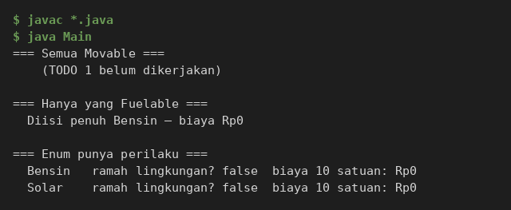

* **After** *(Kondisi akhir / Eksekusi berhasil)*:
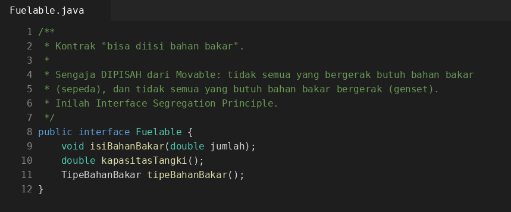

### 1.3. File: `TipeBahanBakar.java`
**Penjelasan Kode:**
> Enum dengan perilaku: `BENSIN` (12.000), `SOLAR` (10.500), dan `LISTRIK` (2.500), masing-masing membawa label dan harga. Method `biayaPengisian(jumlah)` menghitung biaya dan menolak jumlah negatif, sedangkan `ramahLingkungan()` hanya bernilai `true` untuk `LISTRIK`. Dengan enum, nilai yang tidak terdaftar ditolak kompilator, tidak seperti konstanta `int`.

**Bukti Eksekusi (Screenshot):**
* **Before** *(Kondisi awal / Kesalahan kompilasi)*:


* **After** *(Kondisi akhir / Eksekusi berhasil)*:


### 1.4. File: `Kendaraan.java`
**Penjelasan Kode:**
> Abstract class yang menjawab "apa benda ini": menampung kode yang benar-benar sama di semua kendaraan (`merek`, `tahun`, `umur()`), dengan `jumlahRoda()` abstrak. Constructor menolak merek kosong dan tahun <= 0. `umur()` memakai `Math.max(0, ...)` supaya tidak pernah negatif.

**Bukti Eksekusi (Screenshot):**
* **Before** *(Kondisi awal / Kesalahan kompilasi)*:


* **After** *(Kondisi akhir / Eksekusi berhasil)*:
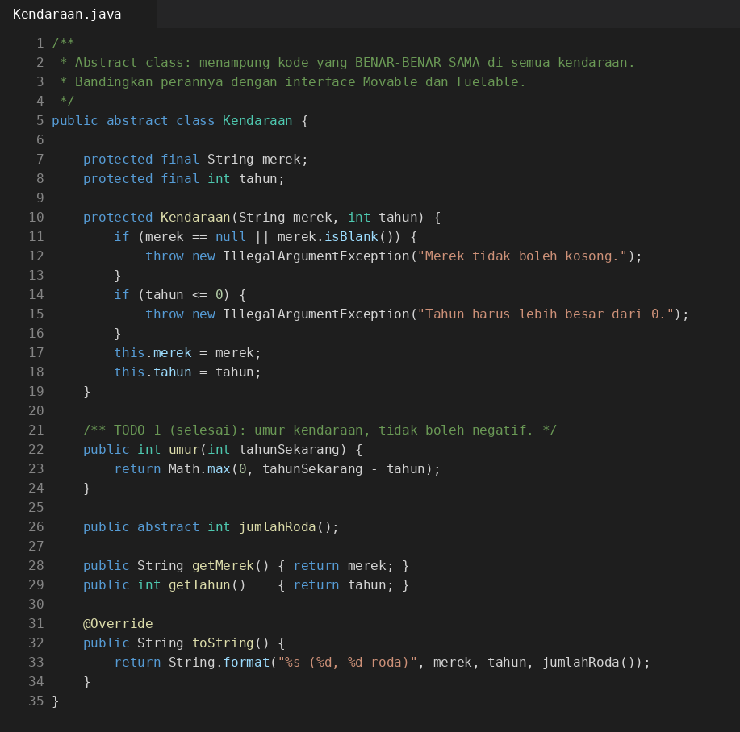

### 1.5. File: `Mobil.java`
**Penjelasan Kode:**
> `Mobil extends Kendaraan implements Movable, Fuelable`: mewarisi satu class dan mengimplementasikan dua interface. `isiBahanBakar` menolak jumlah <= 0 dan jumlah yang membuat isi melebihi kapasitas tangki, dan constructor menolak kapasitas tangki <= 0. Satu objek `Mobil` bisa ditampung variabel bertipe `Kendaraan`, `Movable`, maupun `Fuelable`.

**Bukti Eksekusi (Screenshot):**
* **Before** *(Kondisi awal / Kesalahan kompilasi)*:


* **After** *(Kondisi akhir / Eksekusi berhasil)*:
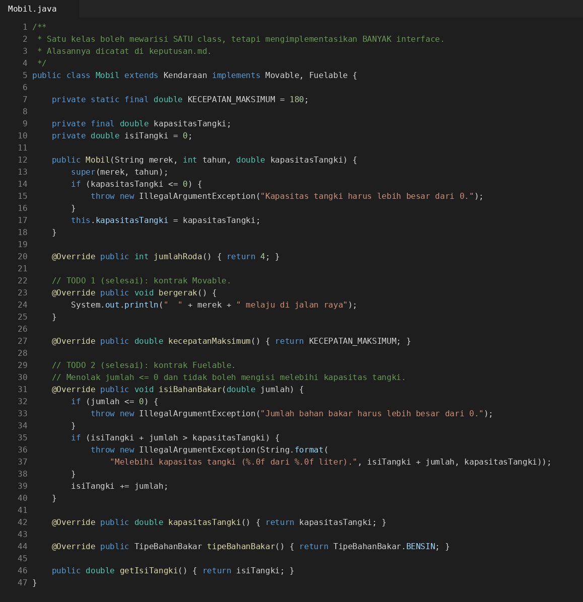

### 1.6. File: `Sepeda.java`
**Penjelasan Kode:**
> `Sepeda extends Kendaraan implements Movable` dan **bukan** `Fuelable`, sehingga `isiPenuh(sepeda)` ditolak kompilator (pesan galat dicatat di [percobaan/01-sepeda-ditolak/](percobaan/01-sepeda-ditolak/)). `ringkasanGerak()` ditimpa dengan memanggil `Movable.super.ringkasanGerak()` lalu menambah keterangan tenaga pengayuh (latihan mandiri E1).

**Bukti Eksekusi (Screenshot):**
* **Before** *(Kondisi awal / Kesalahan kompilasi)*:
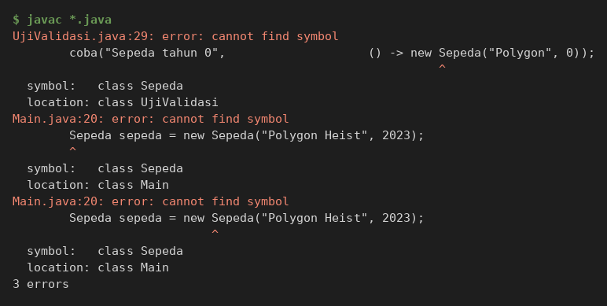

* **After** *(Kondisi akhir / Eksekusi berhasil)*:
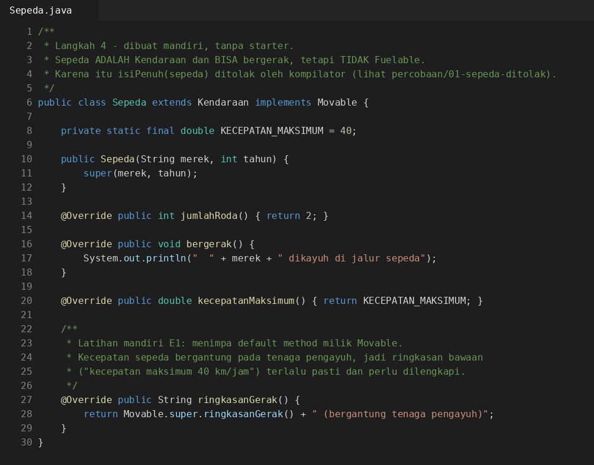

### 1.7. File: `Genset.java`
**Penjelasan Kode:**
> `Genset implements Fuelable` tanpa menjadi `Kendaraan` dan tanpa `Movable`: ia butuh bahan bakar tetapi tidak bergerak. Dipakai sebagai bukti bahwa `isiPenuh(Fuelable)` menerima kelas yang tidak sekerabat selama memenuhi kontraknya.

**Bukti Eksekusi (Screenshot):**
* **Before** *(Kondisi awal / Kesalahan kompilasi)*:
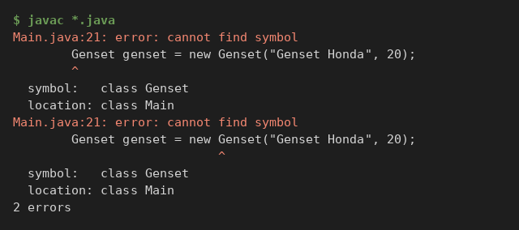

* **After** *(Kondisi akhir / Eksekusi berhasil)*:
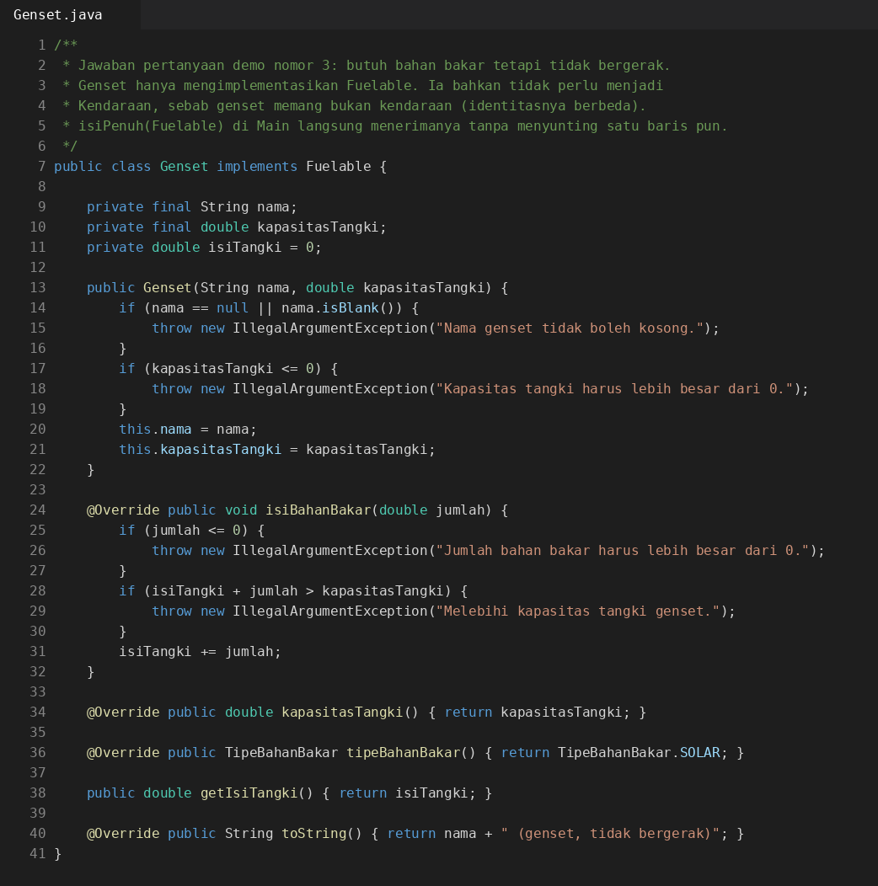

### 1.8. File: `UjiValidasi.java`
**Penjelasan Kode:**
> Program uji terpisah (supaya `Main.java` tidak perlu disunting) yang membuktikan setiap aturan ditolak: pengisian 0 atau negatif, melebihi kapasitas tangki, merek kosong, tahun 0, kapasitas tangki 0, `biayaPengisian(-1)`, dan bahwa `umur()` tidak pernah negatif.

**Bukti Eksekusi (Screenshot):**
* **Before** *(Kondisi awal / Kesalahan kompilasi)*:


* **After** *(Kondisi akhir / Eksekusi berhasil)*:


### 1.9. File: `Main.java`
**Penjelasan Kode:**
> Menunjukkan satu objek `Mobil` dengan tiga tipe variabel, memproses semua `Movable`, memproses hanya yang `Fuelable` lewat `isiPenuh(Fuelable)`, dan memamerkan perilaku enum `TipeBahanBakar`. Pemanggilan `isiPenuh(sepeda)` sengaja dibiarkan menjadi komentar supaya program tetap bisa dikompilasi.

**Bukti Eksekusi (Screenshot):**
* **Before** *(Kondisi awal / Kesalahan kompilasi)*:


* **After** *(Kondisi akhir / Eksekusi berhasil)*:
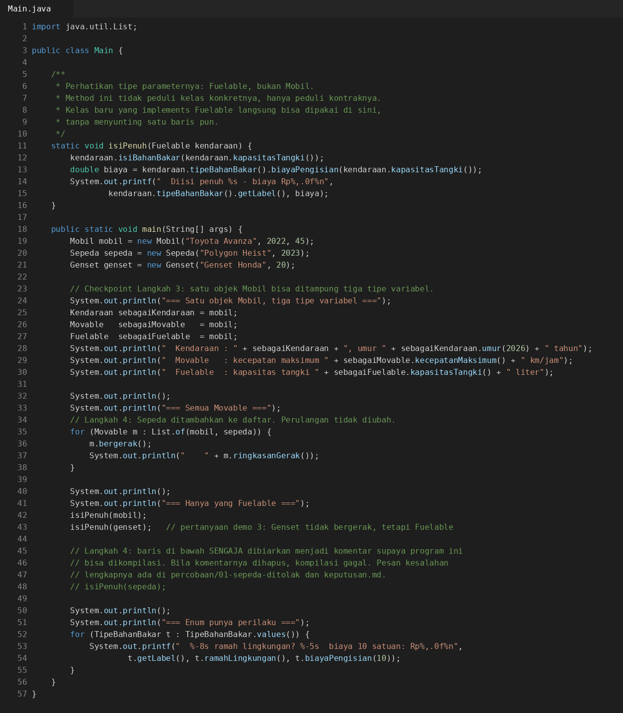

### 1.10. Latihan Mandiri: `Peminjamable` dan `StatusPinjam` (`latihan/java/`)
**Penjelasan Kode:**
> Dibuat tanpa starter. `Koleksi` (abstract class) menjadi identitas bersama dengan `kode`, `judul`, dan `jenis()`. `Peminjamable` (interface) menjadi kemampuan lewat `bolehDipinjam()` dan `masaPinjamHari()`, dan `StatusPinjam` (enum) punya case `TERSEDIA`, `DIPINJAM`, `TERLAMBAT`, `HILANG` beserta `keterangan()`. `Buku` (boleh, 14 hari), `Majalah` (boleh, 3 hari), dan `Skripsi` (tidak boleh dipinjam) memenuhi kontrak itu, dan fungsi `ringkas(Peminjamable p)` di `Main` memproses ketiganya tanpa satu pun `instanceof`.

**Bukti Eksekusi (Screenshot):**
* **Before** *(Kondisi awal / Kesalahan kompilasi)*:
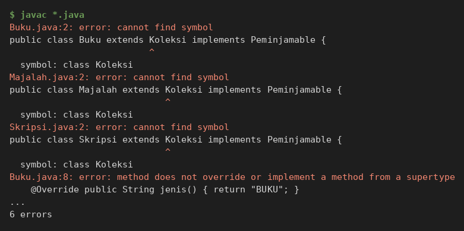

* **After** *(Kondisi akhir / Eksekusi berhasil)*:
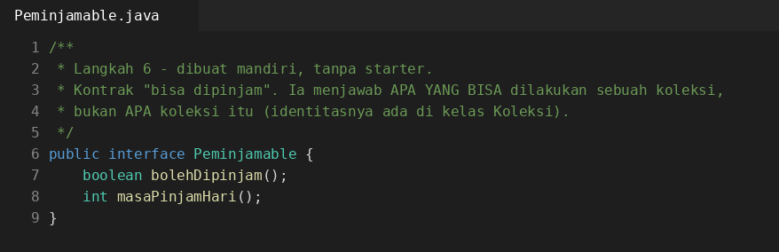
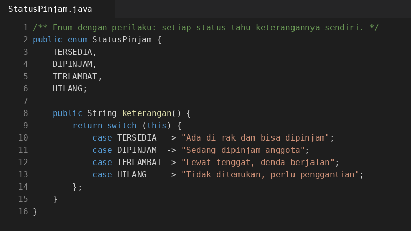


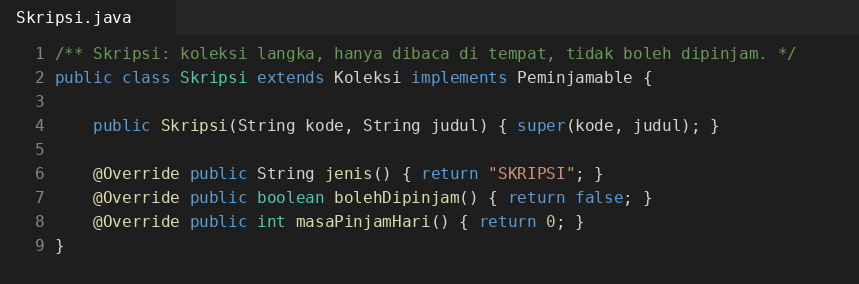


* **Output** *(`java Main (folder latihan/java)`)*:
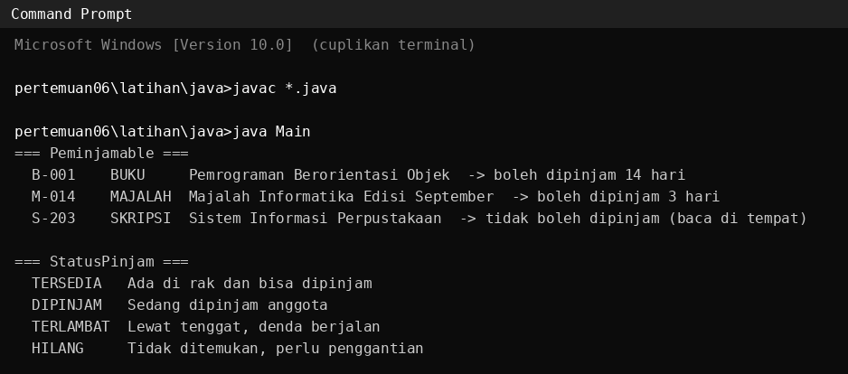

### Output
**Output Program:**

`java Main`


`java UjiValidasi`

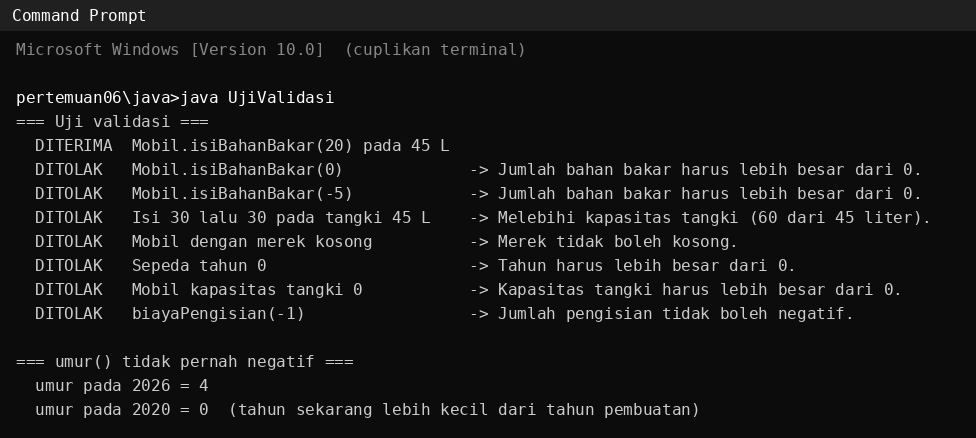

---

## 2. Implementasi PHP

### 2.1. File: `abstraksi.php`
**Penjelasan Kode:**
> Seluruh struktur PHP berada di satu berkas, sesuai starter: `interface Movable` dan `Fuelable`, backed enum `TipeBahanBakar: string`, abstract class `Kendaraan`, `final class Mobil extends Kendaraan implements Movable, Fuelable`, `Sepeda`, `Genset`, serta trait `Loggable` yang dipakai oleh `Mobil` dan `Pesanan` (dua kelas yang tidak sekerabat, itulah penggunaan ulang horizontal). `Loggable::log()` mencetak `[jam] NamaKelas: pesan` memakai `static::class`. Perilaku enum memakai `match ($this)`, dan penolakan `isiPenuh(sepeda)` terjadi sebagai `TypeError` saat berjalan.

**Bukti Eksekusi (Screenshot):**
* **Before** *(Kondisi awal / Galat logika)*:
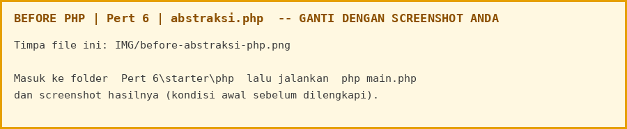

* **After** *(Kondisi akhir / Eksekusi berhasil)*:
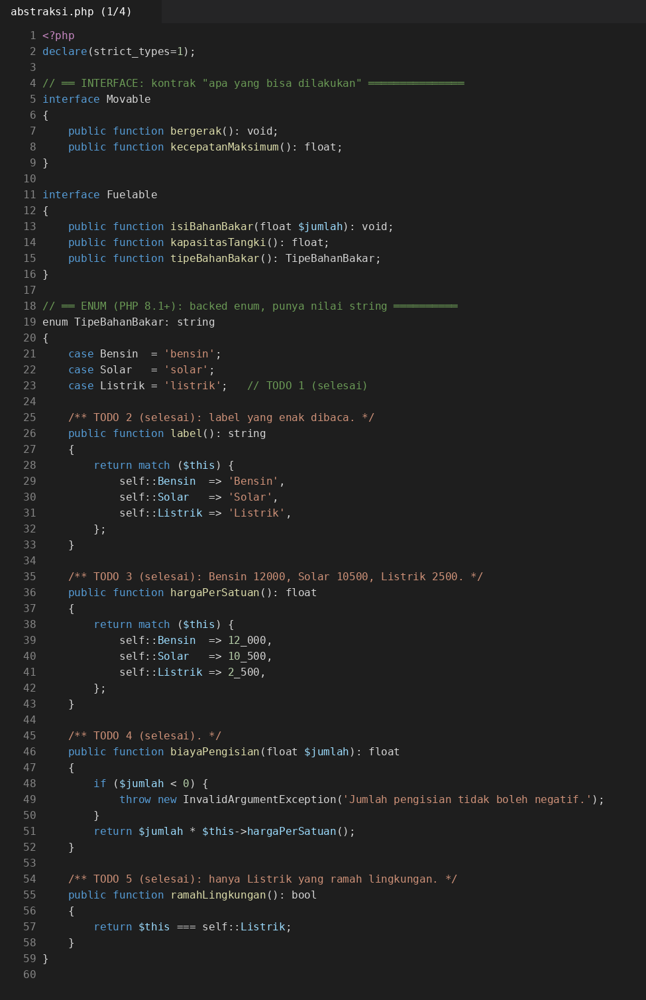
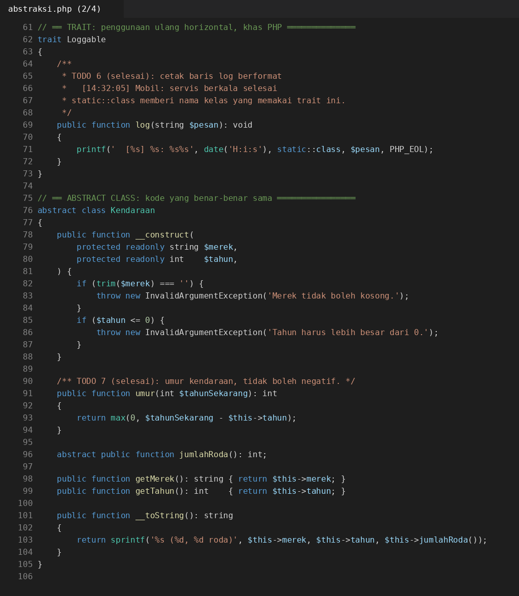
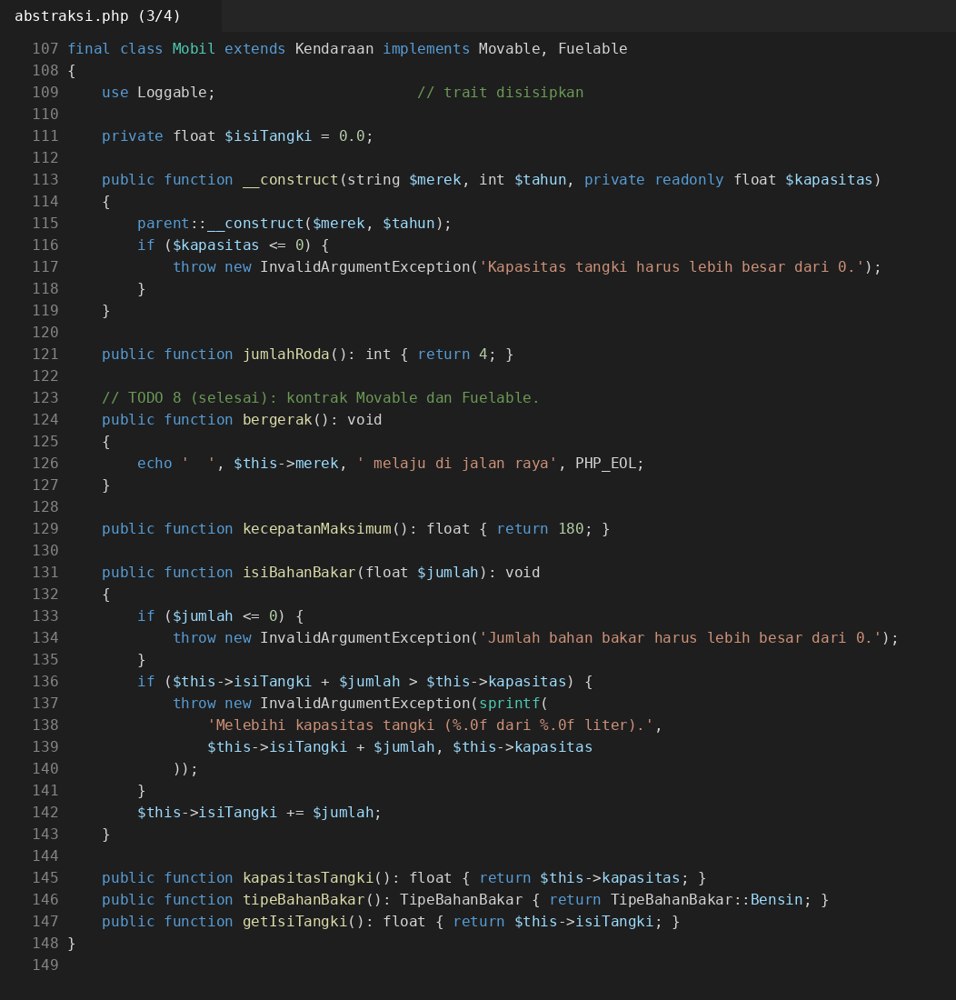


### 2.2. File: `uji-validasi.php`
**Penjelasan Kode:**
> Padanan PHP dari `UjiValidasi.java` dengan tambahan pengujian enum: `from('hidrogen')` melempar `ValueError`, sedangkan `tryFrom('hidrogen')` mengembalikan `null`.

**Bukti Eksekusi (Screenshot):**
* **Before** *(Kondisi awal / Galat logika)*:
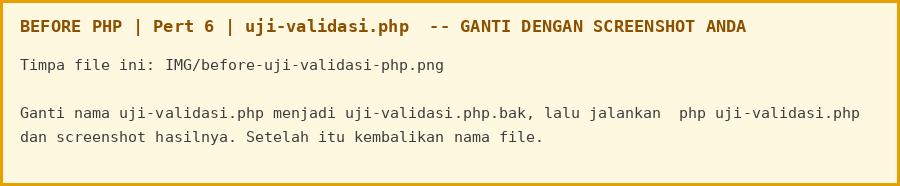

* **After** *(Kondisi akhir / Eksekusi berhasil)*:
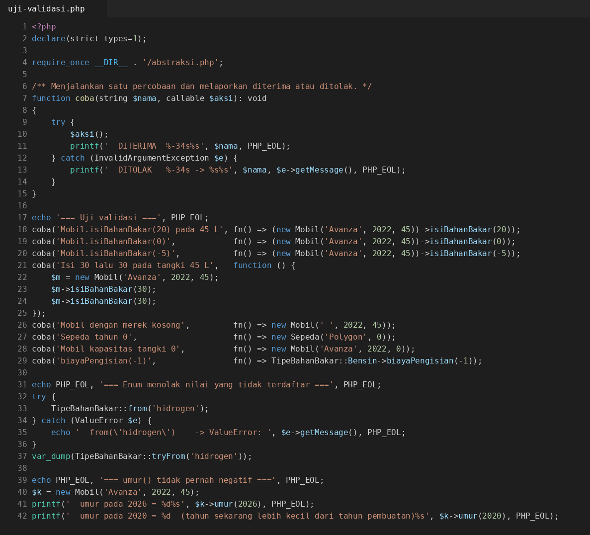

### 2.3. File: `main.php`
**Penjelasan Kode:**
> Padanan PHP dari `Main.java`: satu objek `Mobil` dengan tiga tipe, semua `Movable`, hanya yang `Fuelable` (`isiPenuh(Fuelable)` menolak `Sepeda` dengan `TypeError` saat berjalan), perilaku enum, dan demo trait `Loggable` pada `Mobil` dan `Pesanan`.

**Bukti Eksekusi (Screenshot):**
* **Before** *(Kondisi awal / Galat logika)*:


* **After** *(Kondisi akhir / Eksekusi berhasil)*:


### 2.4. Latihan Mandiri PHP (`latihan/php/`)
**Penjelasan Kode:**
> Padanan PHP dari latihan `Peminjamable`. `koleksi.php` berisi `Koleksi` (abstract), interface `Peminjamable`, enum `StatusPinjam` (case `Tersedia`, `Dipinjam`, `Terlambat`, `Hilang`), dan kelas `Buku`, `Majalah`, `Skripsi`. `main.php` memproses ketiganya lewat `Peminjamable` tanpa `instanceof` dan menghasilkan isi yang sama dengan versi Java.

**Bukti Eksekusi (Screenshot):**
* **Before** *(Kondisi awal / Galat logika)*:


* **After** *(Kondisi akhir / Eksekusi berhasil)*:


* **Output** *(`php main.php (folder latihan/php)`)*:


### Output
**Output Program:**

`php main.php`

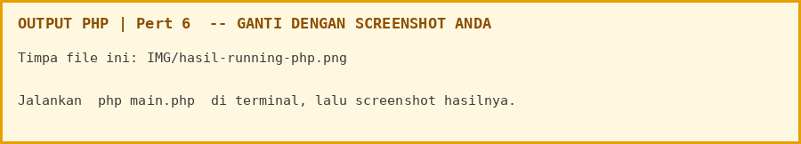

`php uji-validasi.php`

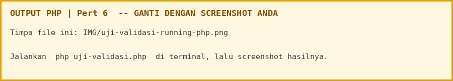

**Keluaran yang diharapkan:**

`php main.php`
```text
=== Satu objek Mobil, tiga tipe ===
  Kendaraan : Toyota Avanza (2022, 4 roda), umur 4 tahun
  Movable   : ya
  Fuelable  : ya

=== Semua Movable ===
  Toyota Avanza melaju di jalan raya
    kecepatan maksimum 180 km/jam
  Polygon Heist dikayuh di jalur sepeda
    kecepatan maksimum 40 km/jam

=== Hanya yang Fuelable ===
  Diisi penuh Bensin - biaya Rp540.000
  Diisi penuh Solar - biaya Rp210.000
  DITOLAK saat berjalan: isiPenuh(): Argument #1 ($kendaraan) must be of type Fuelable, Sepeda given

=== Enum punya perilaku ===
  Bensin   ramah lingkungan? tidak  biaya 10 satuan: Rp120.000
  Solar    ramah lingkungan? tidak  biaya 10 satuan: Rp105.000
  Listrik  ramah lingkungan? ya     biaya 10 satuan: Rp25.000

=== Trait dipakai kelas yang tidak sekerabat ===
  [jam:menit:detik] Mobil: servis berkala selesai
  [jam:menit:detik] Pesanan: pesanan #1042 dibuat
  Mobil dan Pesanan sekerabat? tidak (Pesanan tidak punya induk)
```

---

## 3. Kesimpulan
> Pegangan utama pertemuan ini: **abstract class menjawab "apa benda ini", interface menjawab "apa yang bisa dilakukannya"**. Satu kelas hanya boleh `extends` satu induk tetapi boleh `implements` banyak kemampuan, sehingga `Mobil` bisa menjadi `Kendaraan`, `Movable`, dan `Fuelable` sekaligus, sedangkan `Sepeda` hanya `Movable` dan `Genset` hanya `Fuelable`. Enum menggantikan konstanta angka dan membawa perilakunya sendiri, sedangkan trait di PHP dipakai untuk menggunakan ulang kode di antara kelas yang tidak sekerabat.
>
> | Tipe | Jenis | Peran | Catatan |
> |---|---|---|---|
> | `Kendaraan` | abstract class | Identitas: `merek`, `tahun`, `umur()`, `jumlahRoda()` abstrak | Konstruktor menolak merek kosong dan tahun <= 0 |
> | `Movable` | interface | Kemampuan bergerak | Punya `default` method `ringkasanGerak()` (Java) |
> | `Fuelable` | interface | Kemampuan diisi bahan bakar | Terpisah dari `Movable` |
> | `TipeBahanBakar` | enum | `BENSIN` 12.000, `SOLAR` 10.500, `LISTRIK` 2.500 | `ramahLingkungan()` hanya `true` untuk `LISTRIK` |
> | `Mobil` | class | `extends Kendaraan implements Movable, Fuelable` | Menolak isi <= 0 dan melebihi kapasitas tangki |
> | `Sepeda` | class | `extends Kendaraan implements Movable` | **Bukan** `Fuelable` |
> | `Genset` | class | `implements Fuelable` | Tidak bergerak, bukan `Kendaraan` |
> | `Loggable` | trait (PHP) | Method `log()` | Dipakai `Mobil` dan `Pesanan` |
>
> | Konsep | Java | PHP |
> |---|---|---|
> | Enum | `enum TipeBahanBakar { BENSIN("Bensin", 12000), ... }` | `enum TipeBahanBakar: string { case Bensin = 'bensin'; ... }` |
> | Daftar semua nilai enum | `TipeBahanBakar.values()` | `TipeBahanBakar::cases()` |
> | Nilai tidak terdaftar | `valueOf()` melempar `IllegalArgumentException` | `from()` melempar `ValueError`, `tryFrom()` mengembalikan `null` |
> | Default method di interface | `default String ringkasanGerak()` | Tidak ada |
> | Trait | Tidak ada | `trait Loggable`, dipakai dengan `use Loggable;` |
> | Penolakan `isiPenuh(sepeda)` | Galat **kompilasi** | `TypeError` saat **berjalan** |
>
> Pesan kompilator saat `isiPenuh(sepeda)` dibuka dari komentar:
>
> ```text
> Main.java:10: error: incompatible types: Sepeda cannot be converted to Fuelable
>         isiPenuh(sepeda);   // <- komentar dihapus: kompilasi harus gagal
>                  ^
> 1 error
> ```
>
> 
>
> Pemeriksaan manual: Mobil 45 liter x Rp12.000 = Rp540.000; Genset 20 liter x Rp10.500 = Rp210.000; 10 satuan Bensin, Solar, Listrik = Rp120.000, Rp105.000, Rp25.000; `umur(2026)` untuk tahun 2022 = 4.
>
> Latihan mandiri di lab (lihat [percobaan-mandiri.md](percobaan-mandiri.md)): E1 default method yang ditimpa `Sepeda`, E2 interface gemuk (8 method) yang dipecah menjadi `Switchable`, `Printable`, `Scannable`, serta percobaan enum versus konstanta `int` (angka 99 lolos pada konstanta `int`, tetapi ditolak kompilator pada enum).
>
> 
> 
> 
>
> Class diagram ([uml/abstraksi.puml](uml/abstraksi.puml) dan [uml/latihan.puml](uml/latihan.puml)): garis penuh untuk pewarisan (`extends`), garis putus untuk realisasi interface (`implements`).
>
> 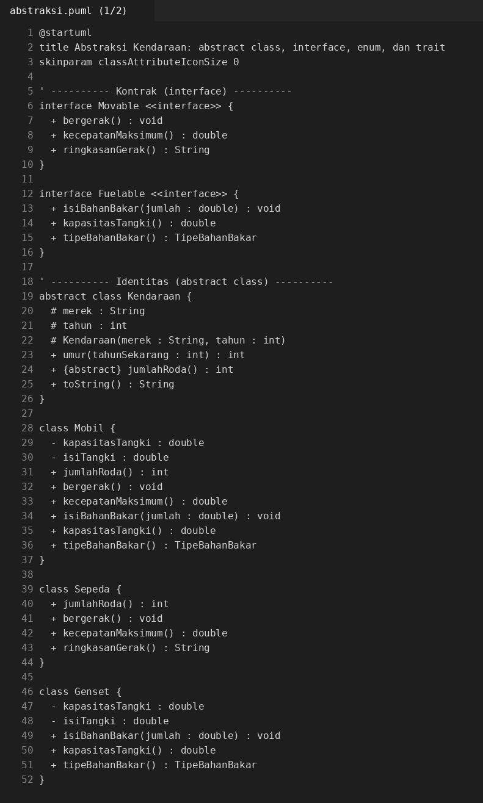
> 
> 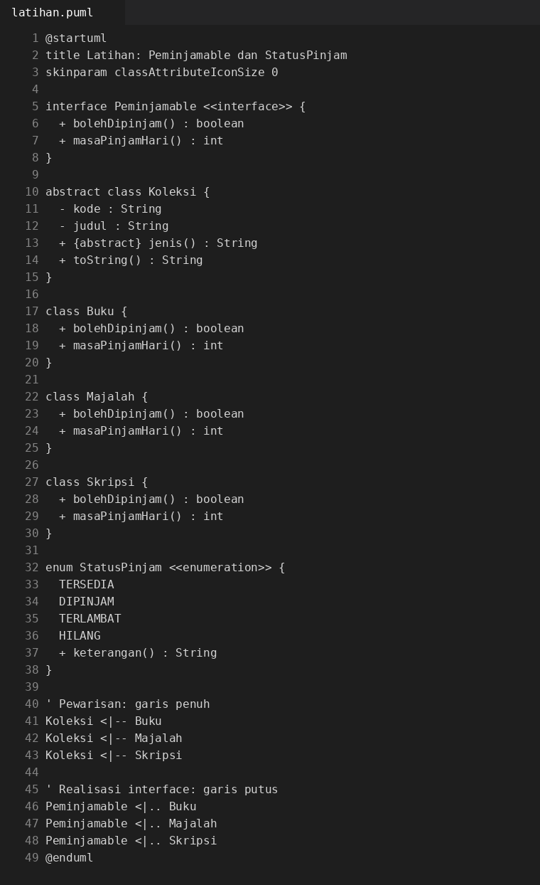
>
> Dokumen pendukung: [keputusan.md](keputusan.md), [percobaan-mandiri.md](percobaan-mandiri.md), [persiapan-demo.md](persiapan-demo.md), tugas rumah [refleksi.md](refleksi.md) dan [persiapan-sesi07.md](persiapan-sesi07.md), folder [uml/](uml/), [percobaan/](percobaan/), dan [starter/](starter/), serta modul [Modul-Praktikum-06-abstract-class-interface-enum-dan-trait.docx](Modul-Praktikum-06-abstract-class-interface-enum-dan-trait.docx).
>
> Cara menjalankan:
> ```cmd
> cd "Pert 6\java"
> javac *.java
> java Main
> java UjiValidasi
>
> cd ..\latihan\java
> javac *.java
> java Main
>
> cd ..\..\php
> php main.php
> php uji-validasi.php
>
> cd ..\latihan\php
> php main.php
> ```
