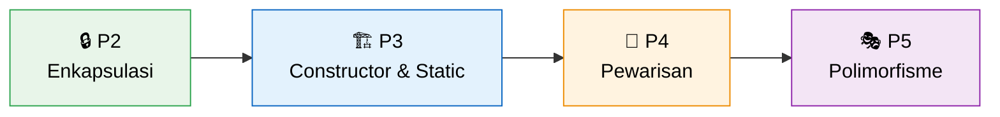
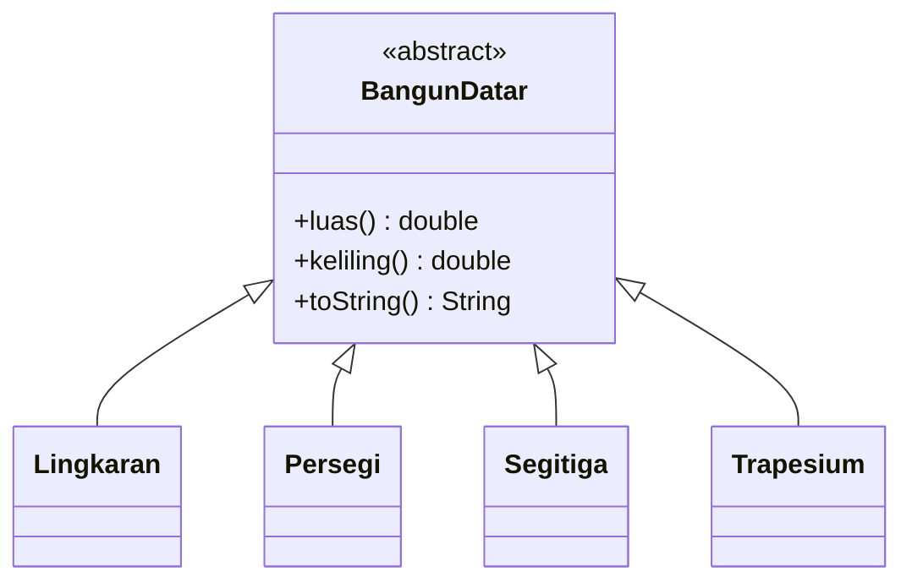

<div align="center">

# 🧩 Praktikum Pemrograman Berorientasi Objek

**Dari satu kelas sederhana sampai polimorfisme, ditulis dalam dua bahasa: Java ☕ dan PHP 🐘**


| | |
|---|---|
| 👤 **Nama** | Muhammad Salman Al Farisi |
| 🪪 **NPM** | 4525210141 |
| 📚 **Mata Kuliah** | Pemrograman Berorientasi Objek (Kelas A) |
| 🏫 **Kampus** | Universitas Pancasila, Fakultas Teknik, Informatika |

</div>

---

## 🗺️ Peta Perjalanan

Setiap pertemuan membangun di atas pertemuan sebelumnya. Mulai dari menjaga data tetap benar, sampai membuat kode yang bisa dikembangkan tanpa disentuh.



| # | Topik | Studi Kasus | Kata Kunci | Laporan |
|:-:|---|---|---|:-:|
| 2 | 🔒 **Enkapsulasi dan invariant** | `Mahasiswa` | validasi constructor, `private final`, method privat pembantu | [📄 Buka](pertemuan02/README.md) |
| 3 | 🏗️ **Constructor, static, konstanta** | `RekeningBank` | delegasi `this(...)`, `static`, `final`, named constructor | [📄 Buka](pertemuan03/README.md) |
| 4 | 🧬 **Pewarisan, overriding, komposisi** | `Pegawai` | `extends`, `super`, kelas abstrak, "adalah" vs "memiliki" | [📄 Buka](pertemuan04/README.md) |
| 5 | 🎭 **Polimorfisme** | `BangunDatar` dan `Notifikasi` | upcasting, dynamic dispatch, Open-Closed, refaktor `instanceof` | [📄 Buka](pertemuan05/README.md) |

---

## 🎭 Sorotan Terbaru: Pertemuan 5

> **Satu perintah, banyak perilaku.** Tipe *variabel* menentukan method apa yang **boleh** dipanggil. Tipe *objek* menentukan method mana yang **benar-benar** dijalankan.



Perulangan di `Main` tidak pernah berubah, sekalipun bangun datar baru terus ditambahkan:

```java
for (BangunDatar b : daftar) {
    total += b.luas();   // Lingkaran? Segitiga? Trapesium? Main tidak perlu tahu.
}
```

<details>
<summary><b>✨ Yang dikerjakan di pertemuan 5 (klik untuk membuka)</b></summary>

<br>

| Bagian | Isi |
|---|---|
| ☕ **Java** | `Lingkaran`, `Persegi`, `Segitiga` (rumus Heron), `Trapesium`, dan `AntiPatternRefaktor` tanpa satu pun `instanceof` |
| 🐘 **PHP** | Padanan hierarki bangun datar, dan hierarki `Notifikasi` (`Email`, `SMS`, `WhatsApp`) dengan `kirimSemua()` tanpa pemeriksaan tipe |
| 🔍 **Penelusuran** | Alur dynamic dispatch dibuktikan lewat bytecode (`invokevirtual`) di [penelusuran.md](pertemuan05/penelusuran.md) |
| 🧪 **Latihan mandiri** | Method `static` yang hanya menutupi (*hiding*), dan alasan `Object[]` merusak polimorfisme |
| 🏠 **Tugas rumah** | [Refleksi framework](pertemuan05/refleksi.md) dan `biayaKeterlambatan()` untuk `Buku`, `Majalah`, `Skripsi` |
| 🎤 **Persiapan demo** | Jawaban tujuh pertanyaan demo di [persiapan-demo.md](pertemuan05/persiapan-demo.md) |

</details>

---

## 🗂️ Struktur Folder

```text
📦 Praktikum-PBO-A-MuhammadSalmanAlFarisi-4525210141
├── 📁 pertemuan02/   ☕ java/  🐘 php/  🖼️ IMG/  📝 analisis.md  📄 README.md
├── 📁 pertemuan03/   ☕ java/  🐘 php/  🖼️ IMG/  📝 percobaan-static.md  📐 sekuens-constructor.puml  📄 README.md
├── 📁 pertemuan04/   ☕ java/  🐘 php/  🖼️ IMG/  📝 justifikasi.md  📝 catatan.md  📐 diagram.puml  📄 README.md
└── 📁 pertemuan05/   ☕ java/  🐘 php/  🖼️ IMG/  🧪 percobaan/  🏠 tugas-rumah/  🌱 starter/
                      📝 penelusuran.md  📝 refleksi.md  📝 percobaan-mandiri.md  📝 persiapan-demo.md
                      📐 diagram.puml  📐 sekuens-dispatch.puml  📐 diagram-notifikasi.puml  📄 README.md
```

---

## 🚀 Cara Menjalankan

<table>
<tr>
<td width="50%" valign="top">

### ☕ Java
*JDK 17 atau lebih baru*

```cmd
cd pertemuan05\java
javac *.java
java Main
```

Program lain di folder yang sama:

```cmd
java UjiValidasi
java AntiPattern
java AntiPatternRefaktor
```

</td>
<td width="50%" valign="top">

### 🐘 PHP
*PHP 8.1 atau lebih baru*

```cmd
cd pertemuan05\php
php main.php
php uji-validasi.php
php notifikasi.php
```

Untuk pertemuan lain, ganti angka `05` dengan `02`, `03`, atau `04`.

</td>
</tr>
</table>

> 💡 File `.class` tidak ikut di-commit (lihat `.gitignore`).

---

## 🎯 Prinsip yang Dipegang

| Prinsip | Artinya di kode ini |
|---|---|
| 🛡️ **Invariant terjaga** | Objek yang tidak sah ditolak sejak constructor, bukan baru gagal belakangan |
| ♻️ **Tidak menyalin kode** | Perilaku bersama ditulis sekali di induk dan dipakai ulang lewat pewarisan |
| 🔓 **Open-Closed** | Terbuka untuk ditambah, tertutup untuk diubah |
| 🏷️ **Tanpa angka ajaib** | Nilai tetap ditulis sebagai konstanta bernama |

---

<div align="center">

**Dibuat dengan ☕ dan banyak `javac`**

*Muhammad Salman Al Farisi · 4525210141 · PBO Kelas A*

</div>