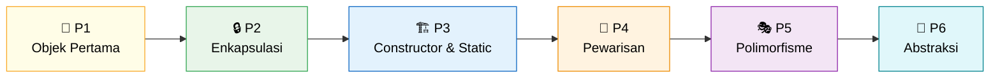
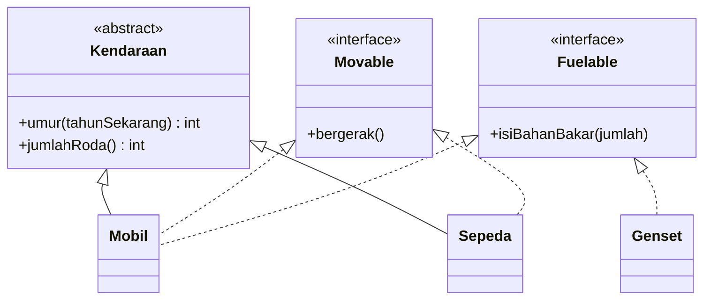

<div align="center">

# 🧩 Praktikum Pemrograman Berorientasi Objek

**Dari objek pertama sampai abstraksi, ditulis dalam dua bahasa: Java ☕ dan PHP 🐘**


| | |
|---|---|
| 👤 **Nama** | Muhammad Salman Al Farisi |
| 🪪 **NPM** | 4525210141 |
| 📚 **Mata Kuliah** | Pemrograman Berorientasi Objek (Kelas A) |
| 🏫 **Kampus** | Universitas Pancasila, Fakultas Teknik, Informatika |

</div>

---

## 🗺️ Peta Perjalanan

Setiap pertemuan membangun di atas pertemuan sebelumnya. Mulai dari menjaga data tetap benar, sampai memisahkan kontrak dari identitas supaya kode bisa dikembangkan tanpa disentuh.



| # | Topik | Studi Kasus | Kata Kunci | Laporan |
|:-:|---|---|---|:-:|
| 1 | 🌱 **Lingkungan pengembangan dan objek pertama** | `HaloObjek` | `private`, `this`, constructor, `.gitignore` | [📄 Buka](Pert%201/README.md) |
| 2 | 🔒 **Enkapsulasi dan invariant** | `Mahasiswa` | validasi constructor, `private final`, method privat pembantu | [📄 Buka](Pert%202/README.md) |
| 3 | 🏗️ **Constructor, static, konstanta** | `RekeningBank` | delegasi `this(...)`, `static`, `final`, named constructor | [📄 Buka](Pert%203/README.md) |
| 4 | 🧬 **Pewarisan, overriding, komposisi** | `Pegawai` | `extends`, `super`, kelas abstrak, "adalah" vs "memiliki" | [📄 Buka](Pert%204/README.md) |
| 5 | 🎭 **Polimorfisme** | `BangunDatar` dan `Notifikasi` | upcasting, dynamic dispatch, Open-Closed, refaktor `instanceof` | [📄 Buka](Pert%205/README.md) |
| 6 | 🧩 **Abstract class, interface, enum, trait** | `Kendaraan`, `Movable`, `Fuelable`, `TipeBahanBakar` | identitas vs kemampuan, `implements` banyak, enum berperilaku, `trait` | [📄 Buka](Pert%206/README.md) |

---

## 🧩 Sorotan Terbaru: Pertemuan 6

> **Pisahkan "apa benda ini" dari "apa yang bisa dilakukannya".** Identitas masuk ke *abstract class*, kemampuan masuk ke *interface*. Satu kelas hanya boleh `extends` satu induk, tetapi boleh `implements` banyak kemampuan.



`Sepeda` bergerak tetapi tidak butuh bahan bakar, sehingga kompilator menolak pemanggilan yang salah sebelum program sempat berjalan:

```java
isiPenuh(mobil);    // OK: Mobil adalah Fuelable
isiPenuh(genset);   // OK: Genset juga Fuelable, walau tidak bergerak
isiPenuh(sepeda);   // error: Sepeda cannot be converted to Fuelable
```

<details>
<summary><b>✨ Yang dikerjakan di pertemuan 6 (klik untuk membuka)</b></summary>

<br>

| Bagian | Isi |
|---|---|
| ☕ **Java** | `Movable` (dengan `default` method), `Fuelable`, enum `TipeBahanBakar`, `Kendaraan`, `Mobil`, `Sepeda`, `Genset`, dan `UjiValidasi` |
| 🐘 **PHP** | Padanan lengkap dalam `abstraksi.php`: backed enum, trait `Loggable` yang dipakai `Mobil` dan `Pesanan` |
| 📚 **Latihan** | `Peminjamable` dan enum `StatusPinjam` untuk `Buku`, `Majalah`, `Skripsi` di dua bahasa |
| 📐 **UML** | Diagram yang membedakan pewarisan (garis penuh) dari realisasi interface (garis putus) di [uml/abstraksi.puml](Pert%206/uml/abstraksi.puml) |
| 🧪 **Percobaan** | `Sepeda` ditolak kompilator, enum vs konstanta `int`, dan interface gemuk yang dipecah |
| 📝 **Keputusan** | Empat catatan rancangan dan dua pesan kompilator di [keputusan.md](Pert%206/keputusan.md) |
| 🏠 **Tugas rumah** | [Refleksi interface vs `instanceof`](Pert%206/refleksi.md) dan [daftar kelas untuk sesi 7](Pert%206/persiapan-sesi07.md) |
| 🎤 **Persiapan demo** | Jawaban tujuh pertanyaan demo di [persiapan-demo.md](Pert%206/persiapan-demo.md) |

</details>

---

## 🗂️ Struktur Folder

```text
📦 Praktikum-PBO-A-MuhammadSalmanAlFarisi-4525210141
├── 📁 Pert 1/   ☕ java/  🐘 php/  🖼️ IMG/  📝 refleksi.md  📄 README.md
├── 📁 Pert 2/   ☕ java/  🐘 php/  🖼️ IMG/  📝 analisis.md  📄 README.md
├── 📁 Pert 3/   ☕ java/  🐘 php/  🖼️ IMG/  📝 percobaan-static.md  📐 sekuens-constructor.puml  📄 README.md
├── 📁 Pert 4/   ☕ java/  🐘 php/  🖼️ IMG/  📝 justifikasi.md  📝 catatan.md  📐 diagram.puml  📄 README.md
├── 📁 Pert 5/   ☕ java/  🐘 php/  🖼️ IMG/  🧪 percobaan/  🏠 tugas-rumah/  🌱 starter/
│                📝 penelusuran.md  📝 refleksi.md  📝 percobaan-mandiri.md  📝 persiapan-demo.md
│                📐 diagram.puml  📐 sekuens-dispatch.puml  📐 diagram-notifikasi.puml  📄 README.md
└── 📁 Pert 6/   ☕ java/  🐘 php/  📚 latihan/  📐 uml/  🖼️ IMG/  🧪 percobaan/  🌱 starter/
                 📝 keputusan.md  📝 percobaan-mandiri.md  📝 refleksi.md  📝 persiapan-sesi07.md
                 📝 persiapan-demo.md  📄 README.md
```

---

## 🚀 Cara Menjalankan

<table>
<tr>
<td width="50%" valign="top">

### ☕ Java
*JDK 17 atau lebih baru*

```cmd
cd "Pert 6\java"
javac *.java
java Main
```

Program lain di folder yang sama:

```cmd
java UjiValidasi
```

</td>
<td width="50%" valign="top">

### 🐘 PHP
*PHP 8.1 atau lebih baru*

```cmd
cd "Pert 6\php"
php main.php
php uji-validasi.php
```

Untuk pertemuan lain, ganti angka `6` dengan `1` sampai `5`.

</td>
</tr>
</table>

> 💡 File `.class` tidak ikut di-commit (lihat `.gitignore`).

---

## 🎯 Prinsip yang Dipegang

| Prinsip | Artinya di kode ini |
|---|---|
| 🛡️ **Invariant terjaga** | Objek yang tidak sah ditolak sejak constructor, bukan baru gagal belakangan |
| ♻️ **Tidak menyalin kode** | Perilaku bersama ditulis sekali di induk dan dipakai ulang lewat pewarisan |
| 🔓 **Open-Closed** | Terbuka untuk ditambah, tertutup untuk diubah |
| 🏷️ **Tanpa angka ajaib** | Nilai tetap ditulis sebagai konstanta bernama, dan status ditulis sebagai `enum` |
| 🧩 **Kontrak kecil** | Kemampuan dipecah menjadi interface kecil (`Movable`, `Fuelable`) sehingga tiap kelas hanya menerima yang ia butuhkan |

---

<div align="center">

**Dibuat dengan ☕ dan banyak `javac`**

*Muhammad Salman Al Farisi · 4525210141 · PBO Kelas A*

</div>