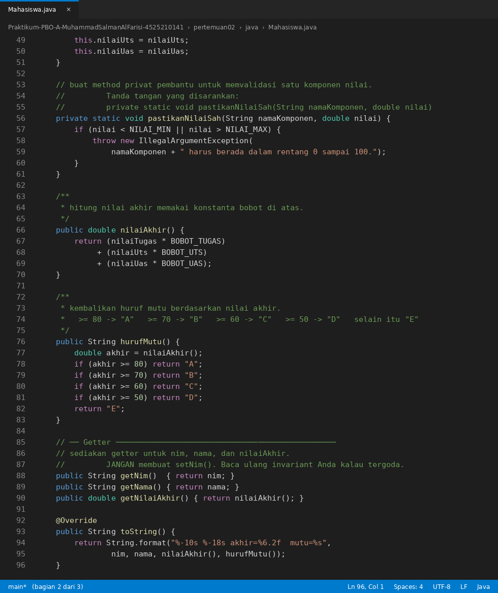
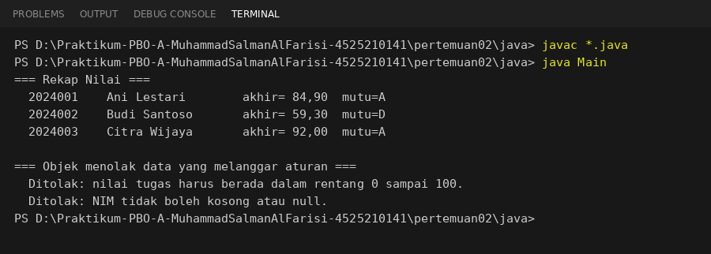
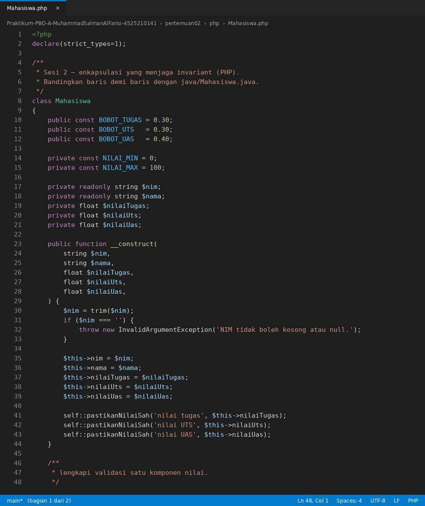
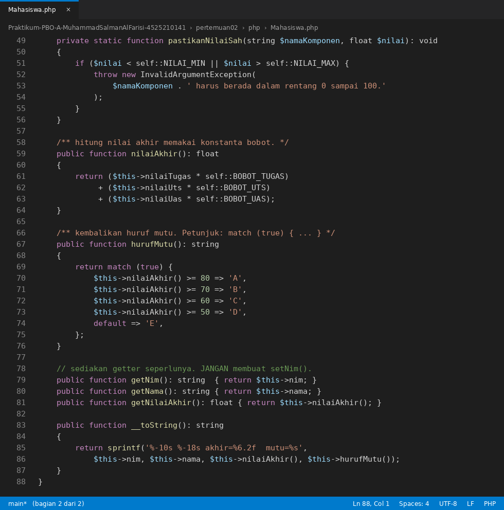
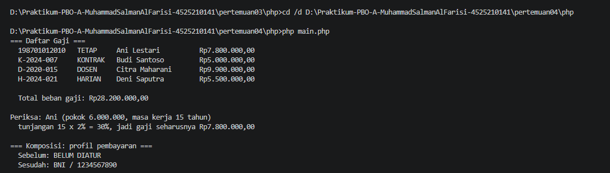

# Laporan Praktikum PBO Pertemuan 2
**Nama          :** Muhammad Salman Al Farisi
**NPM           :** 4525210141
**Mata Kuliah   :** Pemrograman Berorientasi Objek (Kelas A)

## Materi
Sistem akademik sederhana (kelas `Mahasiswa`) menggunakan Java dan PHP.
Materi: enkapsulasi yang menjaga invariant, validasi di constructor, konstanta bobot, dan method privat pembantu.

## Deskripsi Masalah
Sistem akademik mencatat mahasiswa dengan NIM, nama, dan tiga komponen nilai: tugas, UTS, dan UAS.
NIM tidak pernah berubah setelah mahasiswa terdaftar, setiap komponen nilai berada pada rentang 0 sampai 100,
dan nilai akhir dihitung dengan bobot 30% tugas, 30% UTS, 40% UAS.
Daftar invariant lengkap ada di [analisis.md](analisis.md).

## Ringkasan Implementasi
| Aturan | Java | PHP |
|---|---|---|
| NIM tidak boleh berubah | `private final String nim`, tanpa `setNim()` | `private readonly string $nim`, tanpa `setNim()` |
| NIM kosong atau null ditolak | `IllegalArgumentException` | `InvalidArgumentException` |
| Nilai di luar 0-100 ditolak | `pastikanNilaiSah(...)` dipanggil 3 kali | `pastikanNilaiSah(...)` dipanggil 3 kali |
| Bobot nilai | `BOBOT_TUGAS`, `BOBOT_UTS`, `BOBOT_UAS` | `const BOBOT_*` |
| Huruf mutu | rangkaian `if` dari nilai tertinggi | `match (true) { ... }` |

## Screenshot Coding Main.java


## Screenshot Coding Mahasiswa.java




## Hasil Running Program java


> Hasil running Java di atas dijalankan dengan `javac *.java` lalu `java Main` pada folder `java/`.

Pemeriksaan manual nilai akhir (dibandingkan dengan keluaran program):

| Mahasiswa | Perhitungan | Nilai akhir | Mutu |
|---|---|---|---|
| Ani Lestari | 85x0,30 + 78x0,30 + 90x0,40 = 25,5 + 23,4 + 36,0 | 84,90 | A |
| Budi Santoso | 60x0,30 + 55x0,30 + 62x0,40 = 18,0 + 16,5 + 24,8 | 59,30 | D |
| Citra Wijaya | 92x0,30 + 88x0,30 + 95x0,40 = 27,6 + 26,4 + 38,0 | 92,00 | A |

Dua data tidak sah ditolak dengan pesan yang menyebut apa yang salah (nilai tugas 150, dan NIM kosong).

## Screenshot Coding Main.php


## Screenshot Coding Mahasiswa.php



## Hasil Running Program php


> Screenshot ini masih berupa placeholder. Jalankan `php main.php` pada folder `php/`, lalu timpa file `IMG/hasil-running-php.png` dengan screenshot terminalnya.

## Cara Menjalankan
```cmd
cd pertemuan02\java
javac *.java
java Main

cd ..\php
php main.php
```
