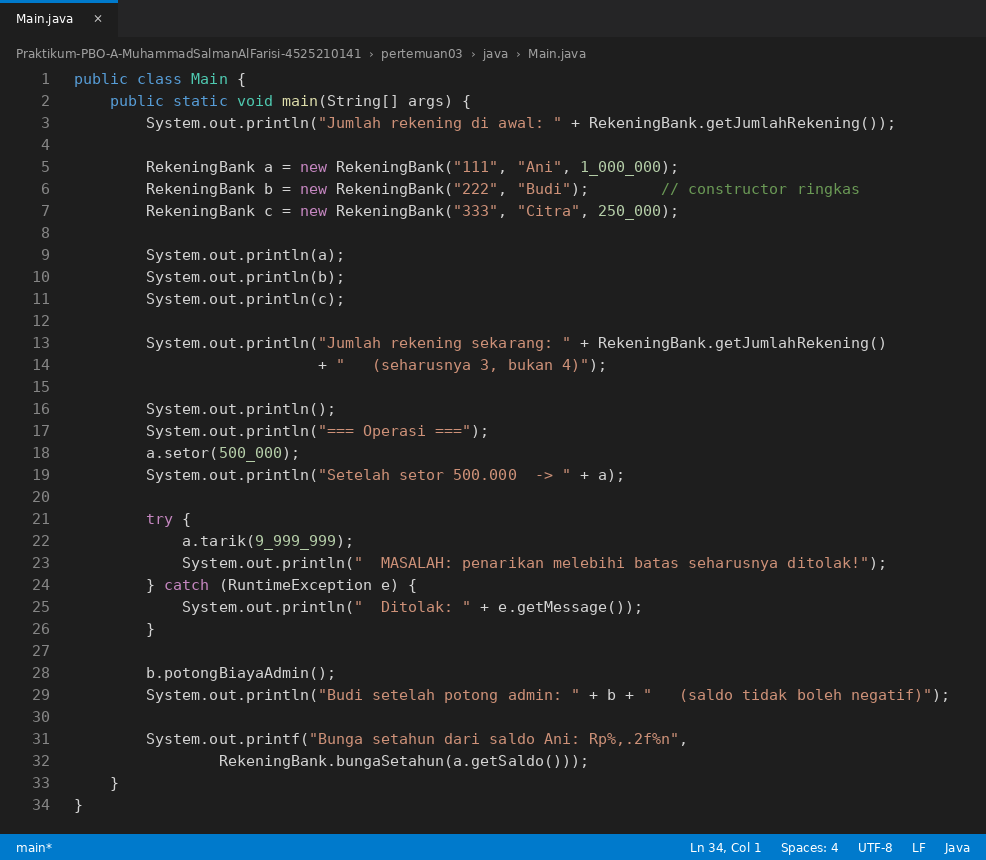
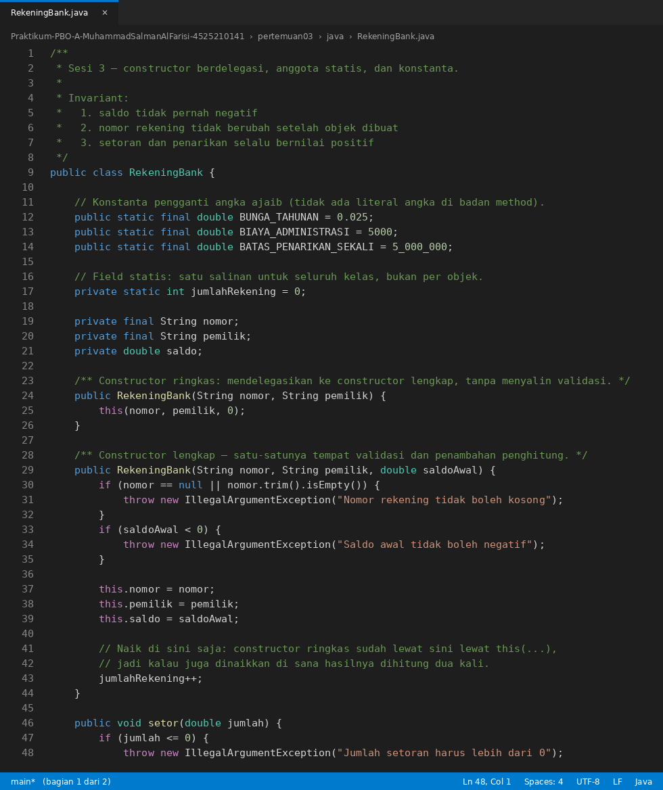
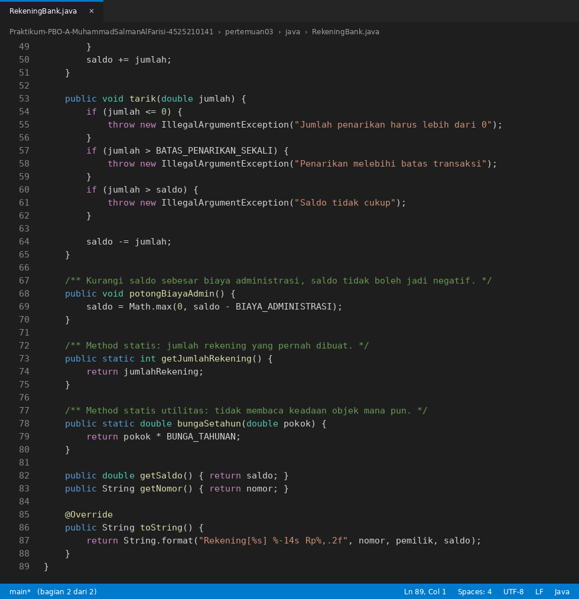
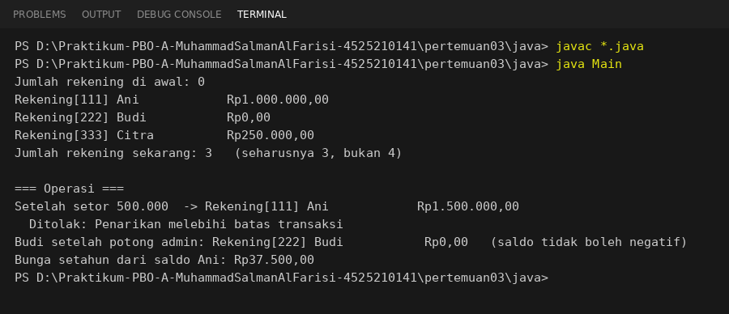

# Laporan Praktikum PBO Pertemuan 3
**Nama          :** Muhammad Salman Al Farisi
**NPM           :** 4525210141
**Mata Kuliah   :** Pemrograman Berorientasi Objek (Kelas A)

## Materi
Program rekening bank menggunakan Java dan PHP.
Materi: constructor (delegasi), anggota statis, konstanta, dan validasi.

## Invariant `RekeningBank`
1. Saldo tidak pernah negatif.
2. Nomor rekening tidak berubah setelah objek dibuat.
3. Setoran dan penarikan selalu bernilai positif.

## Ringkasan Implementasi
| Konsep | Java | PHP |
|---|---|---|
| Konstanta (tanpa angka ajaib) | `public static final` | `public const` |
| Penghitung rekening | `private static int jumlahRekening` | `private static int $jumlahRekening` |
| Constructor ringkas | `this(nomor, pemilik, 0)` (delegasi) | default parameter `$saldoAwal = 0` |
| Cara lain membuat objek | - | named constructor `rekeningPelajar()` dengan `new static` |
| Validasi | hanya di constructor lengkap | hanya di `__construct` |
| Method statis | `getJumlahRekening()`, `bungaSetahun()` | `getJumlahRekening()`, `bungaSetahun()` |

Konstanta yang dipakai: `BUNGA_TAHUNAN = 0.025`, `BIAYA_ADMINISTRASI = 5000`, `BATAS_PENARIKAN_SEKALI = 5.000.000`.

## Screenshot Coding Main.java


## Screenshot Coding RekeningBank.java



## Hasil Running Program java


> Hasil running Java di atas dijalankan dengan `javac *.java` lalu `java Main` pada folder `java/`.

Penjelasan hasil:

| Keluaran | Penjelasan |
|---|---|
| `Jumlah rekening di awal: 0` | Penghitung statis bernilai awal 0 sebelum ada objek |
| `Jumlah rekening sekarang: 3` | Tiga objek dibuat. Constructor ringkas Budi mendelegasikan ke constructor lengkap, jadi penghitung naik sekali, bukan dua kali |
| `Rp1.500.000,00` setelah setor | 1.000.000 + 500.000 |
| `Ditolak: Penarikan melebihi batas transaksi` | Penarikan 9.999.999 melampaui batas 5.000.000 per transaksi |
| Budi `Rp0,00` setelah potong admin | Saldo 0 dikurangi 5.000 dibatasi `Math.max(0, ...)`, sehingga tidak negatif |
| `Rp37.500,00` | Bunga setahun dari saldo Ani: 1.500.000 x 0,025 |

## Screenshot Coding Main.php


## Screenshot Coding RekeningBank.php


## Hasil Running Program php


> Screenshot ini masih berupa placeholder. Jalankan `php main.php` pada folder `php/`, lalu timpa file `IMG/hasil-running-php.png` dengan screenshot terminalnya.

## Dokumen Pendukung
- [percobaan-static.md](percobaan-static.md): hasil percobaan anggota statis dan jawaban tugas rumah tentang static dan pengujian.
- [sekuens-constructor.puml](sekuens-constructor.puml): sequence diagram delegasi constructor.
- [materi-pertemuan03.pptx](materi-pertemuan03.pptx): slide materi pertemuan.

## Tugas Pekan Ini
- [x] Konstanta `BIAYA_ADMINISTRASI` dan method `potongBiayaAdmin()` pada `RekeningBank`.
- [x] Named constructor `RekeningBank::rekeningPelajar(...)` pada versi PHP.
- [x] Percobaan anggota statis dan jawaban tugas rumah (lihat `percobaan-static.md`).

## Cara Menjalankan
```cmd
cd pertemuan03\java
javac *.java
java Main

cd ..\php
php main.php
```
