# Laporan Praktikum PBO Pertemuan 4
**Nama          :** Muhammad Salman Al Farisi
**NPM           :** 4525210141
**Mata Kuliah   :** Pemrograman Berorientasi Objek (Kelas A)

## Materi
Penggajian pegawai universitas menggunakan Java dan PHP.
Materi: pewarisan (inheritance), overriding, pemanggilan constructor induk, dan komposisi.

## Gambaran Program
Data yang sama pada semua pegawai (NIP, nama, gaji pokok) ditulis sekali di kelas abstrak `Pegawai`.
Aturan gaji yang berbeda ditaruh di kelas turunan. Semua jenis pegawai tetap bisa diproses lewat satu tipe `Pegawai`.

## Hierarki Kelas
| Kelas | Induk | Aturan gaji |
|---|---|---|
| `Pegawai` (abstract) | - | Gaji pokok apa adanya |
| `PegawaiTetap` | `Pegawai` | Gaji pokok + tunjangan masa kerja 2% per tahun, maksimal 40% |
| `PegawaiKontrak` | `Pegawai` | Gaji pokok (tidak meng-override `hitungGaji()`) |
| `Dosen` | `PegawaiTetap` | Gaji pegawai tetap + tunjangan fungsional |
| `PegawaiHarian` | `Pegawai` | Tarif per hari x jumlah hari kerja |
| `ProfilPembayaran` | - | Komposisi: setiap `Pegawai` memiliki satu profil pembayaran |

Padanan sintaks:

| Konsep | Java | PHP |
|---|---|---|
| Mewarisi | `extends Pegawai` | `extends Pegawai` |
| Constructor induk | `super(nip, nama, gajiPokok)` | `parent::__construct(...)` |
| Method induk | `super.hitungGaji()` | `parent::hitungGaji()` |
| Kelas abstrak | `abstract class` + `abstract String jenis()` | `abstract class` + `abstract function jenis()` |

## Screenshot Coding Main.java
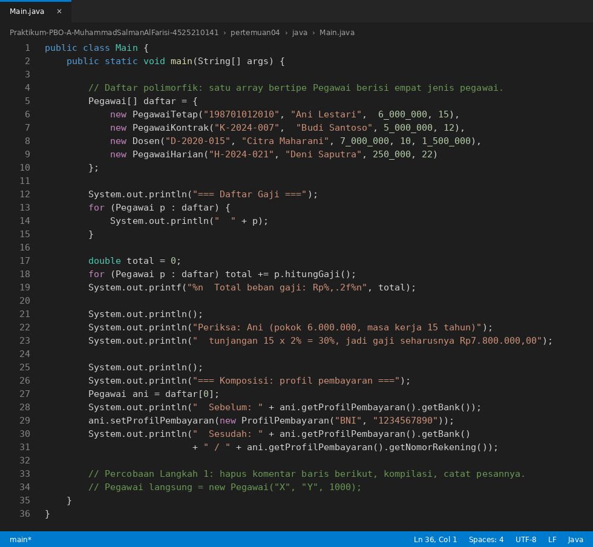

## Screenshot Coding Pegawai.java
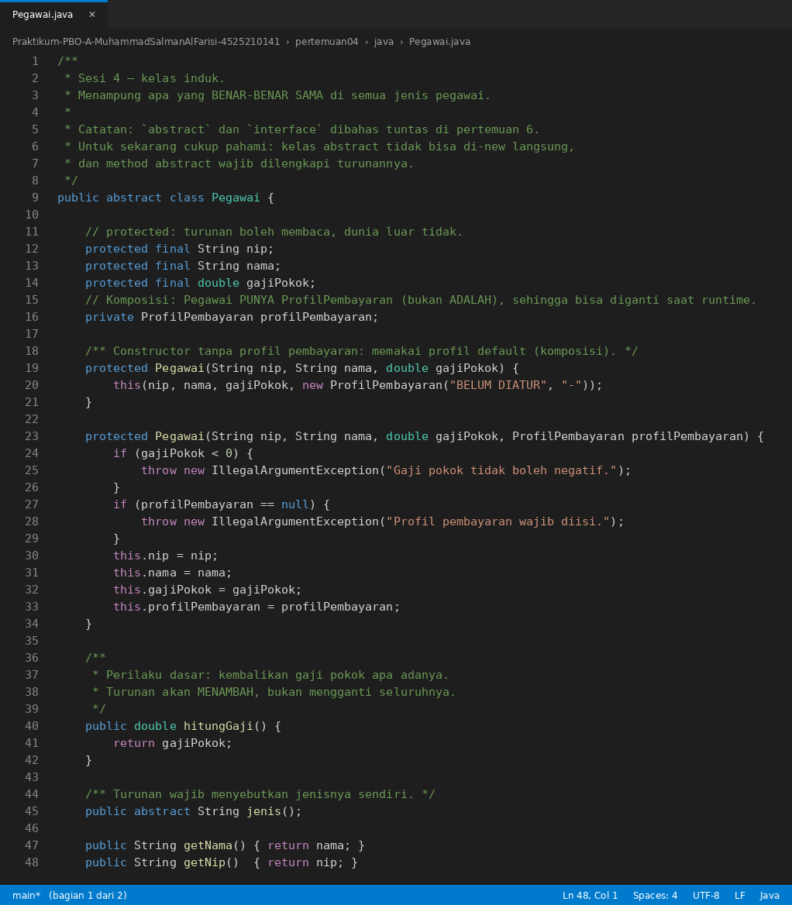
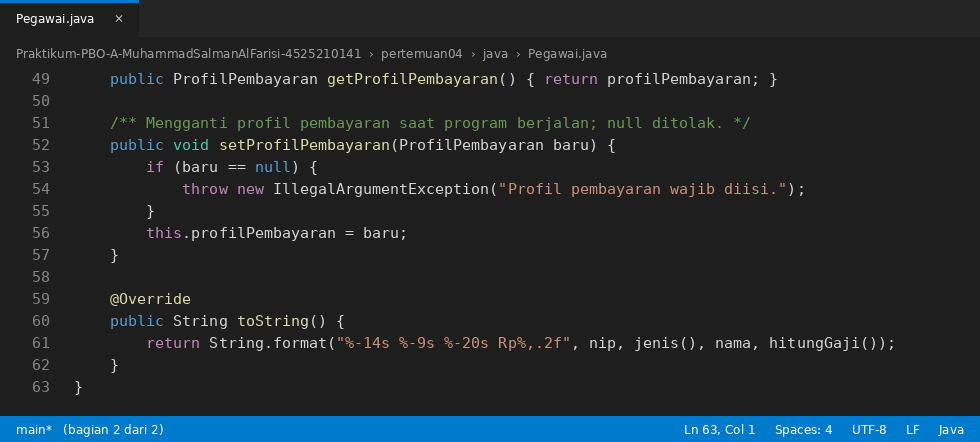

## Screenshot Coding PegawaiTetap.java
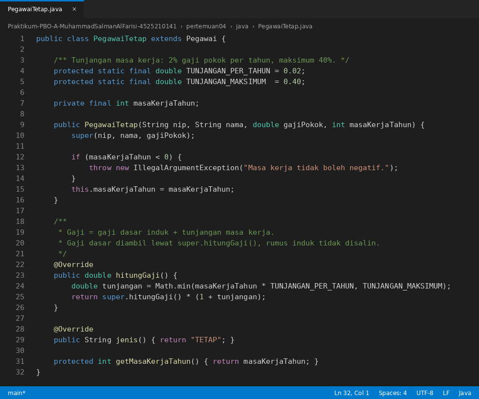

## Screenshot Coding PegawaiKontrak.java


## Screenshot Coding Dosen.java
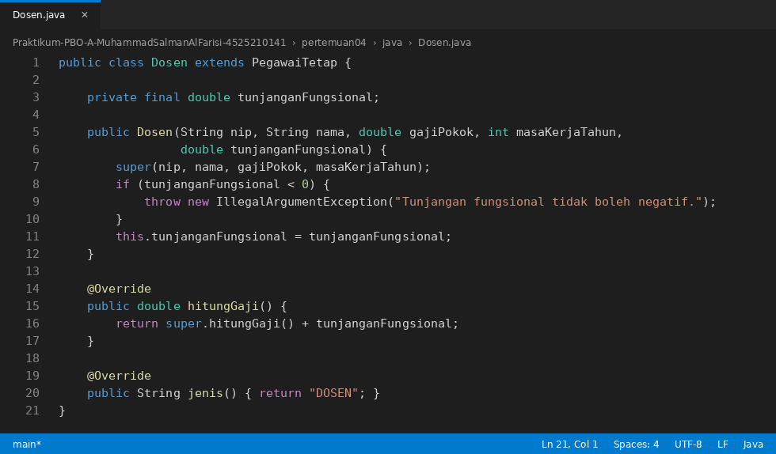

## Screenshot Coding PegawaiHarian.java
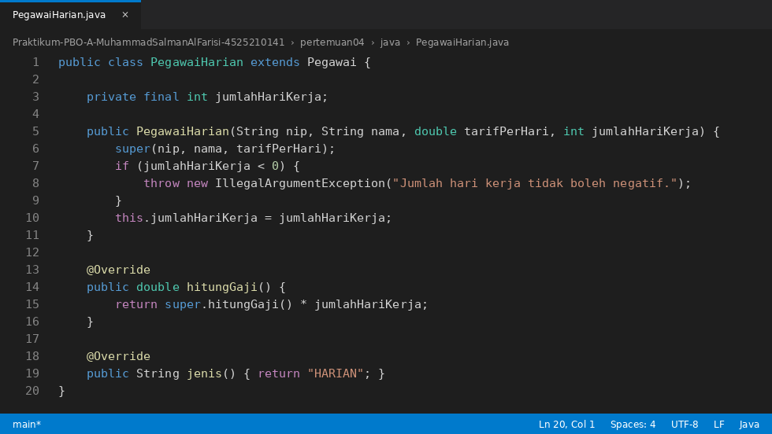

## Screenshot Coding ProfilPembayaran.java
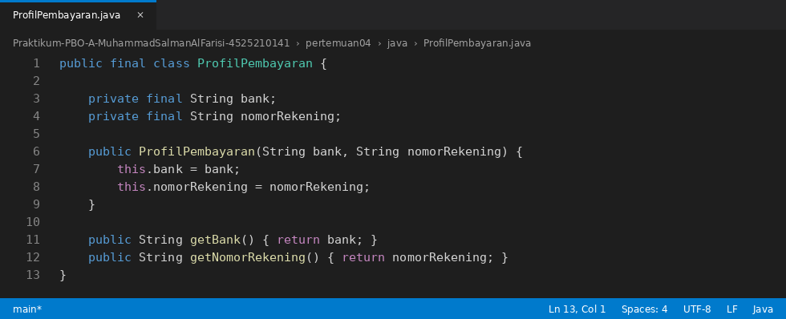

## Hasil Running Program java
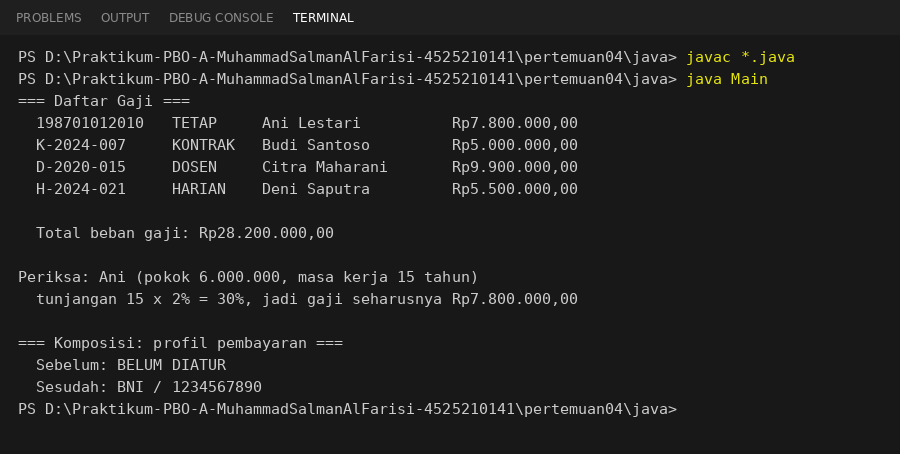

> Hasil running Java di atas dijalankan dengan `javac *.java` lalu `java Main` pada folder `java/`.

Pemeriksaan manual:

| Pegawai | Perhitungan | Gaji |
|---|---|---|
| Ani (tetap) | 6.000.000 x (1 + 15 x 2% = 30%) | Rp7.800.000,00 |
| Budi (kontrak) | gaji pokok | Rp5.000.000,00 |
| Citra (dosen) | 7.000.000 x (1 + 10 x 2% = 20%) = 8.400.000, ditambah 1.500.000 | Rp9.900.000,00 |
| Deni (harian) | 250.000 x 22 hari | Rp5.500.000,00 |
| **Total** | 7.800.000 + 5.000.000 + 9.900.000 + 5.500.000 | **Rp28.200.000,00** |

Bagian "Komposisi: profil pembayaran" memperlihatkan bahwa profil pembayaran Ani berubah dari `BELUM DIATUR` menjadi `BNI` saat program berjalan.

## Screenshot Coding Main.php


## Screenshot Coding Pegawai.php

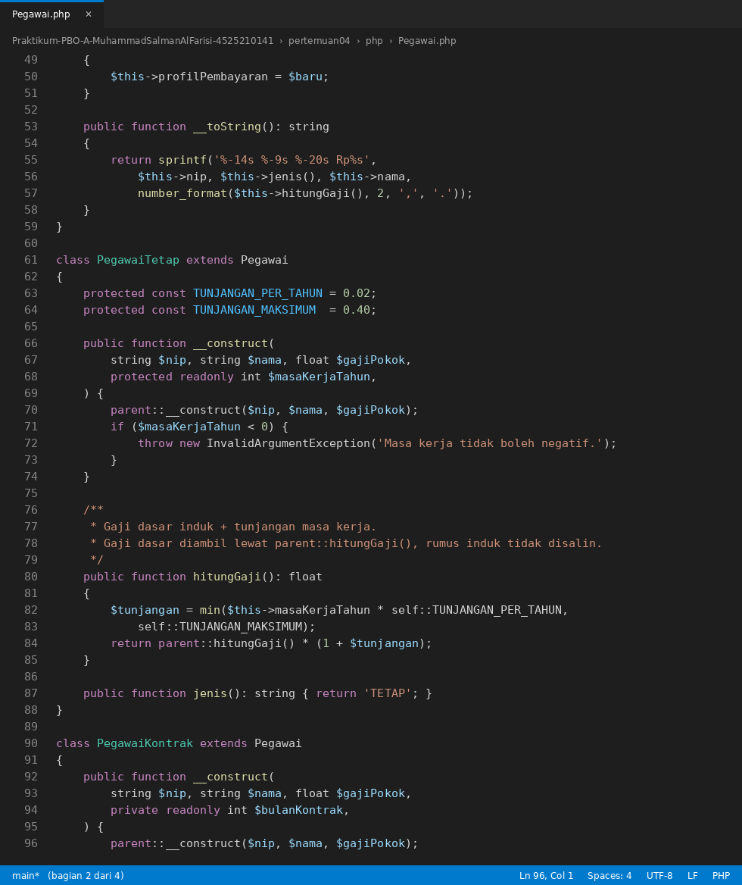
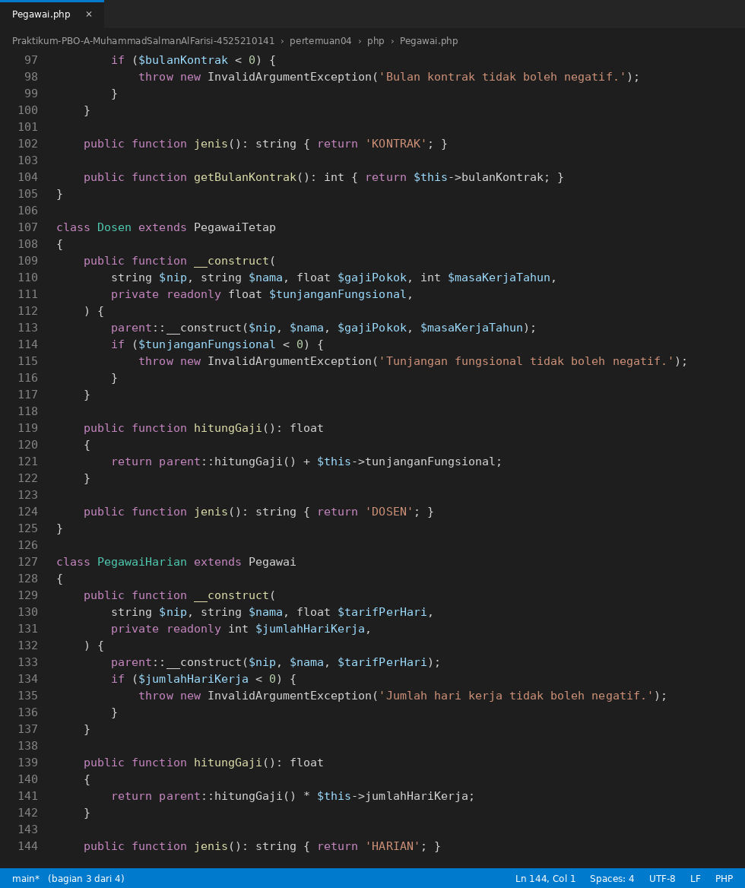


## Hasil Running Program php
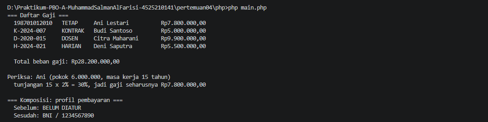

> Screenshot ini masih berupa placeholder. Jalankan `php main.php` pada folder `php/`, lalu timpa file `IMG/hasil-running-php.png` dengan screenshot terminalnya.

## Dokumen Pendukung
- [diagram.puml](diagram.puml): class diagram PlantUML.
- [justifikasi.md](justifikasi.md): justifikasi hubungan pewarisan dan komposisi (sekitar 325 kata, syarat 300-400).
- [catatan.md](catatan.md): alasan `PegawaiKontrak` tidak meng-override `hitungGaji()`, dan hasil percobaan abstract serta `super(...)`.
- [materi-pertemuan04.pptx](materi-pertemuan04.pptx) dan [materi-inheritance.pptx](materi-inheritance.pptx): slide materi.

## Status Pengerjaan (Tugas 1)
- [x] Hierarki penggajian dengan minimal empat jenis pegawai.
- [x] Implementasi Java.
- [x] Implementasi PHP.
- [x] Class diagram PlantUML.
- [x] Justifikasi 300-400 kata.
- [x] Satu relasi komposisi beserta alasannya.
- [x] Validasi data input (gaji, masa kerja, hari kerja, tunjangan, bulan kontrak tidak boleh negatif).

## Cara Menjalankan
```cmd
cd pertemuan04\java
javac *.java
java Main

cd ..\php
php main.php
```
