# Laporan Praktikum PBO Pertemuan 5
**Nama          :** Muhammad Salman Al Farisi
**NPM           :** 4525210141
**Mata Kuliah   :** Pemrograman Berorientasi Objek (Kelas A)

## Materi
Bangun datar (Java dan PHP) dan notifikasi (PHP).
Materi: polimorfisme runtime (overriding), upcasting, dynamic dispatch, Open-Closed Principle, dan refaktor rantai `instanceof` menjadi kode polimorfik.

## Gambaran Program
Kelas abstrak `BangunDatar` menetapkan kontrak `luas()` dan `keliling()`. Setiap turunan mengisi rumusnya sendiri.
`Main` menyimpan semua bangun dalam satu array bertipe `BangunDatar[]` (upcasting) dan memprosesnya dengan perulangan yang sama, tanpa satu pun pemeriksaan tipe.
Menambah bangun baru (Segitiga, Trapesium) cukup dengan membuat kelas baru dan menambah satu baris objek di array. Logika perulangan tidak berubah.

## Hierarki Kelas
| Kelas | Induk | Luas | Keliling | Validasi constructor |
|---|---|---|---|---|
| `BangunDatar` (abstract) | - | `abstract luas()` | `abstract keliling()` | - |
| `Lingkaran` | `BangunDatar` | `Math.PI x r x r` | `2 x Math.PI x r` | jari-jari > 0 |
| `Persegi` | `BangunDatar` | `sisi x sisi` | `4 x sisi` | sisi > 0 |
| `Segitiga` | `BangunDatar` | rumus Heron | `a + b + c` | sisi > 0 dan jumlah dua sisi > sisi ketiga |
| `Trapesium` | `BangunDatar` | `(alasAtas + alasBawah) / 2 x tinggi` | jumlah keempat sisi | semua ukuran > 0, sisi miring tidak lebih pendek dari tinggi |

Padanan sintaks:

| Konsep | Java | PHP |
|---|---|---|
| Kelas abstrak | `abstract class BangunDatar` | `abstract class BangunDatar` |
| Method kontrak | `public abstract double luas();` | `abstract public function luas(): float;` |
| Overriding | `@Override public double luas()` | `public function luas(): float` (tanpa anotasi) |
| Upcasting | `BangunDatar[] daftar = { new Lingkaran(7), ... }` | `$daftar = [new Lingkaran(7), ...]` |
| Cetak objek | `toString()` | `__toString()` |
| Validasi | `IllegalArgumentException` | `InvalidArgumentException` |
| Konstanta pi | `Math.PI` | `M_PI` |

Padanan overloading di PHP (dari slide materi):

| Kebutuhan | Java | PHP |
|---|---|---|
| Beda jumlah argumen | `f(int a)` dan `f(int a, int b)` | default parameter |
| Beda tipe argumen | `f(int a)` dan `f(String a)` | union type `int\|string` |
| Argumen tak tentu | `f(int... a)` | variadic `f(int ...$a)` |

## Langkah 1 dan 2: Hierarki dan Segitiga (Java)

### Screenshot Coding Main.java


> `Main.java` hanya berubah pada isi array (dua komentar TODO diganti dua baris objek). Dua perulangan dan bagian downcasting tidak diubah. Detail `diff` ada di [penelusuran.md](penelusuran.md).

### Screenshot Coding BangunDatar.java
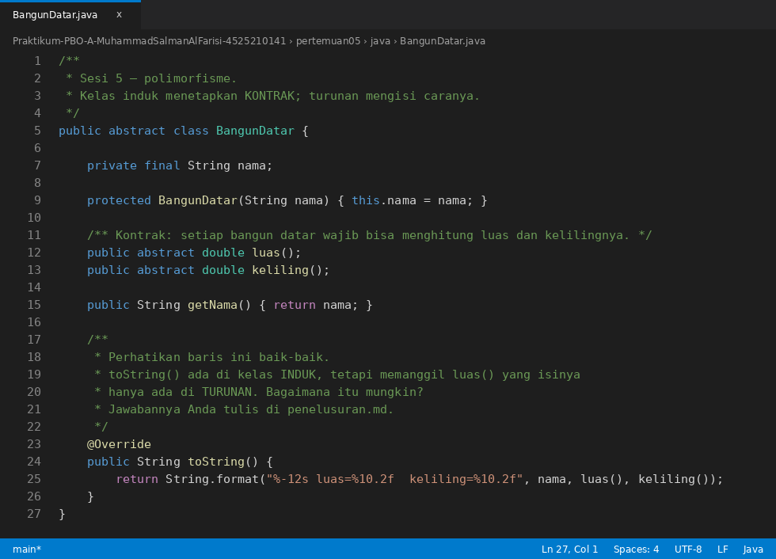

### Screenshot Coding Lingkaran.java


### Screenshot Coding Persegi.java


### Screenshot Coding Segitiga.java


## Langkah 4: Trapesium (Java)

### Screenshot Coding Trapesium.java
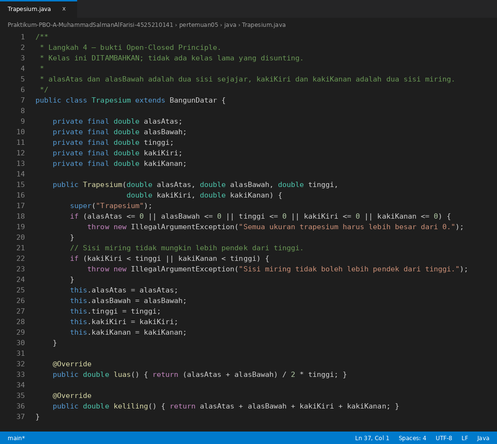

## Hasil Running Program java
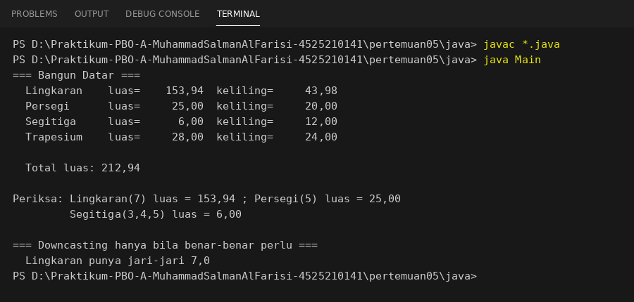

> Hasil running Java di atas dijalankan dengan `javac *.java` lalu `java Main` pada folder `java/`.

Pemeriksaan manual:

| Bangun | Perhitungan luas | Luas | Keliling |
|---|---|---|---|
| Lingkaran(7) | 3,14159... x 7 x 7 | 153,94 | 2 x 3,14159... x 7 = 43,98 |
| Persegi(5) | 5 x 5 | 25,00 | 4 x 5 = 20,00 |
| Segitiga(3, 4, 5) | s = 6, luas = akar(6 x 3 x 2 x 1) = akar(36) | 6,00 | 3 + 4 + 5 = 12,00 |
| Trapesium(4, 10, 4, 5, 5) | (4 + 10) / 2 x 4 | 28,00 | 4 + 10 + 5 + 5 = 24,00 |
| **Total luas** | 153,94 + 25,00 + 6,00 + 28,00 | **212,94** | |

Checkpoint:

| Checkpoint | Hasil |
|---|---|
| Langkah 1: `Main` mencetak luas dan keliling tanpa pemeriksaan tipe | Terpenuhi. Perulangan `for (BangunDatar b : daftar)` tidak mengandung `instanceof` |
| Langkah 2: `Segitiga(3, 4, 5)` luas 6,00 | Terpenuhi |
| Langkah 4: program berjalan dengan empat bangun, perulangan `Main` tidak disentuh | Terpenuhi |

### Uji validasi constructor (`UjiValidasi.java`)
Pembuktian bahwa konstruksi yang tidak sah ditolak **saat objek dibuat** (sehingga rumus Heron tidak pernah menghasilkan `NaN`). Program ini dibuat terpisah supaya `Main.java` tidak perlu disunting.


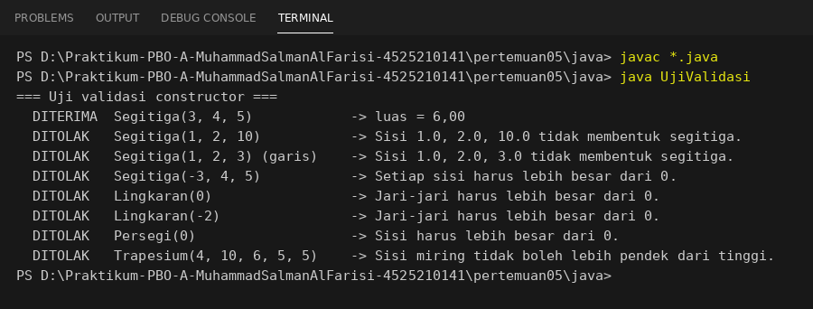

| Uji | Hasil |
|---|---|
| `Segitiga(3, 4, 5)` | Diterima, luas 6,00 |
| `Segitiga(1, 2, 10)` | **Ditolak** (1 + 2 <= 10) |
| `Segitiga(1, 2, 3)` | Ditolak (1 + 2 = 3, hanya berupa garis) |
| `Lingkaran(0)`, `Persegi(0)` | Ditolak |

## Langkah 3: Penelusuran Dynamic Dispatch
Lihat [penelusuran.md](penelusuran.md). Intinya, `toString()` ada di induk tetapi memanggil `luas()` lewat `invokevirtual`, sehingga method yang berjalan ditentukan oleh **tipe objek**, bukan tipe variabel.

## Langkah 5: Refaktor AntiPattern

### Screenshot Coding AntiPatternRefaktor.java
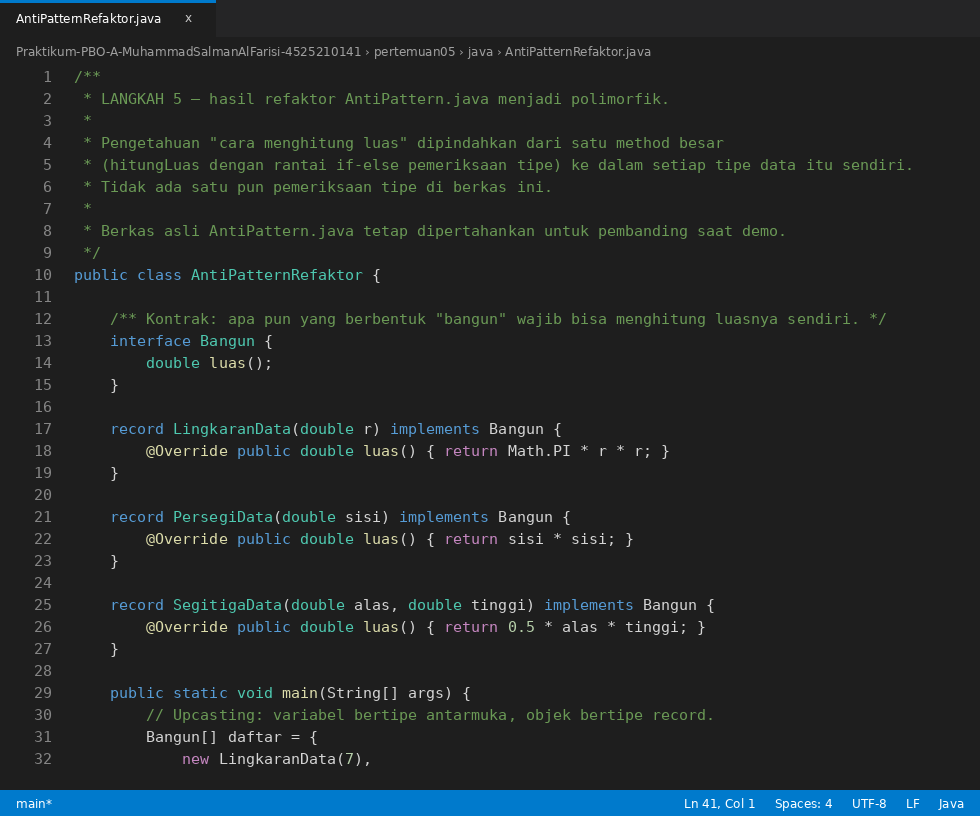


### Hasil Running AntiPattern dan AntiPatternRefaktor


Kedua versi menghasilkan total luas yang sama (184,94). Versi refaktor tidak mengandung `instanceof`. `AntiPattern.java` asli tidak dihapus dan tidak diubah.

| Menambah satu tipe baru | `AntiPattern.java` | `AntiPatternRefaktor.java` |
|---|---|---|
| Baris yang disisipkan ke logika lama | 2 | 0 |
| Method lama yang harus dibuka | `hitungLuas()` | tidak ada |
| Bila lupa melengkapi | Galat baru muncul saat berjalan | Ditolak saat kompilasi |

## Langkah 6: Versi PHP dan Notifikasi

### Screenshot Coding main.php


### Screenshot Coding BangunDatar.php
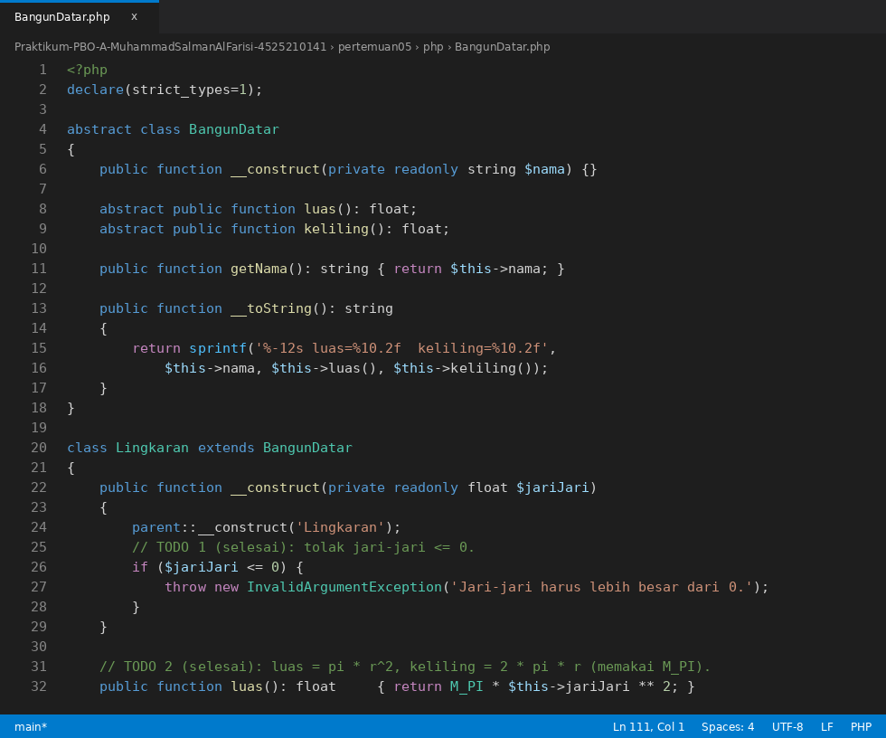
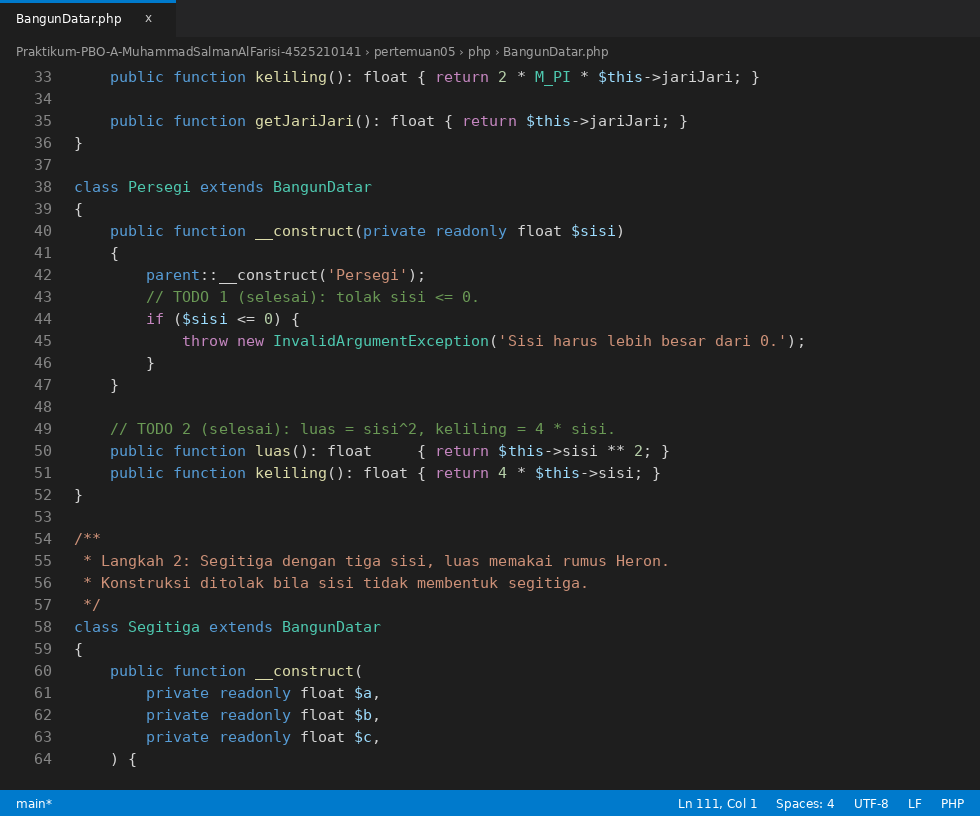
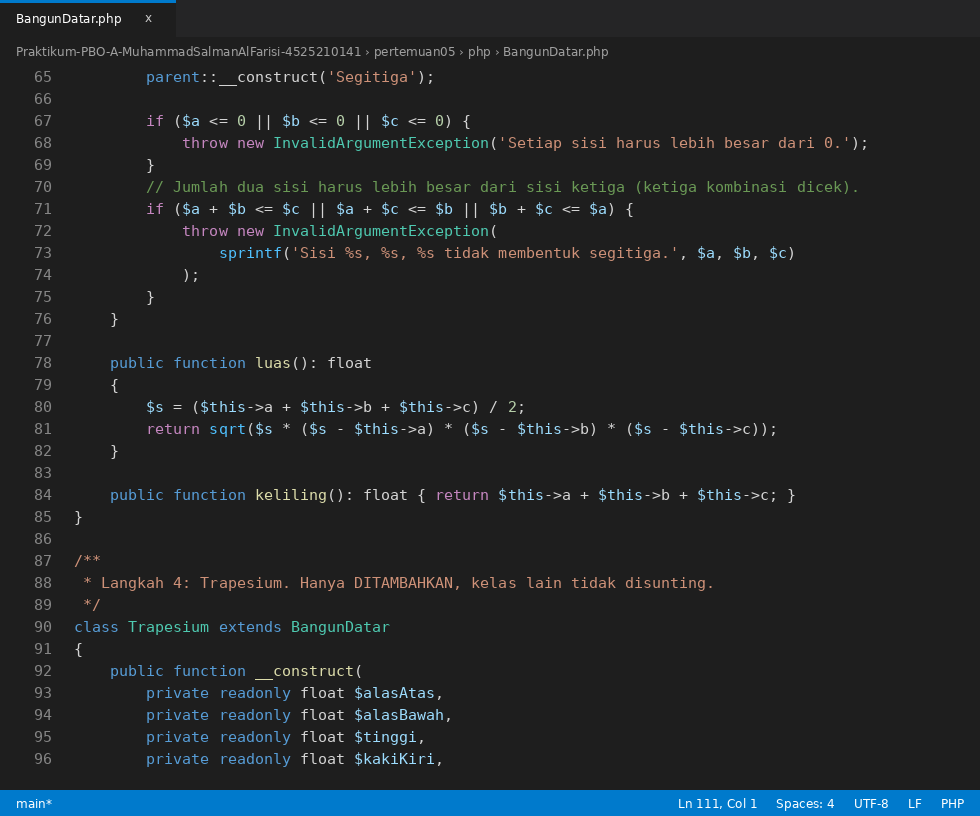


### Screenshot Coding uji-validasi.php
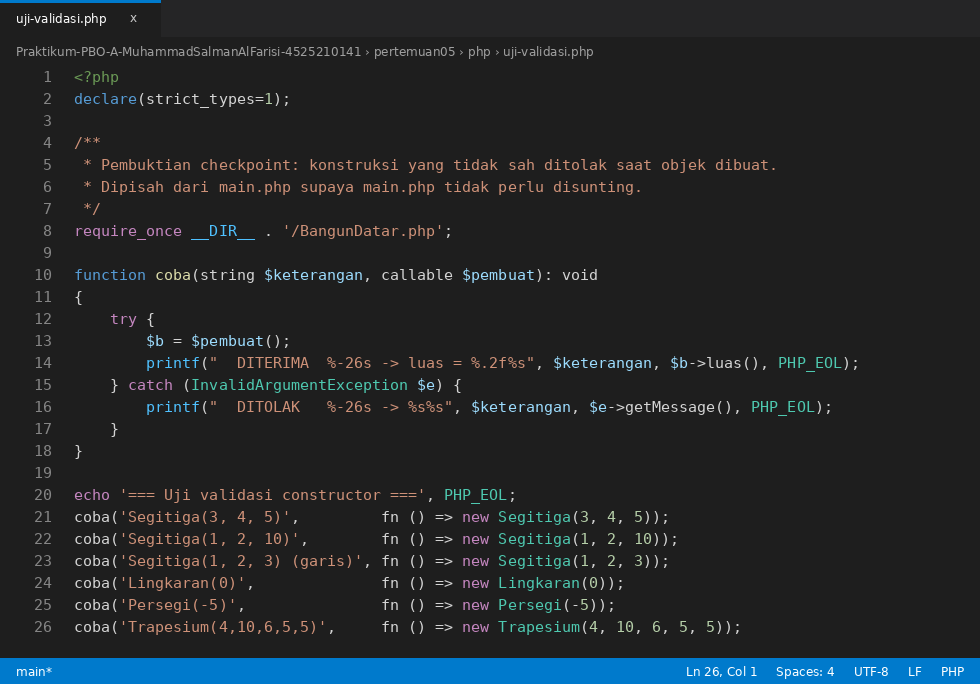

### Screenshot Coding notifikasi.php
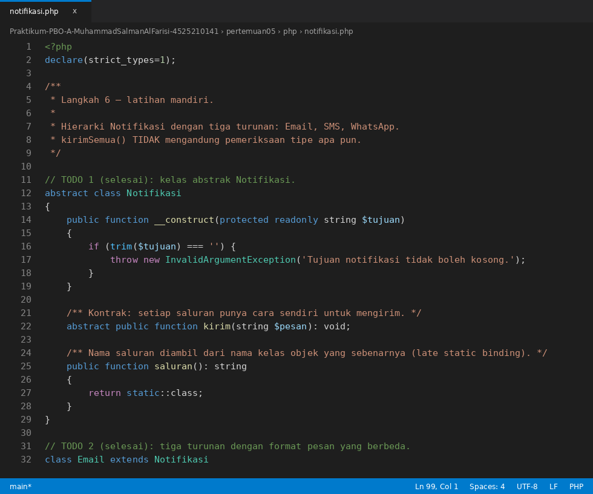


Hierarki `Notifikasi` (abstrak) memiliki turunan `Email`, `SMS`, dan `WhatsApp`. Masing-masing punya `kirim(string $pesan)` dengan format berbeda:

| Kelas | Format keluaran |
|---|---|
| `Email` | tiga baris: Kepada, Subjek, Isi |
| `SMS` | satu baris, pesan dipotong bila lebih dari 160 karakter |
| `WhatsApp` | nomor diubah ke format `+62...`, isi diberi judul tebal |
| `Telegram` (tambahan bukti Open-Closed) | satu baris dengan `@nama` |

Fungsi `kirimSemua(array $daftar, string $pesan)` hanya berisi `foreach` yang memanggil `$notifikasi->kirim($pesan)`. Tidak ada `instanceof`, `match`, maupun `switch` atas jenis notifikasi.

### Hasil Running Program php
Keluaran yang diharapkan dari `php main.php`:
```text
=== Bangun Datar ===
  Lingkaran    luas=    153.94  keliling=     43.98
  Persegi      luas=     25.00  keliling=     20.00
  Segitiga     luas=      6.00  keliling=     12.00
  Trapesium    luas=     28.00  keliling=     24.00

  Total luas: 212.94

Periksa: Lingkaran(7) luas = 153,94 ; Persegi(5) luas = 25,00
         Segitiga(3,4,5) luas = 6,00
```

Keluaran yang diharapkan dari `php uji-validasi.php`:
```text
=== Uji validasi constructor ===
  DITERIMA  Segitiga(3, 4, 5)          -> luas = 6.00
  DITOLAK   Segitiga(1, 2, 10)         -> Sisi 1, 2, 10 tidak membentuk segitiga.
  DITOLAK   Segitiga(1, 2, 3) (garis)  -> Sisi 1, 2, 3 tidak membentuk segitiga.
  DITOLAK   Lingkaran(0)               -> Jari-jari harus lebih besar dari 0.
  DITOLAK   Persegi(-5)                -> Sisi harus lebih besar dari 0.
  DITOLAK   Trapesium(4,10,6,5,5)      -> Sisi miring tidak boleh lebih pendek dari tinggi.
```

Keluaran yang diharapkan dari `php notifikasi.php`:
```text
=== kirimSemua: Email, SMS, WhatsApp ===
[Email] Kepada : ani@univpancasila.ac.id
        Subjek : Pemberitahuan Perpustakaan
        Isi    : Buku yang Anda pesan sudah tersedia.
[SMS] 081234567890 : Buku yang Anda pesan sudah tersedia.
[WhatsApp] ke +6281234567890 : *Pemberitahuan* Buku yang Anda pesan sudah tersedia.

=== Saluran baru (Telegram) tanpa menyunting kirimSemua ===
[Telegram] @ani_pancasila : Terima kasih sudah meminjam.
```

> Screenshot hasil running PHP belum ada. Jalankan `php main.php`, `php uji-validasi.php`, dan `php notifikasi.php` pada folder `php/`, lalu simpan screenshot terminalnya sebagai `IMG/hasil-running-php.png`, `IMG/uji-validasi-php-running.png`, dan `IMG/notifikasi-running.png`.
> Pada PHP, `%f` memakai titik desimal (`153.94`), berbeda dengan Java pada komputer berlokal Indonesia (`153,94`).

## Latihan Mandiri
Hasil lengkap ada di [percobaan-mandiri.md](percobaan-mandiri.md).

| Latihan | Hasil singkat |
|---|---|
| 1. Method `static hitungLuas()` di induk dan "override" di `Lingkaran` | Method yang terpanggil ditentukan **tipe variabel** (static binding). Ini *hiding*, bukan overriding. `@Override` pada static ditolak kompilator |
| 2. `BangunDatar[]` diganti `Object[]` | `Object cannot be converted to BangunDatar`, dan `luas()` tidak ditemukan pada `Object`. Kontrak hilang sehingga polimorfisme tidak bisa bekerja |

## Tugas Rumah

### 1. Refleksi 150 kata: framework dan dynamic dispatch
Lihat [refleksi.md](refleksi.md) (147 kata).

### 2. Biaya keterlambatan pada hierarki Koleksi (`tugas-rumah/`)
Folder `tugas-rumah/` berisi `Koleksi` (abstrak) dengan turunan `Buku`, `Majalah`, dan `Skripsi`. Masing-masing meng-override `biayaKeterlambatan(int hariTerlambat)` dengan aturan berbeda:

| Kelas | Aturan denda |
|---|---|
| `Buku` | Rp1.000 per hari |
| `Majalah` | Rp500 per hari, 3 hari pertama bebas denda |
| `Skripsi` | Rp5.000 per hari untuk 7 hari pertama, lalu Rp50.000 per hari |

> Hierarki Koleksi pada sesi 4 tidak ada di repositori ini (sesi 4 membahas `Pegawai`), sehingga hierarki Koleksi dibuat baru di folder `tugas-rumah/`. Jika Anda punya hierarki Koleksi sendiri, method `biayaKeterlambatan()` bisa dipindahkan ke sana.


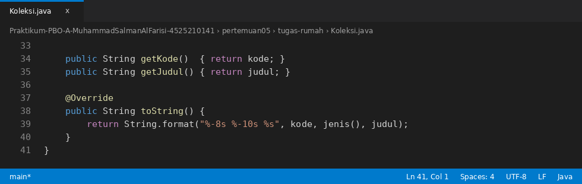
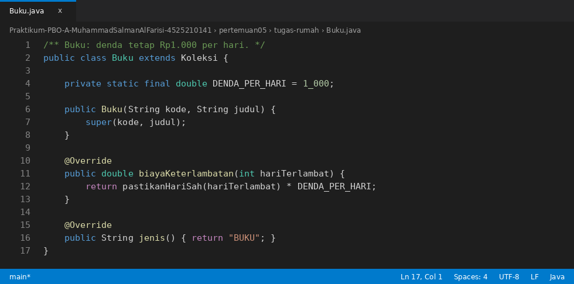


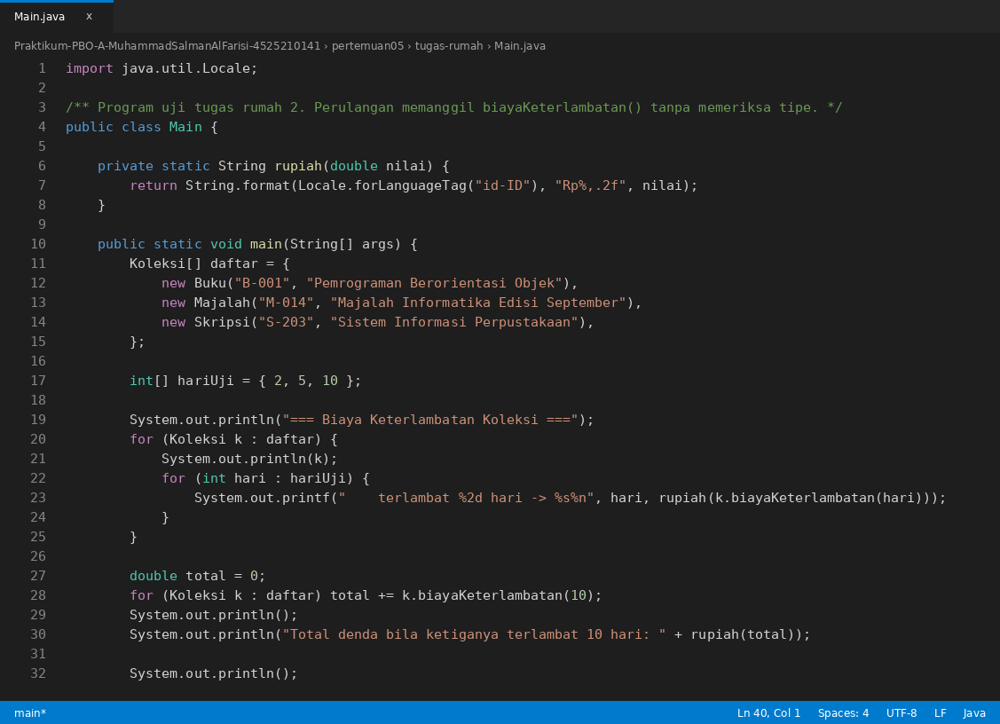
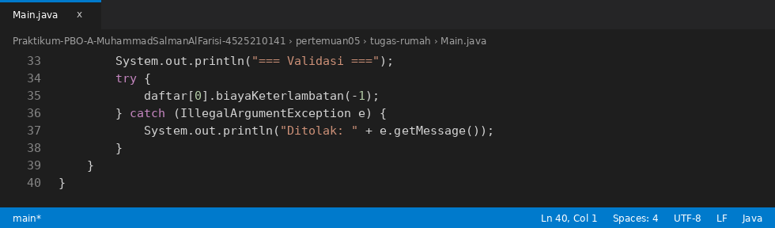

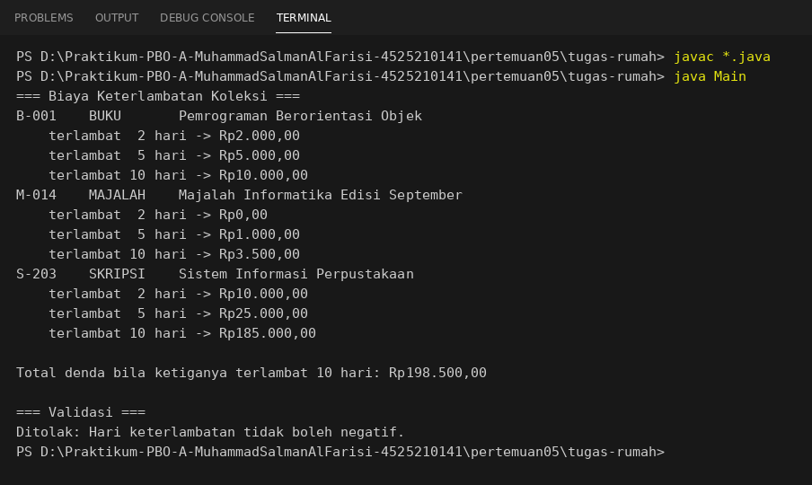

Pemeriksaan manual:

| Koleksi | Terlambat 10 hari | Denda |
|---|---|---|
| Buku | 10 x 1.000 | Rp10.000,00 |
| Majalah | (10 - 3) x 500 | Rp3.500,00 |
| Skripsi | 7 x 5.000 + 3 x 50.000 = 35.000 + 150.000 | Rp185.000,00 |
| **Total** | | **Rp198.500,00** |

## Dokumen Pendukung
- [penelusuran.md](penelusuran.md): penelusuran dynamic dispatch, bukti Open-Closed Principle, dan perbandingan dua versi AntiPattern.
- [refleksi.md](refleksi.md): jawaban 150 kata tentang framework dan dynamic dispatch.
- [percobaan-mandiri.md](percobaan-mandiri.md): hasil latihan mandiri (static hiding dan `Object[]`).
- [persiapan-demo.md](persiapan-demo.md): jawaban tujuh pertanyaan demo dan saran riwayat commit.
- [diagram.puml](diagram.puml), [sekuens-dispatch.puml](sekuens-dispatch.puml), [diagram-notifikasi.puml](diagram-notifikasi.puml): class diagram dan sequence diagram PlantUML.
- [percobaan/](percobaan/): kode dan bukti percobaan (static, `Object[]`, `@Override`, variabel `Object`, `BelahKetupat`, penambahan tipe pada dua versi AntiPattern).
- [starter/](starter/): berkas starter asli, tidak diubah.
- [materi-pertemuan05.pptx](materi-pertemuan05.pptx) dan [Modul-Praktikum-05-polimorfisme.docx](Modul-Praktikum-05-polimorfisme.docx): slide materi dan modul.

## Status Pengerjaan
- [x] Langkah 1: `Lingkaran` dan `Persegi` dilengkapi (validasi, `luas()`, `keliling()`), `Main` tidak diubah logikanya.
- [x] Langkah 2: `Segitiga` (rumus Heron, penolakan sisi yang tidak membentuk segitiga), `Main` hanya bertambah satu baris.
- [x] Langkah 3: `penelusuran.md` (dynamic dispatch).
- [x] Langkah 4: `Trapesium`, jumlah berkas lama yang diubah = 0.
- [x] Langkah 5: `AntiPatternRefaktor.java` tanpa `instanceof`, `AntiPattern.java` tetap ada.
- [x] Langkah 6: padanan PHP (`BangunDatar.php`, `main.php`) dan `notifikasi.php`.
- [x] Latihan mandiri 1 dan 2.
- [x] Tugas rumah 1 (`refleksi.md`) dan tugas rumah 2 (`biayaKeterlambatan()`).
- [x] Pertanyaan demo dijawab di `persiapan-demo.md`.
- [ ] Screenshot hasil running PHP (dijalankan di komputer sendiri).
- [ ] Lembar verifikasi demo (diisi dosen atau asisten saat demo).

## Cara Menjalankan
Java (JDK 17 atau lebih baru):
```cmd
cd pertemuan05\java
javac *.java
java Main
java UjiValidasi
java AntiPattern
java AntiPatternRefaktor

cd ..\tugas-rumah
javac *.java
java Main
```
PHP (8.1 atau lebih baru):
```cmd
cd pertemuan05\php
php main.php
php uji-validasi.php
php notifikasi.php
```
