# Laporan Praktikum PBO Pertemuan 6
**Nama          :** Muhammad Salman Al Farisi
**NPM           :** 4525210141
**Mata Kuliah   :** Pemrograman Berorientasi Objek (Kelas A)

## Materi
Abstract class, interface, enum, dan trait (Java dan PHP).
Sub-CPMK-P4: mengimplementasikan abstraksi lewat abstract class, interface, enum, dan trait. Studi kasus: `Kendaraan`, `Movable`, `Fuelable`, `TipeBahanBakar`, ditambah latihan perpustakaan (`Peminjamable`, `StatusPinjam`).

## Gambaran Program
Pegangan utama sesi ini: **abstract class menjawab "apa benda ini", interface menjawab "apa yang bisa dilakukannya"**.

- `Kendaraan` (abstract class) menampung kode yang benar-benar sama di semua kendaraan: `merek`, `tahun`, `umur()`.
- `Movable` dan `Fuelable` (interface) dipisah karena tidak semua yang bergerak butuh bahan bakar (sepeda), dan tidak semua yang butuh bahan bakar bergerak (genset). Ini *Interface Segregation Principle*.
- `TipeBahanBakar` (enum) membawa label, harga, dan perilaku (`biayaPengisian()`, `ramahLingkungan()`).
- `Mobil` mewarisi satu class dan mengimplementasikan dua interface. `Sepeda` hanya `Movable`. `Genset` hanya `Fuelable`.
- Di PHP ditambah trait `Loggable` yang dipakai `Mobil` dan `Pesanan` (dua kelas yang tidak sekerabat).

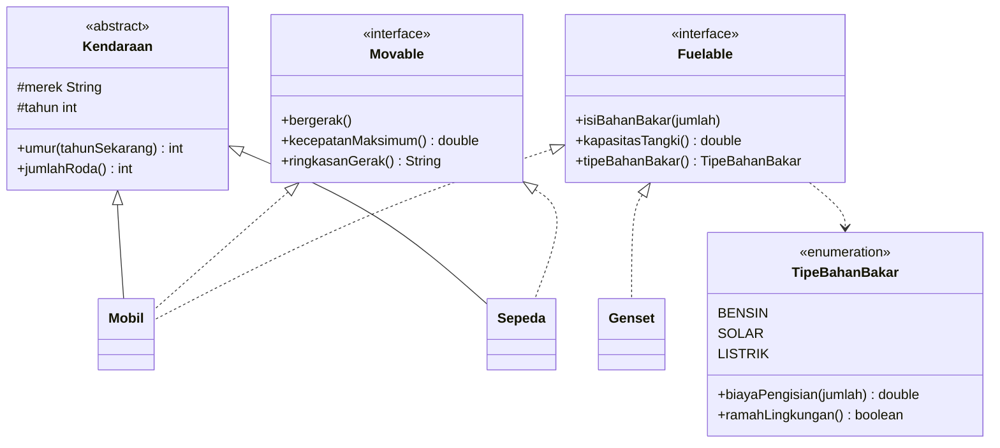

> Garis penuh = pewarisan (`extends`). Garis putus = realisasi interface (`implements`). Diagram PlantUML lengkap (termasuk trait) ada di [uml/abstraksi.puml](uml/abstraksi.puml).

## Hierarki dan Peran Tiap Tipe
| Tipe | Jenis | Peran | Catatan |
|---|---|---|---|
| `Kendaraan` | abstract class | Identitas: `merek`, `tahun`, `umur()`, `jumlahRoda()` abstrak | Konstruktor menolak merek kosong dan tahun <= 0 |
| `Movable` | interface | Kemampuan bergerak | Punya `default` method `ringkasanGerak()` (Java) |
| `Fuelable` | interface | Kemampuan diisi bahan bakar | Terpisah dari `Movable` |
| `TipeBahanBakar` | enum | `BENSIN` 12.000, `SOLAR` 10.500, `LISTRIK` 2.500 | `ramahLingkungan()` hanya `true` untuk `LISTRIK` |
| `Mobil` | class | `extends Kendaraan implements Movable, Fuelable` | Menolak isi <= 0 dan melebihi kapasitas tangki |
| `Sepeda` | class | `extends Kendaraan implements Movable` | **Bukan** `Fuelable` |
| `Genset` | class | `implements Fuelable` | Tidak bergerak, bukan `Kendaraan` |
| `Loggable` | trait (PHP) | Method `log()` | Dipakai `Mobil` dan `Pesanan` |

Padanan sintaks:

| Konsep | Java | PHP |
|---|---|---|
| Abstract class | `abstract class Kendaraan` | `abstract class Kendaraan` |
| Interface | `interface Movable` | `interface Movable` |
| Banyak interface | `implements Movable, Fuelable` | `implements Movable, Fuelable` |
| Enum | `enum TipeBahanBakar { BENSIN("Bensin", 12000), ... }` | `enum TipeBahanBakar: string { case Bensin = 'bensin'; ... }` |
| Perilaku enum | method biasa, `this == LISTRIK` | `match ($this) { ... }`, `$this === self::Listrik` |
| Daftar semua nilai enum | `TipeBahanBakar.values()` | `TipeBahanBakar::cases()` |
| Nilai tidak terdaftar | `valueOf()` melempar `IllegalArgumentException` | `from()` melempar `ValueError`, `tryFrom()` mengembalikan `null` |
| Default method di interface | `default String ringkasanGerak()` | Tidak ada |
| Trait | Tidak ada (pakai default method dengan hati-hati) | `trait Loggable`, dipakai dengan `use Loggable;` |
| Penolakan `isiPenuh(sepeda)` | Galat **kompilasi** | `TypeError` saat **berjalan** |

## Langkah 1: Interface dan Abstract Class (Java)
Berkas: [java/Movable.java](java/Movable.java), [java/Fuelable.java](java/Fuelable.java), [java/Kendaraan.java](java/Kendaraan.java).
`Movable.ringkasanGerak()` (TODO 1) menyusun teks "kecepatan maksimum 180 km/jam" dari `kecepatanMaksimum()`. `Kendaraan.umur()` memakai `Math.max(0, ...)` supaya tidak pernah negatif.
Keputusan interface vs abstract class ditulis di [keputusan.md](keputusan.md).

### Screenshot Coding Movable.java
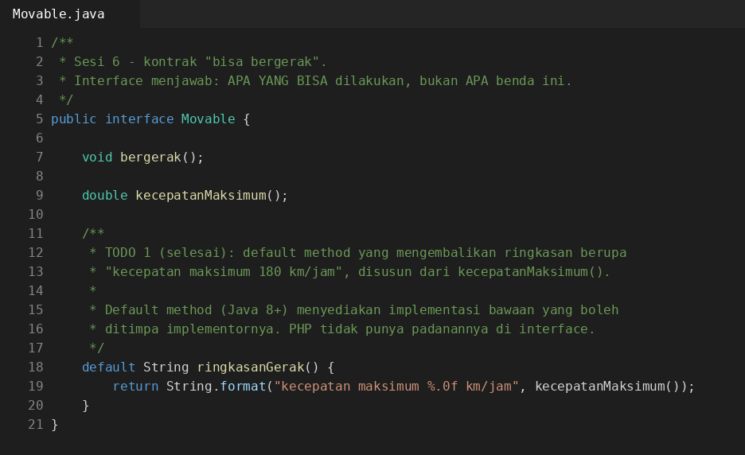

### Screenshot Coding Fuelable.java


### Screenshot Coding Kendaraan.java


## Langkah 2: Enum dengan Perilaku (Java)
Berkas: [java/TipeBahanBakar.java](java/TipeBahanBakar.java). Ketiga konstanta lengkap dengan harga, ditambah `biayaPengisian()` dan `ramahLingkungan()`.

### Screenshot Coding TipeBahanBakar.java
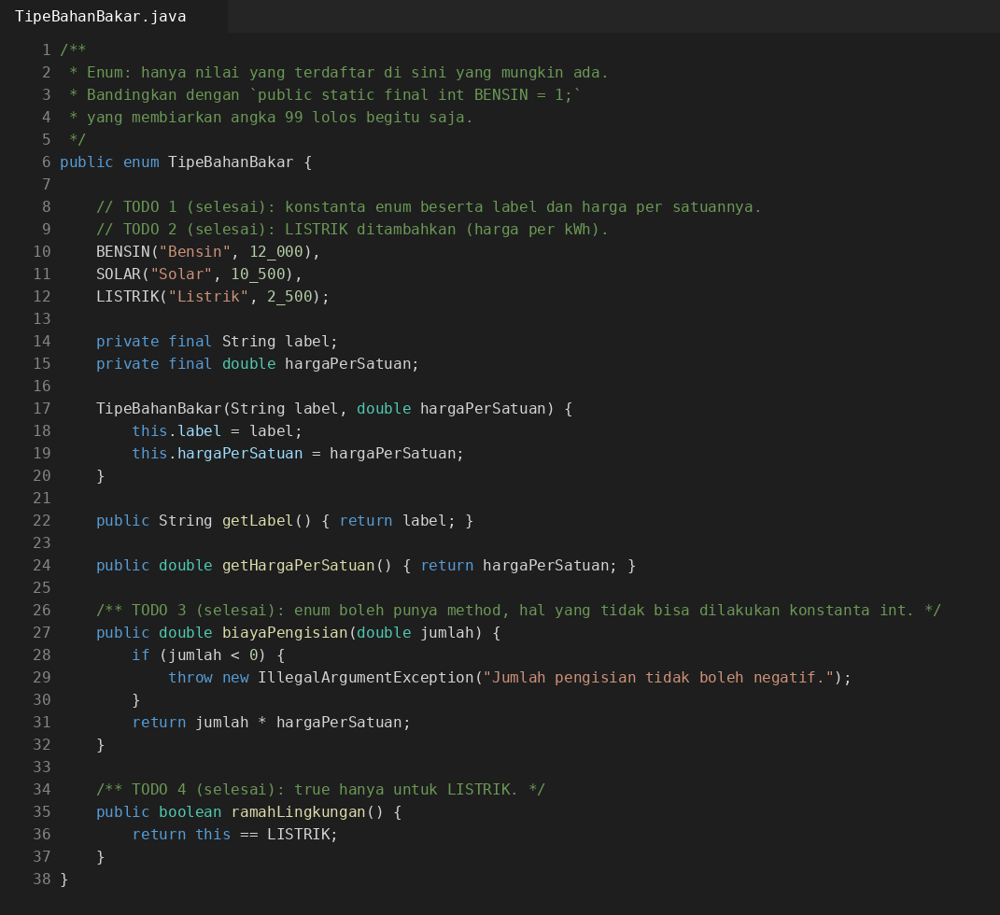

## Langkah 3: Dua Interface pada Satu Kelas
Berkas: [java/Mobil.java](java/Mobil.java). `Mobil` bisa ditampung variabel bertipe `Kendaraan`, `Movable`, maupun `Fuelable` (bagian pertama `Main`).

### Screenshot Coding Mobil.java


## Langkah 4: Sepeda dan Interface Segregation
Berkas: [java/Sepeda.java](java/Sepeda.java), [java/Genset.java](java/Genset.java). `Sepeda` bukan `Fuelable`, sehingga `isiPenuh(sepeda)` ditolak kompilator. Baris itu dibiarkan menjadi komentar di `Main.java` supaya program tetap bisa dikompilasi. Pesan galat lengkap ada di [percobaan/01-sepeda-ditolak/](percobaan/01-sepeda-ditolak/):

```text
Main.java:10: error: incompatible types: Sepeda cannot be converted to Fuelable
        isiPenuh(sepeda);   // <- komentar dihapus: kompilasi harus gagal
                 ^
1 error
```

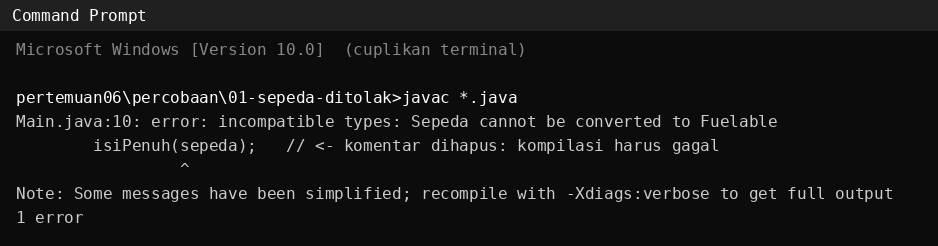

### Screenshot Coding Sepeda.java


### Screenshot Coding Genset.java


### Screenshot Coding Main.java


## Hasil Running Program Java
Dijalankan dengan `javac *.java` lalu `java Main` pada folder `java/`:

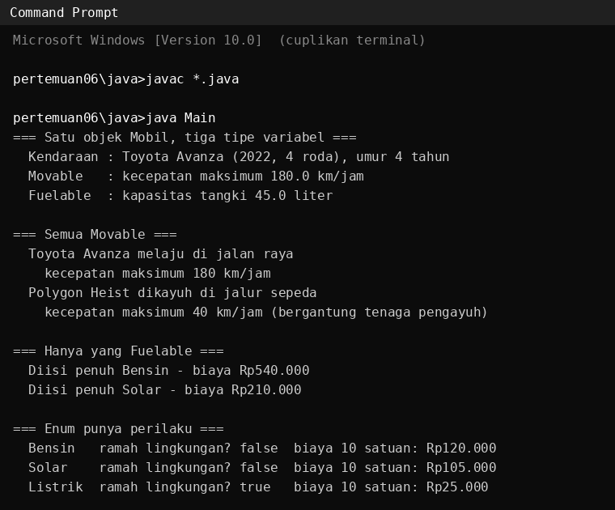

```text
=== Satu objek Mobil, tiga tipe variabel ===
  Kendaraan : Toyota Avanza (2022, 4 roda), umur 4 tahun
  Movable   : kecepatan maksimum 180.0 km/jam
  Fuelable  : kapasitas tangki 45.0 liter

=== Semua Movable ===
  Toyota Avanza melaju di jalan raya
    kecepatan maksimum 180 km/jam
  Polygon Heist dikayuh di jalur sepeda
    kecepatan maksimum 40 km/jam (bergantung tenaga pengayuh)

=== Hanya yang Fuelable ===
  Diisi penuh Bensin - biaya Rp540.000
  Diisi penuh Solar - biaya Rp210.000

=== Enum punya perilaku ===
  Bensin   ramah lingkungan? false  biaya 10 satuan: Rp120.000
  Solar    ramah lingkungan? false  biaya 10 satuan: Rp105.000
  Listrik  ramah lingkungan? true   biaya 10 satuan: Rp25.000
```

Pemeriksaan manual:

| Perhitungan | Hasil |
|---|---|
| Mobil 45 liter x Rp12.000 | Rp540.000 |
| Genset 20 liter x Rp10.500 | Rp210.000 |
| 10 satuan Bensin, Solar, Listrik | Rp120.000, Rp105.000, Rp25.000 |
| `umur(2026)` untuk tahun 2022 | 4 |

> Pemisah ribuan memakai titik karena dijalankan dengan lokal Indonesia. Pada komputer berlokal lain bisa tercetak dengan koma.

Checkpoint:

| Checkpoint | Hasil |
|---|---|
| Langkah 1: `keputusan.md` memuat tiga keputusan beralasan | Terpenuhi (Keputusan 1) |
| Langkah 2: tiga jenis bahan bakar dengan biaya dan status ramah lingkungan berbeda | Terpenuhi |
| Langkah 3: `Mobil` masuk ke variabel `Kendaraan`, `Movable`, dan `Fuelable` | Terpenuhi |
| Langkah 4: kompilasi menolak `isiPenuh(sepeda)`, pesan tercatat | Terpenuhi |

### Uji validasi (`UjiValidasi.java`)
Dibuat terpisah supaya `Main.java` tidak perlu disunting. Dijalankan dengan `java UjiValidasi`:

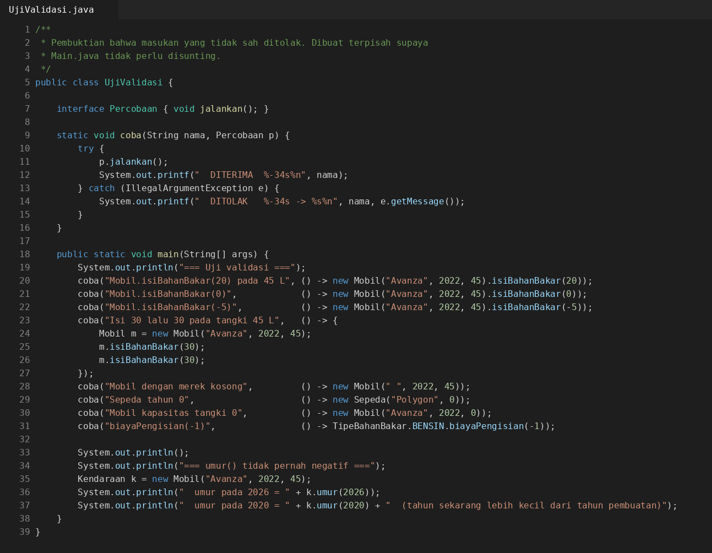


```text
=== Uji validasi ===
  DITERIMA  Mobil.isiBahanBakar(20) pada 45 L
  DITOLAK   Mobil.isiBahanBakar(0)             -> Jumlah bahan bakar harus lebih besar dari 0.
  DITOLAK   Mobil.isiBahanBakar(-5)            -> Jumlah bahan bakar harus lebih besar dari 0.
  DITOLAK   Isi 30 lalu 30 pada tangki 45 L    -> Melebihi kapasitas tangki (60 dari 45 liter).
  DITOLAK   Mobil dengan merek kosong          -> Merek tidak boleh kosong.
  DITOLAK   Sepeda tahun 0                     -> Tahun harus lebih besar dari 0.
  DITOLAK   Mobil kapasitas tangki 0           -> Kapasitas tangki harus lebih besar dari 0.
  DITOLAK   biayaPengisian(-1)                 -> Jumlah pengisian tidak boleh negatif.

=== umur() tidak pernah negatif ===
  umur pada 2026 = 4
  umur pada 2020 = 0  (tahun sekarang lebih kecil dari tahun pembuatan)
```

## Langkah 5: Trait di PHP
Berkas: [php/abstraksi.php](php/abstraksi.php), [php/main.php](php/main.php), [php/uji-validasi.php](php/uji-validasi.php). Seluruh struktur PHP ada di satu berkas (`abstraksi.php`), sesuai starter.

### Screenshot Coding abstraksi.php


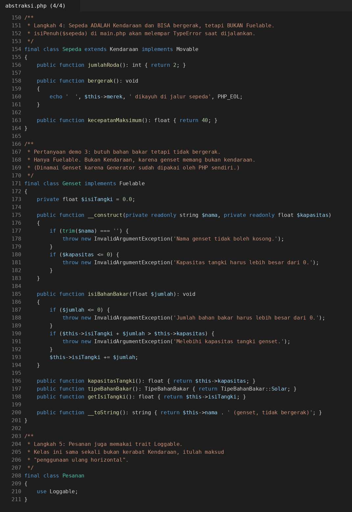

### Screenshot Coding main.php
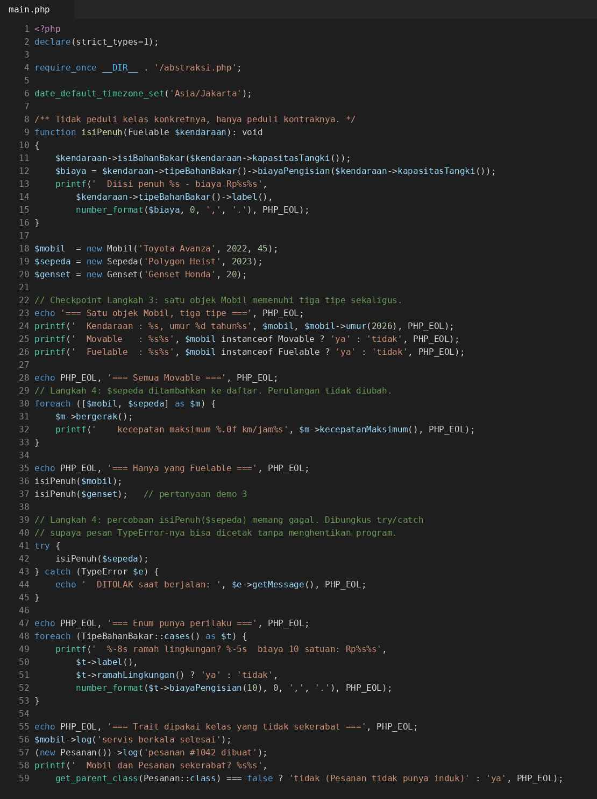

### Screenshot Coding uji-validasi.php


`Loggable::log()` mencetak `[jam] NamaKelas: pesan` memakai `static::class`. Trait dipakai oleh `Mobil` dan oleh `Pesanan`, dua kelas yang sama sekali tidak sekerabat: itulah penggunaan ulang horizontal. Kapan trait berbahaya dibahas di [keputusan.md](keputusan.md), Keputusan 4.

### Hasil Running Program php
Keluaran yang diharapkan dari `php main.php` (jam pada baris log menyesuaikan waktu menjalankan):
```text
=== Satu objek Mobil, tiga tipe ===
  Kendaraan : Toyota Avanza (2022, 4 roda), umur 4 tahun
  Movable   : ya
  Fuelable  : ya

=== Semua Movable ===
  Toyota Avanza melaju di jalan raya
    kecepatan maksimum 180 km/jam
  Polygon Heist dikayuh di jalur sepeda
    kecepatan maksimum 40 km/jam

=== Hanya yang Fuelable ===
  Diisi penuh Bensin - biaya Rp540.000
  Diisi penuh Solar - biaya Rp210.000
  DITOLAK saat berjalan: isiPenuh(): Argument #1 ($kendaraan) must be of type Fuelable, Sepeda given, called in <path>\main.php on line 42

=== Enum punya perilaku ===
  Bensin   ramah lingkungan? tidak  biaya 10 satuan: Rp120.000
  Solar    ramah lingkungan? tidak  biaya 10 satuan: Rp105.000
  Listrik  ramah lingkungan? ya     biaya 10 satuan: Rp25.000

=== Trait dipakai kelas yang tidak sekerabat ===
  [14:32:05] Mobil: servis berkala selesai
  [14:32:05] Pesanan: pesanan #1042 dibuat
  Mobil dan Pesanan sekerabat? tidak (Pesanan tidak punya induk)
```

Keluaran yang diharapkan dari `php uji-validasi.php` (hasil sama dengan versi Java, ditambah bagian enum):
```text
=== Enum menolak nilai yang tidak terdaftar ===
  from('hidrogen')    -> ValueError: <pesan bawaan PHP tentang nilai tidak valid>
NULL
```

Checkpoint Langkah 5: `Mobil` dan `Pesanan` sama-sama memanggil `log()`. Terpenuhi.

> Lingkungan tempat kode ini disusun tidak memiliki PHP, sehingga seluruh berkas PHP **belum dijalankan**. Jalankan `php main.php`, `php uji-validasi.php`, dan `php ../latihan/php/main.php` di komputer sendiri untuk memastikan, lalu simpan screenshotnya (daftar nama berkas ada di Status Pengerjaan).

## Langkah 6: Latihan Mandiri `Peminjamable`
Folder [latihan/](latihan/) (Java di `latihan/java/`, PHP di `latihan/php/`), dibuat tanpa starter.

### Screenshot Coding Java (latihan)


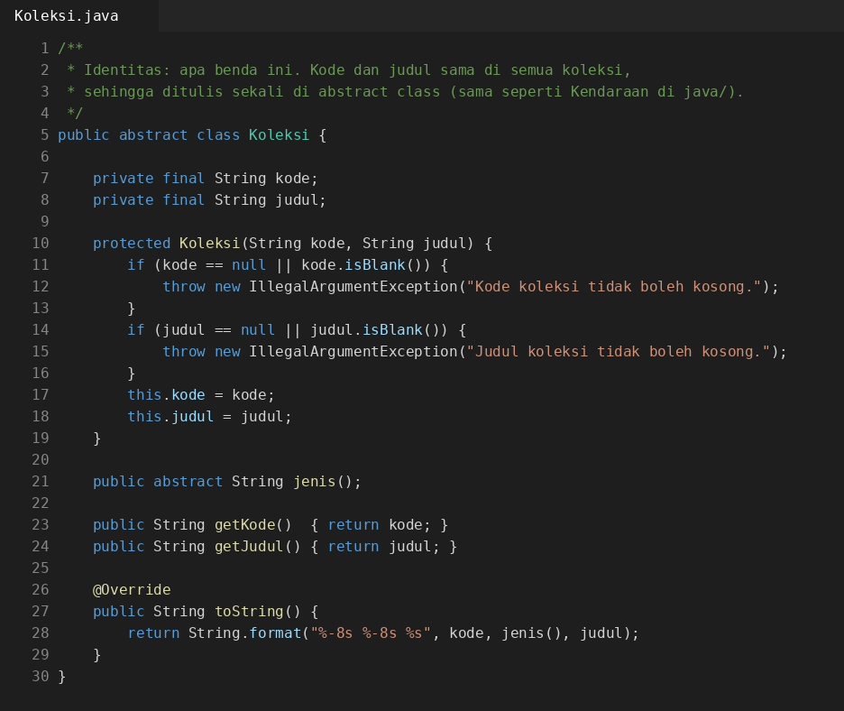
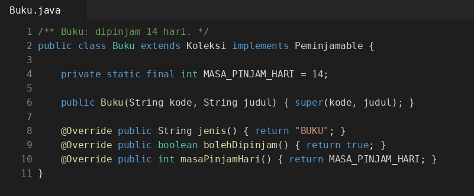
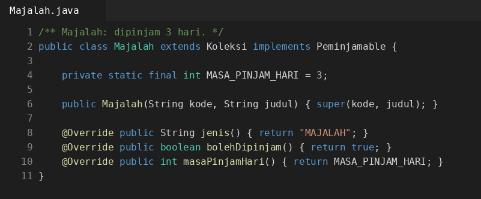

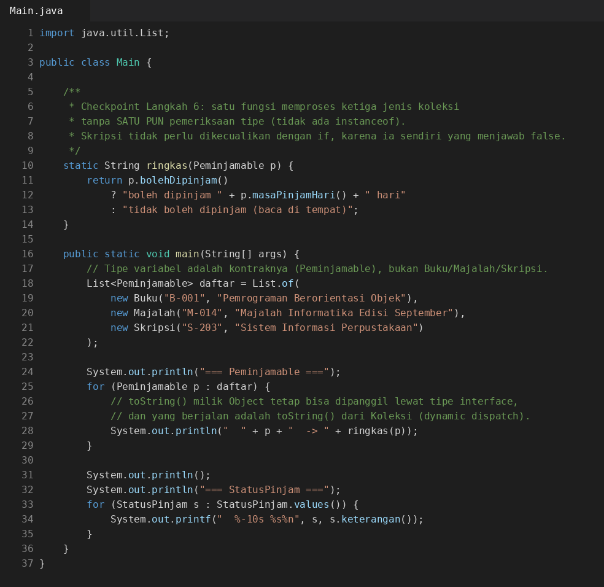

### Screenshot Coding PHP (latihan)


| Kelas | `bolehDipinjam()` | `masaPinjamHari()` |
|---|---|---|
| `Buku` | `true` | 14 |
| `Majalah` | `true` | 3 |
| `Skripsi` | `false` | 0 |

`StatusPinjam` (enum) memiliki case `Tersedia`, `Dipinjam`, `Terlambat`, `Hilang` dan method `keterangan()`. `Koleksi` (abstract class) menjadi identitas bersama, sedangkan `Peminjamable` menjadi kemampuan. Hasil `java Main` pada `latihan/java/`:


```text
=== Peminjamable ===
  B-001    BUKU     Pemrograman Berorientasi Objek  -> boleh dipinjam 14 hari
  M-014    MAJALAH  Majalah Informatika Edisi September  -> boleh dipinjam 3 hari
  S-203    SKRIPSI  Sistem Informasi Perpustakaan  -> tidak boleh dipinjam (baca di tempat)

=== StatusPinjam ===
  TERSEDIA   Ada di rak dan bisa dipinjam
  DIPINJAM   Sedang dipinjam anggota
  TERLAMBAT  Lewat tenggat, denda berjalan
  HILANG     Tidak ditemukan, perlu penggantian
```

Checkpoint: fungsi `ringkas(Peminjamable p)` memproses ketiga jenis koleksi tanpa satu pun `instanceof`. Terpenuhi. Versi PHP (`latihan/php/main.php`) menghasilkan isi yang sama, dengan nama case `Tersedia`, `Dipinjam`, dan seterusnya.

## Langkah 7: Class Diagram
Berkas: [uml/abstraksi.puml](uml/abstraksi.puml) dan [uml/latihan.puml](uml/latihan.puml). Notasi yang dipakai:


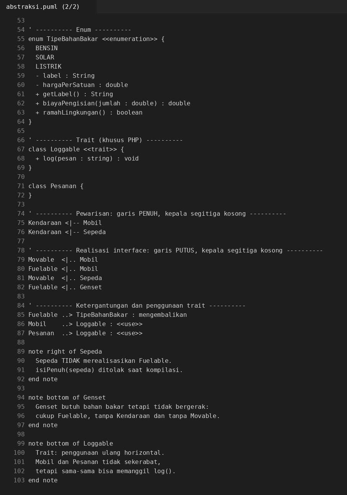


| Hubungan | Notasi PlantUML | Gambar |
|---|---|---|
| Pewarisan (`extends`) | `Kendaraan <\|-- Mobil` | garis penuh, kepala segitiga kosong |
| Realisasi interface (`implements`) | `Movable <\|.. Mobil` | garis putus, kepala segitiga kosong |
| Penggunaan trait | `Mobil ..> Loggable : <<use>>` | panah putus bergaris terbuka |

Interface ditulis dengan kata kunci `interface` dan stereotip `<<interface>>`, enum dengan `enum` dan `<<enumeration>>`, serta abstract class dengan `abstract class`.

## Latihan Mandiri di Lab
Hasil lengkap ada di [percobaan-mandiri.md](percobaan-mandiri.md).

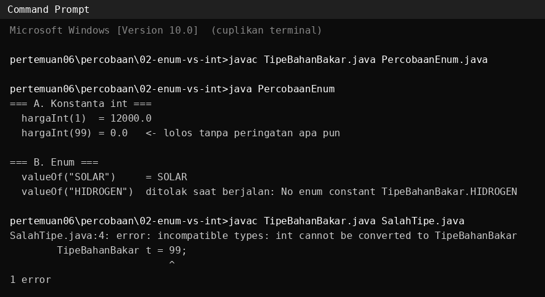
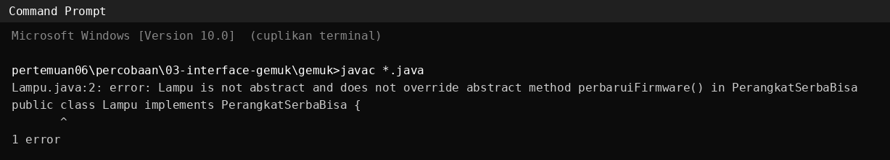
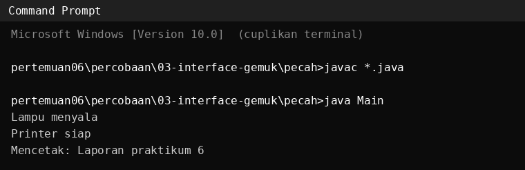

| Latihan | Hasil singkat |
|---|---|
| E1. Default method di `Movable`, di-override di `Sepeda` | `Sepeda` memanggil `Movable.super.ringkasanGerak()` lalu menambah keterangan. Berguna untuk evolusi interface, menyesatkan bila implementor mewarisi perilaku tanpa sadar |
| E2. Interface gemuk (8 method) lalu dipecah | `Lampu` dipaksa menulis method yang tidak ia butuhkan. Setelah dipecah jadi `Switchable`, `Printable`, `Scannable`, tiap kelas hanya mengambil yang relevan |
| Tambahan: enum vs konstanta int | Angka 99 lolos pada konstanta int, tetapi ditolak kompilator pada enum |

## Tugas Rumah
1. **Refleksi 150 kata:** mengapa `bolehDipinjam()` lebih baik di interface daripada `if ($item instanceof Skripsi)`. Lihat [refleksi.md](refleksi.md) (133 kata).
2. **Persiapan sesi 7:** daftar kelas Sistem Perpustakaan. Lihat [persiapan-sesi07.md](persiapan-sesi07.md). Modul sesi 7 belum tersedia sehingga daftar ini bersifat sementara.

## Dokumen Pendukung
- [keputusan.md](keputusan.md): empat keputusan rancangan dan dua pesan kompilator.
- [percobaan-mandiri.md](percobaan-mandiri.md): hasil latihan mandiri E1, E2, dan bukti enum vs int.
- [persiapan-demo.md](persiapan-demo.md): jawaban tujuh pertanyaan demo dan saran riwayat commit.
- [refleksi.md](refleksi.md) dan [persiapan-sesi07.md](persiapan-sesi07.md): tugas rumah.
- [uml/](uml/): class diagram PlantUML.
- [percobaan/](percobaan/): kode dan bukti percobaan (`01-sepeda-ditolak`, `02-enum-vs-int`, `03-interface-gemuk`).
- [starter/](starter/): berkas starter asli, tidak diubah.
- [Modul-Praktikum-06-abstract-class-interface-enum-dan-trait.docx](Modul-Praktikum-06-abstract-class-interface-enum-dan-trait.docx): modul praktikum.

## Status Pengerjaan
- [x] Langkah 1: `Movable`, `Fuelable`, `Kendaraan` dilengkapi, keputusan ditulis di `keputusan.md`.
- [x] Langkah 2: `TipeBahanBakar` lengkap dengan `LISTRIK`, `biayaPengisian()`, `ramahLingkungan()`.
- [x] Langkah 3: `Mobil` mengimplementasikan dua interface.
- [x] Langkah 4: `Sepeda` (bukan `Fuelable`), pesan kompilator tercatat. `Genset` untuk pertanyaan demo 3.
- [x] Langkah 5: trait `Loggable` dipakai `Mobil` dan `Pesanan` (kode PHP selesai, belum dijalankan).
- [x] Langkah 6: `Peminjamable` dan `StatusPinjam` di Java dan PHP.
- [x] Langkah 7: `uml/abstraksi.puml`.
- [x] Latihan mandiri E1 dan E2.
- [x] Tugas rumah 1 (`refleksi.md`) dan tugas rumah 2 (`persiapan-sesi07.md`, sementara).
- [x] Pertanyaan demo dijawab di `persiapan-demo.md`.
- [x] Screenshot coding (Java, PHP, PlantUML) dan hasil running Java di `IMG/`. Gambar ini dirender dari isi berkas dan keluaran program yang sebenarnya, bukan tangkapan layar IDE. Boleh diganti dengan screenshot VS Code milik sendiri bila dosen menghendaki.
- [ ] Menjalankan seluruh kode PHP di komputer sendiri dan menyimpan screenshot terminalnya: `IMG/hasil-running-php.png`, `IMG/uji-validasi-running-php.png`, `IMG/latihan-hasil-running-php.png`, lalu menambahkannya ke README.
- [ ] Merender `uml/abstraksi.puml` menjadi gambar (opsional).
- [ ] Mencocokkan `persiapan-sesi07.md` dengan modul sesi 7.
- [ ] Lembar verifikasi demo (diisi dosen atau asisten saat demo).

## Cara Menjalankan
Java (JDK 17 atau lebih baru):
```cmd
cd pertemuan06\java
javac *.java
java Main
java UjiValidasi

cd ..\latihan\java
javac *.java
java Main
```
PHP (8.1 atau lebih baru):
```cmd
cd pertemuan06\php
php main.php
php uji-validasi.php

cd ..\latihan\php
php main.php
```
